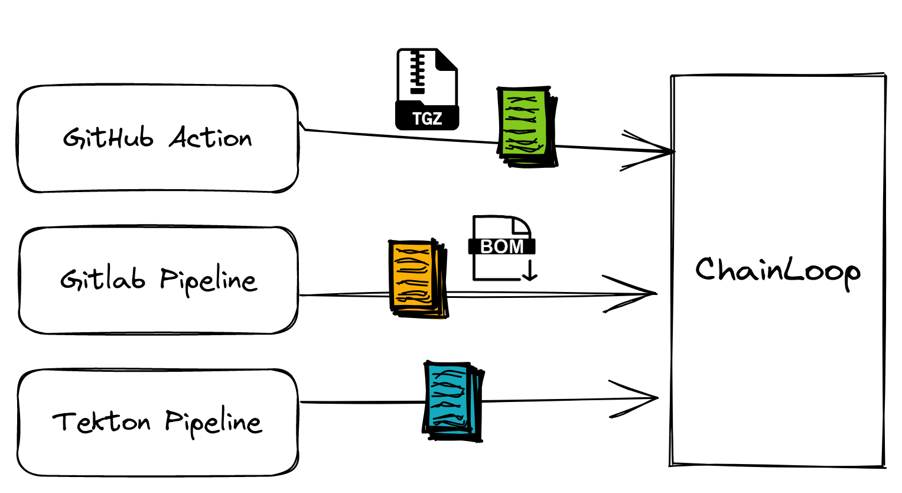
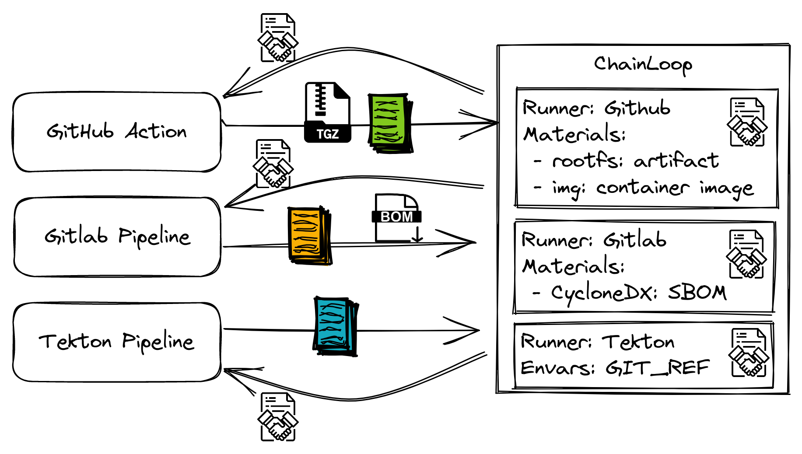
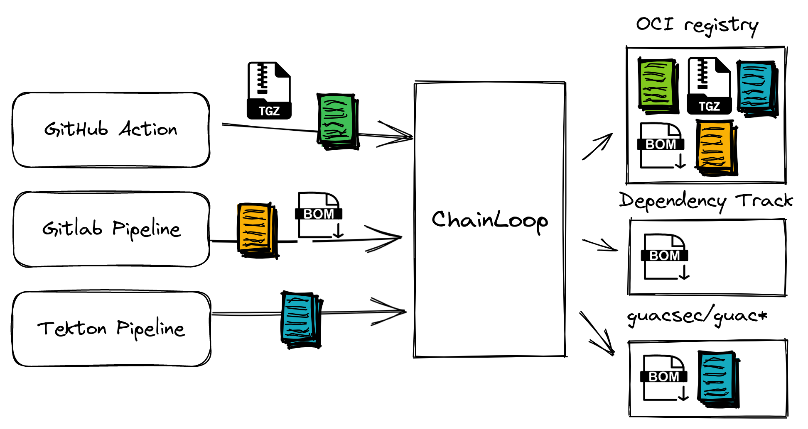

# Chainloop

[](https://securityscorecards.dev/viewer/?uri=github.com/chainloop-dev/chainloop)
[](https://goreportcard.com/report/github.com/chainloop-dev/chainloop)

[](https://join.slack.com/t/chainloop-community/shared_invite/zt-2k34dvx3r-u85uGP_KiLC6ic5Wy4aRnQ)
[](https://github.com/chainloop-dev/chainloop/blob/main/LICENSE.md)

> Chainloop is under active development and you should expect breaking changes before the first stable release.
> If you are interested in contributing, please take a look at our [contributor guide](./CONTRIBUTING.md).

## What is it?

Chainloop is an open-source Software Supply Chain control plane, a single source of truth for metadata and artifacts, plus a declarative attestation process.

With Chainloop, SecOps teams can declaratively state the pieces of evidence and artifact expectations for their organization’s CI/CD workflows. At the same time, they can rest assured that the metadata will reach the desired destination for storage and analysis, always meeting the latest standards and best practices.

On the other hand, developer teams do not need to become security experts. The attestation crafting tool will guide them with guardrails and a familiar developer experience.

To learn more about the project motivation please look at [our documentation](https://docs.chainloop.dev) and see it in action in [this video](https://www.youtube.com/watch?v=GfSR2ZkZ3as).

## Getting started

See the [getting started guide](https://docs.chainloop.dev/getting-started/installation#command-line-interface-cli-installation) for detailed information on a) how to download and configure the Chainloop CLI and b) how to deploy Chainloop on your Kubernetes Cluster.

### Command Line Interface (CLI) installation

> Alternatively, you can download the CLI from the [releases pages](https://github.com/chainloop-dev/chainloop/releases) or [build it from source](./CONTRIBUTING.md).

To **install the latest version** for macOS, Linux or Windows (using [WSL](https://learn.microsoft.com/en-us/windows/wsl/install)) just choose one of the following installation methods.

```bash
curl -sfL https://raw.githubusercontent.com/chainloop-dev/chainloop/main/docs/static/install.sh | bash -s
```

you can retrieve a specific version with

```bash
curl -sfL https://raw.githubusercontent.com/chainloop-dev/chainloop/main/docs/static/install.sh | bash -s -- --version v0.8.95
```

and customize the install path (default to /usr/local/bin)

```bash
curl -sfL https://raw.githubusercontent.com/chainloop-dev/chainloop/main/docs/static/install.sh | bash -s -- --path /my-path
```

if [`cosign`](https://docs.sigstore.dev/cosign) is present in your system, in addition to the checksum check, a signature verification will be performed. This behavior can be enforced via the `--force-verification` flag.

```bash
curl -sfL https://raw.githubusercontent.com/chainloop-dev/chainloop/main/docs/static/install.sh | bash -s -- --force-verification
```

### Deploy Chainloop (optional)

Downloading the CLI is everything you need to give Chainloop a try, since, by default, it points to a [running instance of Chainloop](https://app.chainloop.dev).

You can also **run your own Chainloop instance** on your Kubernetes cluster by leveraging [this Helm Chart](./deployment/chainloop/).

### Configure CLI (optional)

If you are running your [own instance](https://github.com/chainloop-dev/chainloop) of the Control Plane. You can make the CLI point to your instance by using the `chainloop config save` command.

```sh
chainloop config save \
  --control-plane my-controlplane.acme.com \
  --artifact-cas cas.acme.com
```

### Authentication

Authenticate to the Control Plane by running

```bash
$ chainloop auth login
```

### Finishing the setup

Once you've been logged in, follow [these instructions](https://docs.chainloop.dev/getting-started/setup) to learn how to set up your account.

## How does it work?

### Compliant Single Source of Truth

Craft and store attestation metadata and artifacts via a single integration point regardless of your CI/CD provider choice.



The result is having a SLSA level 3 compliant single Source of truth for metadata, artifacts and attestations built on OSS standards such as [Sigstore](https://www.sigstore.dev/), [in-toto](https://in-toto.io/), [SLSA](https://slsa.dev) and [OCI](https://github.com/opencontainers/image-spec/blob/main/spec.md).

Chainloop also makes sure the crafting of artifacts and attestation follows **best practices and meets the requirements** declared in their associated Workflow Contract.

### Declarative, contract-based attestation

One key aspect is that in Chainloop, CI/CD integrations are declared via [**Workflow Contracts**](https://docs.chainloop.dev/getting-started/workflow-definition#workflow-contracts).

A [Workflow Contract](https://docs.chainloop.dev/reference/operator/contract) gives operators **full control over what kind of data (build info, materials) must be received as part of the attestation and the environment where these workflows must be executed at**. This enables an easy, and maintainable, way of propagating and enforcing requirements downstream to your organization.

You can think of it as an [**API for your organization's Software Supply Chain**](https://docs.chainloop.dev/reference/operator/contract) that both parties, development and SecOps teams can use to interact effectively.



### We meet you where you are with third-party integrations

Operators can set up third-party integrations such as [Dependency-Track](https://docs.chainloop.dev/guides/dependency-track), or [Guac](https://docs.chainloop.dev/guides/guac/) for SBOM analysis or a storage backend such as an OCI registry, or cloud blob storage to place the received artifacts, pieces of evidence and attestation metadata.



Ops can mix and match with different integrations while **not requiring developers to make any changes on their side**!

To learn more and to find the list of available integrations, check our [integrations page](./devel/integrations.md).

### Role-tailored experience

Chainloop makes sure to clearly define the responsibilities, experience and functional scope of the **two main personas, Security/Operation (SecOps) and Development/Application teams**.

SecOps are the ones in charge of defining the Workflow Contracts, setting up third-party integrations, or having access to the control plane where all the Software Supply Chain Security bells and whistles are exposed.

Development teams on the other hand, just need to integrate Chainloop's jargon-free [crafting tool](https://docs.chainloop.dev/getting-started/attestation-crafting) and follow the steps via a familiar DevExp to make sure they comply with the Workflow Contract defined by the SecOps team. No need to learn in-toto, signing, SLSA, OCI, APIs, nada :)

## Supported Pieces of Evidence / Materials

Chainloop supports the collection of the following pieces of evidence types:

- [Container Image Reference](https://github.com/opencontainers/image-spec)
- [CycloneDX SBOM](https://github.com/CycloneDX/specification)
- [SPDX SBOM](https://spdx.dev/specifications/)
- [OpenVEX](https://github.com/openvex)
- [SARIF](https://docs.oasis-open.org/sarif/sarif/v2.1.0/)
- [JUnit](https://www.ibm.com/docs/en/developer-for-zos/14.1?topic=formats-junit-xml-format)
- [Helm Chart](https://helm.sh/docs/topics/charts/)
- [CSAF Security Incident Report](https://docs.oasis-open.org/csaf/csaf/v2.0/os/csaf-v2.0-os.html#42-profile-2-security-incident-response)
- [CSAF Informational Advisory](https://docs.oasis-open.org/csaf/csaf/v2.0/os/csaf-v2.0-os.html#43-profile-3-informational-advisory)
- [CSAF Security Advisory](https://docs.oasis-open.org/csaf/csaf/v2.0/os/csaf-v2.0-os.html#44-profile-4-security-advisory)
- [CSAF VEX](https://docs.oasis-open.org/csaf/csaf/v2.0/os/csaf-v2.0-os.html#45-profile-5-vex)
- [Gitlab Security report](https://docs.gitlab.com/ee/user/application_security/)
- Attestation: existing Chainloop attestations.
- Artifact Type: It represents a software artifact.
- Custom Evidence Type: Custom piece of evidence that doesn't fit in any other category, for instance, an approval report in json format, etc.
- Key-Value metadata pairs

During the attestation process, these pieces of evidence will get uploaded to the [Content Addressable Storage](https://docs.chainloop.dev/reference/operator/cas-backend/) (if applicable) and referenced in a [SLSA](https://slsa.dev) attestation.

## Documentation

To learn more, please visit the Chainloop project's documentation website, https://docs.chainloop.dev where you will find a getting started guide, FAQ, examples, and more.

## Community / Discussion / Support

Chainloop is developed in the open and is constantly improved by our users, contributors and maintainers. Got a question, comment, or idea? Please don't hesitate to reach out via:

- GitHub [Issues](https://github.com/chainloop-dev/chainloop/issues)
- [Slack](https://join.slack.com/t/chainloop-community/shared_invite/zt-2k34dvx3r-u85uGP_KiLC6ic5Wy4aRnQ)
- Youtube [Channel](https://www.youtube.com/channel/UCISrWrPyR_AFjIQYmxAyKdg)

## Contributing

Want to get involved? Contributions are welcome.

If you are ready to jump in and test, add code, or help with documentation, please follow the instructions on
our [Contribution](CONTRIBUTING.md) page. At all times, follow our [Code of Conduct](./CODE_OF_CONDUCT.md).

See the [issue tracker](https://github.com/chainloop-dev/chainloop/issues) if you're unsure where to start, especially the [Good first issue](https://github.com/chainloop-dev/chainloop/labels/good%20first%20issue) label.

## Changelog

Take a look at the list of [releases](http://github.com/chainloop-dev/chainloop/releases) to stay tuned for the latest features and changes.

## License

Chainloop is released under the Apache License, Version 2.0. Please see the [LICENSE](./LICENSE.md) file for more information.
