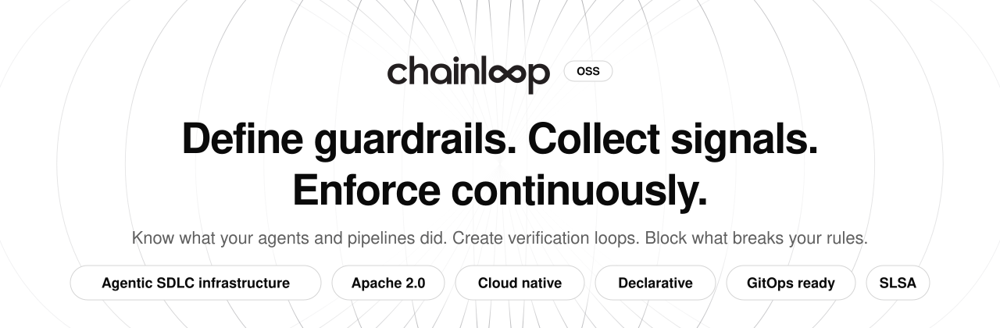
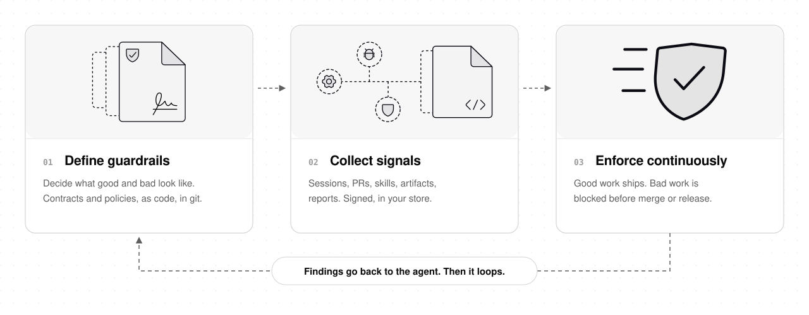
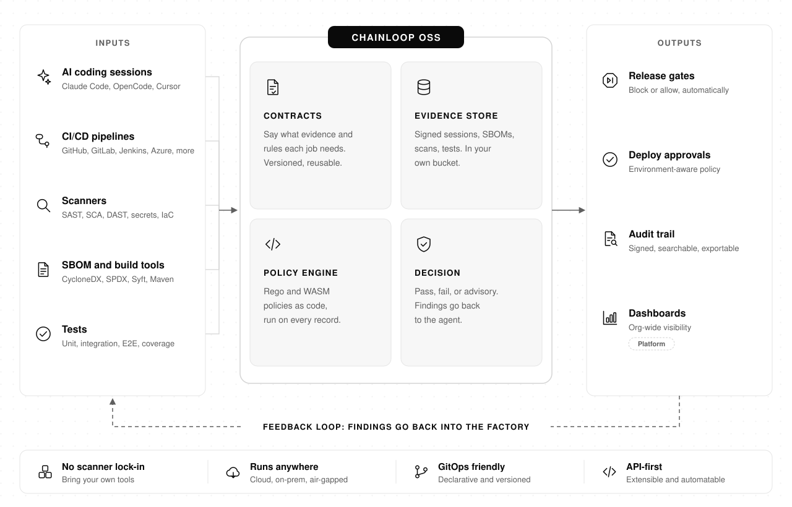
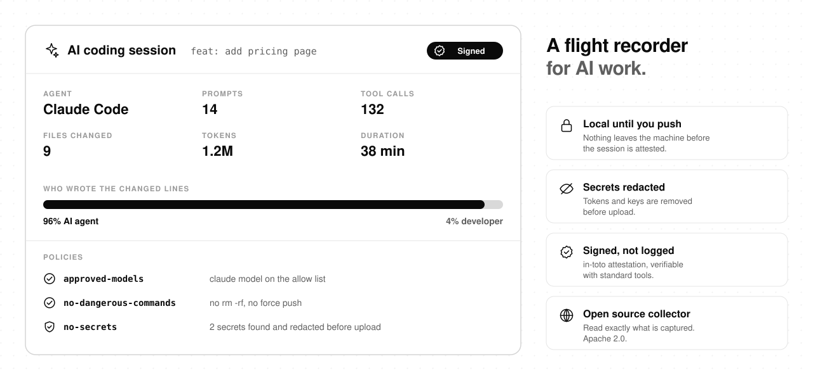
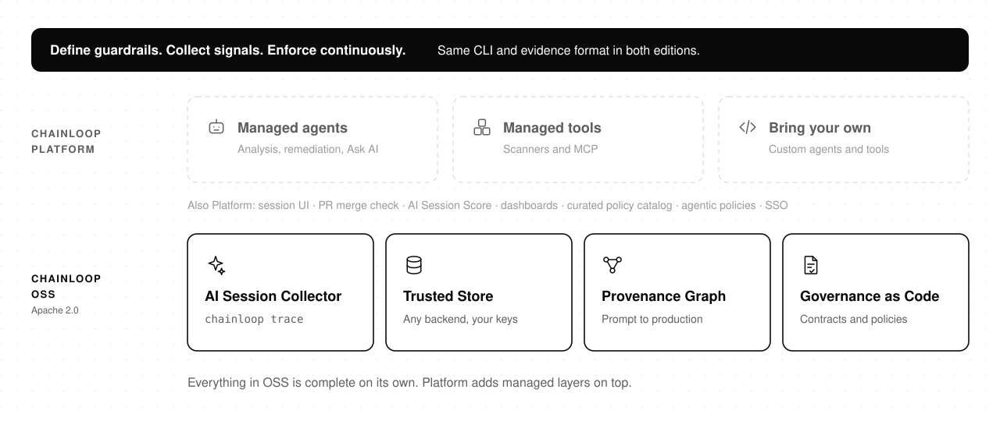

<p align="center">
  <picture>
    <source media="(prefers-color-scheme: dark)" srcset="./docs/img/readme/hero-dark.svg">
    
  </picture>
</p>

<p align="center">
  <a href="https://github.com/chainloop-dev/chainloop/blob/main/LICENSE.md"></a>
  <a href="https://securityscorecards.dev/viewer/?uri=github.com/chainloop-dev/chainloop"></a>
  <a href="https://insights.linuxfoundation.org/project/chainloop"></a>
  <a href="https://github.com/chainloop-dev/chainloop/actions/workflows/test.yml?query=branch%3Amain"></a>
  <a href="https://github.com/chainloop-dev/chainloop/releases"></a>
  <a href="https://join.slack.com/t/chainloop-community/shared_invite/zt-2k34dvx3r-u85uGP_KiLC6ic5Wy4aRnQ"></a>
</p>

<p align="center">
  <a href="https://chainloop.dev?utm_source=github&utm_medium=readme&utm_campaign=chainloop-oss&utm_content=header">Website</a> ·
  <a href="https://docs.chainloop.dev?utm_source=github&utm_medium=readme&utm_campaign=chainloop-oss&utm_content=header">Docs</a> ·
  <a href="https://docs.chainloop.dev/ai-sessions?utm_source=github&utm_medium=readme&utm_campaign=chainloop-oss&utm_content=header">AI Sessions Quickstart</a> ·
  <a href="#use-cases">Use cases</a> ·
  <a href="https://chainloop.dev/?utm_source=github&utm_medium=readme&utm_campaign=chainloop-oss&utm_content=header">Chainloop Platform</a> ·
  <a href="https://chainloop.dev/blog/?utm_source=github&utm_medium=readme&utm_campaign=chainloop-oss&utm_content=header">Blog</a> ·
  <a href="https://join.slack.com/t/chainloop-community/shared_invite/zt-2k34dvx3r-u85uGP_KiLC6ic5Wy4aRnQ">Slack</a> ·
  <a href="https://github.com/chainloop-dev/chainloop/releases">Changelog</a>
</p>

**Chainloop collects what happens across your software delivery, from the first prompt to the release, into one trusted graph. You define once what good means, as code, and Chainloop enforces it everywhere: every agent, every pipeline, every release.**

Every AI coding session, pull request, build, SBOM, scan, and test report becomes a signed, timestamped record in your own registry or bucket. Each record links to the commit and release it belongs to. Rules live in git. Break one and the pipeline fails. The job prints every failing policy and its reason where the agent reads it. The agent fixes the work and pushes again, until Chainloop is happy.

Open source, Apache 2.0, self-hostable. In production on critical infrastructure at highly regulated enterprises since 2024.

[Try it in 60 seconds](#try-it-in-60-seconds) | Like it? A star helps other teams find it | [Slack](https://join.slack.com/t/chainloop-community/shared_invite/zt-2k34dvx3r-u85uGP_KiLC6ic5Wy4aRnQ)

## How it works

<picture>
  <source media="(prefers-color-scheme: dark)" srcset="./docs/img/readme/loop-dark.svg">
  
</picture>

Every team already runs its own tools: SBOM generators, scanners, test suites, registries, and now coding agents. Each keeps its results in its own format, and none of them can enforce a rule that spans the others. Findings stay advisory, teams generate SBOMs nobody uses, and one new requirement means touching every pipeline. Chainloop sits on top of what you already run:

1. **Define guardrails.** A workflow contract says what every session and pipeline run must produce. Policies, in Rego or WASM, say what each record must satisfy: approved models only, no secrets in prompts, tests pass, every release has an SBOM. → [Contracts and policies](https://docs.chainloop.dev/concepts/policies?utm_source=github&utm_medium=readme&utm_campaign=chainloop-oss&utm_content=how-it-works)
2. **Collect signals.** `chainloop trace` records the agent session on the developer's machine and attests it on `git push`. `chainloop attestation` does the same in any CI job for SBOMs, scans, test reports, and SLSA provenance. Every record is a signed, timestamped in-toto attestation in your OCI registry, S3, or Azure Blob.
3. **Enforce continuously.** Chainloop checks every record against the contract and its policies. If it passes, it ships. If it fails, the pipeline fails, Chainloop signs the violations into the record, and the agent that opened the PR reads them and tries again. Chainloop Platform also blocks the PR.

For example:

| Good: it ships | Bad: it is blocked, and the findings go back |
|---|---|
| An approved agent and model wrote the change | An unapproved model, or an agent nobody allowed |
| Tests pass and coverage holds | A secret in a prompt, a transcript, or a commit |
| Every release has an SBOM and a clean scan | A critical CVE, or a release with no SBOM |
| The pipeline ran every step the contract asks for | A skipped step, a force push, or a dangerous command |

A contract says what a build must hand in and which rules apply. This one asks for a container image and its SBOM, and blocks the push when an SBOM component has no license:

```yaml
apiVersion: chainloop.dev/v1
kind: Contract
metadata:
  name: build
spec:
  materials:
    - name: image
      type: CONTAINER_IMAGE
    - name: sbom
      type: SBOM_CYCLONEDX_JSON
  runner:
    type: GITHUB_ACTION
  policies:
    materials:
      - ref: https://raw.githubusercontent.com/chainloop-dev/chainloop/main/docs/examples/policies/sbom/cyclonedx-licenses.yaml
        gate: true
```

`chainloop apply -f ./contracts/` pushes a directory of them, so a pull request is how a requirement changes. More contracts are in [docs/examples/contracts](./docs/examples/contracts).

A rule is a few lines of Rego. This one fails a build whose SARIF scan has an error:

```rego
violations contains msg if {
	has_errors
	msg := "There are errors in the SARIF report"
}

has_errors if {
	some run in input.runs
	some result in run.results
	result.level == "error"
}
```

Full policy: [sarif-errors.yaml](./docs/examples/policies/sarif-errors.yaml). Rules in the repo today: [sbom-present](./docs/examples/policies/sbom/sbom-present.yaml), [cyclonedx-banned-licenses](./docs/examples/policies/sbom/cyclonedx-banned-licenses.yaml), [sbom-freshness](./docs/examples/policies/sbom-freshness), [github-actions-security](./docs/examples/policies/github-actions-security), [trivy-vulns](./docs/examples/policies/trivy-vulns.yaml), [chainloop-commit](./docs/examples/policies/chainloop-commit.yaml). Write and test your own locally:

```bash
chainloop policy develop init --name sbom-licenses   # scaffold policy.yaml and policy.rego
chainloop policy develop lint                        # schema check plus Regal lint for the Rego
chainloop policy develop eval --policy policy.yaml --material sbom.json --kind SBOM_CYCLONEDX_JSON
```

**Why it holds up**

- **One set of rules for people, pipelines, and agents.** No separate "AI governance" track. The same contract gates a Claude Code session and a Jenkins job.
- **Rules are code, not prompts.** Rego and WASM policies give the same answer every time, and you test them locally before they gate anything.
- **Evidence you can hand to anyone.** Every record is a signed in-toto attestation in your own storage, verifiable with standard tools. Enforcement produces the compliance evidence, so nobody collects it by hand before the audit.
- **Start report-only, then gate.** `gate: false` on a policy reports violations and lets the run pass. `gate: true` blocks it. `chainloop organization update --block` sets the default for every policy, and the attestation records any bypass made with `--exception-bypass-policy-check`. You can roll a rule out across every team without breaking anyone's push on day one.

## Verification loops

Agents check their own work, and the 2026 research keeps finding the same hole. A verifier the agent wrote, running inside the agent's process, can be gamed. Chainloop puts the verifier outside the agent and closes the loop in CI/CD.

1. A human writes the intent once: a contract that says what a build must hand in, and policies that say what good means.
2. An agent does the work and opens a pull request.
3. The pipeline runs `chainloop attestation push`. Every policy runs on the signed record. The job prints each failing policy and why, and fails on a gated violation. On GitHub Actions the same report lands in the job summary.
4. The agent reads the failure, fixes the work, and pushes again. It loops until every gate passes. Every attempt, pass or fail, is a signed record.

What makes the verifier trustworthy:

- **Deterministic.** Policies are Rego or WASM in git, run by the CLI, not by a model. The same input gives the same answer every time.
- **Outside the agent.** The gate runs in the pipeline. The agent cannot turn it off from inside a session, and the record shows any bypass.
- **On evidence the agent cannot edit.** Every run is a signed in-toto attestation in your own storage, with the policy results signed into it.
- **With the intent attached.** `chainloop trace` attests the ticket, doc, or approved plan the agent worked from, next to the session. The record holds what was asked and what was produced.

Chainloop Platform adds the PR merge check, LLM reviewers on the record, and an AI Session Score per pull request.

## Try it in 60 seconds

The CLI sends records to Chainloop Cloud by default. [Sign up](https://app.chainloop.dev/login?utm_source=github&utm_medium=readme&utm_campaign=chainloop-oss&utm_content=try-it-in-60-seconds) and log in once. It is free for 14 days. Self-hosting is free and unlimited, with [Docker Compose or the Helm chart](#self-host). The CLI and the evidence format are the same. The CLI sends anonymous usage stats. `DO_NOT_TRACK=1` turns them off.

```bash
curl -sfL https://dl.chainloop.dev/cli/install.sh | bash -s -- --oss
chainloop auth login        # opens a browser. First login creates your account and organization
```

Two ways to start. Collect signals from the pipelines you already run, or trace AI coding sessions and attest them on `git push`. Same CLI, same record.

**Collect signals from your CI/CD.** Three lines in any job produce an *attestation*: a signed record of what the job built and checked.

```bash
chainloop attestation init --workflow build --project my-app
chainloop attestation add --value sbom.cyclonedx.json
chainloop attestation push   # prints a link to the attestation
```

`chainloop attestation status` shows what the contract still expects. Attach a [contract](#how-it-works) with `gate: true` on a policy and the job fails when a rule breaks, with each violation printed. That is the loop from the section above. Running it locally after `auth login`? Answer `y` at the prompt, or pass `-y`. → [Quickstart](https://docs.chainloop.dev/quickstart?utm_source=github&utm_medium=readme&utm_campaign=chainloop-oss&utm_content=try-it-in-60-seconds) · [Your first attestation](https://docs.chainloop.dev/get-started/first-attestation?utm_source=github&utm_medium=readme&utm_campaign=chainloop-oss&utm_content=try-it-in-60-seconds) · [add a contract](https://docs.chainloop.dev/get-started/adding-contract?utm_source=github&utm_medium=readme&utm_campaign=chainloop-oss&utm_content=try-it-in-60-seconds) · [add policies](https://docs.chainloop.dev/get-started/adding-policies?utm_source=github&utm_medium=readme&utm_campaign=chainloop-oss&utm_content=try-it-in-60-seconds)

**Trace AI coding sessions.** Not every team starts here. When you do, it is one command per repo:

```bash
chainloop trace init        # installs the git and agent hooks, writes .chainloop.yml
```

`trace init` writes `.chainloop.yml` and git hooks (`pre-push`, `post-commit`, `commit-msg`, `post-rewrite`) in the current repo, and `trace uninstall` removes them. Session data stays on your machine until `git push`, and the CLI redacts secrets before upload. The [AI Sessions Quickstart](https://docs.chainloop.dev/ai-sessions?utm_source=github&utm_medium=readme&utm_campaign=chainloop-oss&utm_content=try-it-in-60-seconds) lists what it sends.

Now code with Claude Code, OpenCode, or Cursor, commit, and `git push`. The push hook attests the session and prints where to see it:

```text
Coding Session Available at https://app.chainloop.dev/u/<org>/sessions/<id>
```

Add `requireTrace: true` to `.chainloop.yml` and the hook rejects a push with no recorded session. → [AI Sessions Quickstart](https://docs.chainloop.dev/ai-sessions?utm_source=github&utm_medium=readme&utm_campaign=chainloop-oss&utm_content=try-it-in-60-seconds) · [CLI install options](https://docs.chainloop.dev/cli/installation?utm_source=github&utm_medium=readme&utm_campaign=chainloop-oss&utm_content=try-it-in-60-seconds)

## Who is it for

| Team | What they use Chainloop for |
|---|---|
| **Platform engineering** | One place for the evidence from the tools every team already runs, on top of the existing CI/CD. New requirements go in progressively, from report-only to gated, without touching pipelines. |
| **Security** | One vulnerability threshold across every scanner, required secret scans, signed attestations and SLSA provenance, and control gates in CI/CD. |
| **Compliance and risk** | Evidence collected as a side effect of building. Policy results kept as signed records. SBOMs centralized and used. The lineage of a release from one digest at audit time. Fits regulated industries under the CRA, DORA, or FedRAMP. |
| **Engineering leaders** | Visibility and control over AI agents: which models write code in which repositories, what it costs, and policies on the sessions themselves. |
| **Developers** | One CLI step that says what the contract still expects, and AI coding sessions attested on `git push`. No in-toto, Sigstore, or SLSA to learn. |

A workflow contract is the API between the people who set the rules and the people who ship. Security writes it once, every team inherits it, and nobody needs a meeting.

## What's in the box

<picture>
  <source media="(prefers-color-scheme: dark)" srcset="./docs/img/readme/architecture-dark.svg">
  
</picture>

| Component | What it does |
|---|---|
| [AI session collector](./app/cli/cmd/trace.go) (`chainloop trace`) | Records Claude Code, OpenCode, and Cursor sessions, redacts secrets, attributes AI and human lines, and attests the session on `git push`. `requireTrace` in `.chainloop.yml` blocks a push that has no record. |
| [CLI](./app/cli) (`chainloop`) | One integration point for every major CI runner and 45 evidence types. It crafts, signs, and pushes attestations, and runs policies. |
| [Trusted store](./app/artifact-cas) | Content-addressable storage for evidence, backed by an OCI registry, S3, Azure Blob Storage, or inline. Your storage, your keys. Called the Artifact CAS in the code. |
| [Signing](./pkg/attestation/signer) | in-toto attestations, keyless by default, or your own cosign / KMS keys, or SignServer. Timestamped. |
| [Provenance graph](./app/controlplane) | The trusted graph from the intro. The control plane links sessions, commits, builds, and releases into one lineage, with organizations, projects, and workflows. |
| [Governance as code](./pkg/policies) | Workflow contracts declare what each job must produce. Rego and WASM policies run on every record. Write and test them locally with `chainloop policy develop`. |
| [Integrations](./app/controlplane/plugins) | Dependency-Track, GUAC, Slack, Discord, webhooks, SMTP, and a plugin SDK for your own. |

**Works with.** Runners: GitHub Actions, GitLab CI, Azure Pipelines, Jenkins, CircleCI, Dagger, TeamCity, Tekton, Docker sandboxes, or any shell as a generic runner. Storage: OCI registry, AWS S3, Azure Blob Storage, or inline for small files. Signing: keyless through the control plane with a file-based CA or [EJBCA](https://docs.chainloop.dev/guides/deployment/guides/ejbca?utm_source=github&utm_medium=readme&utm_campaign=chainloop-oss&utm_content=what-s-in-the-box), [cosign](https://docs.sigstore.dev/cosign) keys, KMS, Keyfactor [SignServer](https://docs.chainloop.dev/guides/signserver?utm_source=github&utm_medium=readme&utm_campaign=chainloop-oss&utm_content=what-s-in-the-box), and an optional timestamp authority ([signing reference](https://docs.chainloop.dev/reference/signing?utm_source=github&utm_medium=readme&utm_campaign=chainloop-oss&utm_content=what-s-in-the-box)). Dependencies: any OIDC provider, PostgreSQL, and Vault, AWS Secrets Manager, GCP Secret Manager, or Azure Key Vault for credentials.

<details>
<summary><b>Repository layout</b></summary>

| Path | What it is |
|---|---|
| [app/controlplane](./app/controlplane) | Control plane: API, contracts, policy evaluation, run index, integrations |
| [app/artifact-cas](./app/artifact-cas) | Content-addressable storage proxy for OCI, S3, and Azure Blob |
| [app/cli](./app/cli) | The `chainloop` CLI, including `chainloop trace` |
| [pkg](./pkg) | Shared libraries: attestation crafter, evidence types, runners, signers, policy engine |
| [deployment/chainloop](./deployment/chainloop) | Helm chart |
| [docs/examples](./docs/examples) | Example contracts, policies, and CI workflows |
| [extras/dagger](./extras/dagger) | Chainloop module for Dagger pipelines |

</details>

<a id="supported-evidence"></a>
<details>
<summary><b>Supported evidence (45 types)</b></summary>

During an attestation you can attach these evidence types. The CLI uploads files to the [trusted store](https://docs.chainloop.dev/concepts/cas-backend?utm_source=github&utm_medium=readme&utm_campaign=chainloop-oss&utm_content=what-s-in-the-box) and references them in a signed in-toto attestation. Full reference: [evidence types](https://docs.chainloop.dev/concepts/material-types?utm_source=github&utm_medium=readme&utm_campaign=chainloop-oss&utm_content=what-s-in-the-box).

- **AI:** Chainloop AI Coding Session, Chainloop AI Agent Config
- **SBOM:** [CycloneDX](https://github.com/CycloneDX/specification), [SPDX](https://spdx.dev/specifications/)
- **VEX and advisories:** [OpenVEX](https://github.com/openvex), [CSAF VEX](https://docs.oasis-open.org/csaf/csaf/v2.0/os/csaf-v2.0-os.html#45-profile-5-vex), [CSAF Informational Advisory](https://docs.oasis-open.org/csaf/csaf/v2.0/os/csaf-v2.0-os.html#43-profile-3-informational-advisory), [CSAF Security Advisory](https://docs.oasis-open.org/csaf/csaf/v2.0/os/csaf-v2.0-os.html#44-profile-4-security-advisory), [CSAF Security Incident Report](https://docs.oasis-open.org/csaf/csaf/v2.0/os/csaf-v2.0-os.html#42-profile-2-security-incident-response)
- **Scans:** [SARIF](https://docs.oasis-open.org/sarif/sarif/v2.1.0/), [GitLab Security report](https://docs.gitlab.com/ee/user/application_security/), [ZAP DAST](https://github.com/marketplace/actions/zap-baseline-scan), [BlackDuck SCA](https://www.blackduck.com/software-composition-analysis-tools/black-duck-sca.html), [Prisma Cloud Twistcli](https://docs.prismacloud.io/en/compute-edition/30/admin-guide/tools/twistcli-scan-images), [Checkmarx One](https://github.com/Checkmarx/ast-cli/blob/main/internal/wrappers/results-json.go), [Oversecured](https://docs.oversecured.com/docs/guide-exporting-reports), [OpenSSF Scorecard](https://github.com/ossf/scorecard), [CERT/CC dranzer](https://github.com/CERTCC/dranzer), [Sysinternals Sigcheck](https://learn.microsoft.com/en-us/sysinternals/downloads/sigcheck), [Sysinternals AccessChk](https://learn.microsoft.com/en-us/sysinternals/downloads/accesschk), [radamsa](https://gitlab.com/akihe/radamsa) metadata log and crashing inputs
- **GitHub Advanced Security:** [code scanning](https://docs.github.com/en/rest/code-scanning/code-scanning), [secret scanning](https://docs.github.com/en/rest/secret-scanning/secret-scanning), [dependency scanning](https://docs.github.com/en/rest/dependabot/alerts)
- **Secrets:** [Gitleaks](https://github.com/gitleaks/gitleaks), [TruffleHog](https://github.com/trufflesecurity/trufflehog), [detect-secrets](https://github.com/Yelp/detect-secrets)
- **Tests and coverage:** [JUnit](https://www.ibm.com/docs/en/developer-for-zos/14.1?topic=formats-junit-xml-format), [JaCoCo](https://www.jacoco.org/jacoco/trunk/doc/), [Cobertura](https://github.com/cobertura/cobertura), [PIT mutation testing](https://pitest.org/)
- **Provenance and artifacts:** [SLSA provenance](https://slsa.dev/spec/v1.1/provenance), [container image](https://github.com/opencontainers/image-spec), [Helm chart](https://helm.sh/docs/topics/charts/), artifact, existing Chainloop attestations
- **API specs:** [OpenAPI](https://spec.openapis.org/oas/latest.html), [AsyncAPI](https://www.asyncapi.com/docs/reference/specification/latest), [GraphQL SDL](https://spec.graphql.org/)
- **Collected automatically:** runner context, pull request info
- **Generic:** key-value metadata, custom evidence (any file, for example an approval report in JSON)

</details>

## Use cases

**Put guardrails on coding agents.** Record every Claude Code, OpenCode, or Cursor session as a signed record, and run your policies on every session. Catch an unapproved model, a secret in the transcript, or more AI lines than the rule allows. Chainloop signs violations into the record, and they fail the pipeline that builds the PR. `requireTrace: true` rejects a push with no recorded session. → [AI Sessions Quickstart](https://docs.chainloop.dev/ai-sessions?utm_source=github&utm_medium=readme&utm_campaign=chainloop-oss&utm_content=use-cases) · [Policies](https://docs.chainloop.dev/concepts/policies?utm_source=github&utm_medium=readme&utm_campaign=chainloop-oss&utm_content=use-cases) · [AI coding governance](https://chainloop.dev/solutions/ai-coding-governance/?utm_source=github&utm_medium=readme&utm_campaign=chainloop-oss&utm_content=use-cases)

**Trace a release back to the prompt.** Follow any release back through the build and the commit to the AI session that started it. `chainloop referrer discover --digest <sha256>` returns every attestation that references an artifact, SBOM, or commit, and what those reference in turn. One record, from prompt to production. → [AI Sessions Quickstart](https://docs.chainloop.dev/ai-sessions?utm_source=github&utm_medium=readme&utm_campaign=chainloop-oss&utm_content=use-cases)

**CI/CD compliance without the spreadsheet.** Every pipeline run produces signed evidence that it followed your contract: the right steps, the right tools, the right environment. The pipeline collects the evidence for CRA, NIST SSDF, SLSA, and SOC 2, so nobody collects it by hand before the audit. → [Continuous compliance](https://chainloop.dev/solutions/continuous-compliance/?utm_source=github&utm_medium=readme&utm_campaign=chainloop-oss&utm_content=use-cases)

**Store and share SBOMs.** Collect CycloneDX and SPDX SBOMs from every build. Chainloop keeps them signed, versioned, and linked to the release, in your own OCI registry or S3 bucket. It can forward them to [Dependency-Track](https://docs.chainloop.dev/guides/dependency-track?utm_source=github&utm_medium=readme&utm_campaign=chainloop-oss&utm_content=use-cases) or [GUAC](./app/controlplane/plugins/core/guac/v1/README.md) for analysis. SARIF, test, coverage, and SLSA provenance records live in the same place. → [Storage backends](./pkg/blobmanager) · [SBOM traceability](https://chainloop.dev/solutions/sbom-traceability/?utm_source=github&utm_medium=readme&utm_campaign=chainloop-oss&utm_content=use-cases)

**One vulnerability threshold across every scanner.** A policy can carry a module per evidence type. The same rule then applies to Trivy, Grype, Snyk, BlackDuck, or Dependabot reports alike. Policy groups bundle policies and their parameters for reuse across contracts. → [Policies](https://docs.chainloop.dev/concepts/policies?utm_source=github&utm_medium=readme&utm_campaign=chainloop-oss&utm_content=use-cases) · [Control gates](https://docs.chainloop.dev/concepts/control-gates?utm_source=github&utm_medium=readme&utm_campaign=chainloop-oss&utm_content=use-cases)

**Manage VEX.** Attach OpenVEX or CSAF VEX statements to a release, so your users and their scanners know which vulnerabilities affect you. → [Evidence types](https://docs.chainloop.dev/concepts/material-types?utm_source=github&utm_medium=readme&utm_campaign=chainloop-oss&utm_content=use-cases)

**Govern every CI/CD pipeline the same way.** A workflow contract says what each pipeline must produce, and Chainloop checks every run. This works the same on GitHub Actions, GitLab, Jenkins, Azure Pipelines, CircleCI, Tekton, Dagger, TeamCity, and more. Start with an optional material and a report-only policy, then make them required and gated in the next contract revision. The pipelines do not change. → [Workflow contracts](https://docs.chainloop.dev/concepts/contracts?utm_source=github&utm_medium=readme&utm_campaign=chainloop-oss&utm_content=use-cases) · [Automated SDLC governance](https://chainloop.dev/solutions/automated-sdlc-governance/?utm_source=github&utm_medium=readme&utm_campaign=chainloop-oss&utm_content=use-cases)

## Spotlight: the AI session collector

<picture>
  <source media="(prefers-color-scheme: dark)" srcset="./docs/img/readme/ai-session-card-dark.svg">
  
</picture>

Git tells you what changed. It no longer tells you how. `chainloop trace` records the part that never reaches git, and attests it as signed evidence when you push. Commits you wrote by hand pass through untouched. This repository traces its own development: see [.chainloop.yml](./.chainloop.yml).

| Agent | Status |
|---|---|
| Claude Code | Supported, with token usage and cost |
| OpenCode | Supported, with token usage and cost |
| Cursor | Experimental, no token usage or cost yet |
| Codex, GitHub Copilot, Gemini, Windsurf, Amp | Coming. [Contributions welcome](#community-and-contributing) |

Wanted: new collector providers for the agents above, and new evidence types. The provider interface is in [app/cli/internal/trace](./app/cli/internal/trace).

Why we open sourced the collector, and what it records: [launch post](https://chainloop.dev/blog/open-sourcing-ai-session-collector/?utm_source=github&utm_medium=readme&utm_campaign=chainloop-oss&utm_content=spotlight-the-ai-session-collector).

## Chainloop OSS vs Chainloop Platform

<picture>
  <source media="(prefers-color-scheme: dark)" srcset="./docs/img/readme/blocks-dark.svg">
  
</picture>

Everything in OSS is complete on its own. Platform adds managed layers on top: same CLI, same evidence format.

| | Chainloop OSS | Chainloop Platform |
|---|---|---|
| **What** | Everything in [What's in the box](#whats-in-the-box) | Everything in OSS, plus the layers below |
| **Define** | Workflow contracts, your own Rego / WASM policies | Curated policy catalog, agentic (AI reviewer) policies |
| **Collect** | AI session collector on developer machines, CLI in any CI, every evidence type, trusted store in your bucket | Same collector and CLI, no fork, plus managed storage |
| **Enforce** | Report-only or gated on every record, the job fails on a gated violation, push gate (`requireTrace`) | PR merge check, AI Session Score, LLM-driven policies |
| **Act** | Integrations and webhooks | Managed agents (analysis, remediation, Ask AI), managed tools (scanners, MCP), bring your own agents and tools |
| **See** | CLI and API | Session replay, org-wide dashboards, risk scoring |
| **Run** | Self-hosted, Apache 2.0, complete on its own | SaaS or on-prem Enterprise, SSO |

See [chainloop.dev](https://chainloop.dev?utm_source=github&utm_medium=readme&utm_campaign=chainloop-oss&utm_content=chainloop-oss-vs-chainloop-platform) and [pricing](https://chainloop.dev/pricing/?utm_source=github&utm_medium=readme&utm_campaign=chainloop-oss&utm_content=chainloop-oss-vs-chainloop-platform), or [talk to the founders](https://chainloop.dev/book-a-demo/?utm_source=github&utm_medium=readme&utm_campaign=chainloop-oss&utm_content=chainloop-oss-vs-chainloop-platform).

Deployment guides: [open source](https://docs.chainloop.dev/guides/deployment/oss?utm_source=github&utm_medium=readme&utm_campaign=chainloop-oss&utm_content=chainloop-oss-vs-chainloop-platform) and [Platform](https://docs.chainloop.dev/guides/deployment/chainloop-ee?utm_source=github&utm_medium=readme&utm_campaign=chainloop-oss&utm_content=chainloop-oss-vs-chainloop-platform). Try Chainloop Cloud [free for 14 days](https://app.chainloop.dev/login?utm_source=github&utm_medium=readme&utm_campaign=chainloop-oss&utm_content=chainloop-oss-vs-chainloop-platform), or [self-host](#self-host) for free.

## Security and trust

- **Local until you push.** AI session data stays on your machine until the push attests the session, and the CLI redacts secrets before upload.
- **Signed, not logged.** Every record is an in-toto attestation signed with Sigstore keyless or your own keys. Anyone you choose can verify it with standard tools, or with `chainloop attestation verify --bundle attestation.json`.
- **Verified installs.** The installer checks checksums, and also verifies the signature when [`cosign`](https://docs.sigstore.dev/cosign) is installed. Pass `--force-verification` to make signature verification required.
- **Scorecard.** Our [OpenSSF Scorecard](https://securityscorecards.dev/viewer/?uri=github.com/chainloop-dev/chainloop) is public. Report vulnerabilities through [SECURITY.md](./SECURITY.md).
- **Telemetry.** The CLI sends anonymous usage data. Set `DO_NOT_TRACK=1` to turn it off. [Details](https://docs.chainloop.dev/cli/telemetry?utm_source=github&utm_medium=readme&utm_campaign=chainloop-oss&utm_content=security-and-trust).

Built on open standards: [Sigstore](https://www.sigstore.dev/), [in-toto](https://in-toto.io/), [SLSA](https://slsa.dev), [OCI](https://github.com/opencontainers/image-spec), [CycloneDX](https://cyclonedx.org/), [SPDX](https://spdx.dev/), [OpenVEX](https://github.com/openvex), [SARIF](https://docs.oasis-open.org/sarif/sarif/v2.1.0/), and [OPA](https://www.openpolicyagent.org/).

## Self-host

<details>
<summary><b>Run Chainloop on your own infrastructure</b></summary>

**Kubernetes.** Deploy the control plane and the trusted store with the [Helm chart](./deployment/chainloop/). The [self-hosting guide](https://docs.chainloop.dev/guides/deployment/oss?utm_source=github&utm_medium=readme&utm_campaign=chainloop-oss&utm_content=self-host) walks through it step by step.

**Local stack.** Start the full stack (control plane, store, Postgres, Vault, Dex) with Docker Compose. The steps, including how to get the development token, are in [devel/README.md](./devel/README.md).

```bash
docker compose -f devel/compose.labs.yml up
```

**Quick evaluation.** Development mode bundles Vault and Dex, so you need nothing else:

```bash
helm install chainloop oci://ghcr.io/chainloop-dev/charts/chainloop --set development=true
```

**Point the CLI at your instance:**

```bash
chainloop config save \
  --control-plane my-controlplane.acme.com \
  --artifact-cas cas.acme.com
chainloop auth login
```

**Install options:**

```bash
# a specific version
curl -sfL https://dl.chainloop.dev/cli/install.sh | bash -s -- --oss --version v1.7.0
# a custom install path (default /usr/local/bin)
curl -sfL https://dl.chainloop.dev/cli/install.sh | bash -s -- --oss --path /my-path
# require cosign signature verification
curl -sfL https://dl.chainloop.dev/cli/install.sh | bash -s -- --oss --force-verification
```

You can also download the CLI from the [releases page](https://github.com/chainloop-dev/chainloop/releases) or [build it from source](./CONTRIBUTING.md). To install the Chainloop Platform CLI instead, omit `--oss`.

</details>

## Documentation

- [Docs home](https://docs.chainloop.dev?utm_source=github&utm_medium=readme&utm_campaign=chainloop-oss&utm_content=documentation) · [Quickstart](https://docs.chainloop.dev/quickstart?utm_source=github&utm_medium=readme&utm_campaign=chainloop-oss&utm_content=documentation) · [AI Sessions Quickstart](https://docs.chainloop.dev/ai-sessions?utm_source=github&utm_medium=readme&utm_campaign=chainloop-oss&utm_content=documentation)
- [Concepts](https://docs.chainloop.dev/concepts/attestations?utm_source=github&utm_medium=readme&utm_campaign=chainloop-oss&utm_content=documentation): attestations, contracts, policies, evidence types, the trusted store
- [CLI reference](https://docs.chainloop.dev/cli/reference?utm_source=github&utm_medium=readme&utm_campaign=chainloop-oss&utm_content=documentation) · [API reference](https://docs.chainloop.dev/api-reference?utm_source=github&utm_medium=readme&utm_campaign=chainloop-oss&utm_content=documentation) · [Self-hosting guide](https://docs.chainloop.dev/guides/deployment/oss?utm_source=github&utm_medium=readme&utm_campaign=chainloop-oss&utm_content=documentation)
- For agents and LLMs: [docs.chainloop.dev/llms.txt](https://docs.chainloop.dev/llms.txt) indexes the whole site, and [llms-full.txt](https://docs.chainloop.dev/llms-full.txt) has the full text. Every page is available as Markdown when you add `.md` to its URL, for example [cli/reference.md](https://docs.chainloop.dev/cli/reference.md)

## For AI coding agents

> [!NOTE]
> **If you are an AI coding agent setting up Chainloop in this repository:** Install the CLI with `curl -sfL https://dl.chainloop.dev/cli/install.sh | bash -s -- --oss`. Ask the user to run `chainloop auth login`, which opens a browser. Then run `chainloop trace init --project <name>` from the repository root. Add `--claude`, `--cursor`, or `--opencode` for the agents in use. The command writes `.chainloop.yml` and git hooks. Commit `.chainloop.yml`. The docs index for agents is https://docs.chainloop.dev/llms.txt. Any docs page is available as Markdown when you add `.md` to its URL. [Documentation](https://docs.chainloop.dev/ai-sessions?utm_source=github&utm_medium=readme&utm_campaign=chainloop-oss&utm_content=for-ai-coding-agents)

Or paste this into Claude Code, Codex, or Cursor:

```text
Read https://github.com/chainloop-dev/chainloop/blob/main/README.md and set up Chainloop AI session recording for this repository.
```

## Community and contributing

The [Chainloop](https://chainloop.dev/about/?utm_source=github&utm_medium=readme&utm_campaign=chainloop-oss&utm_content=community-and-contributing) team and contributors have built Chainloop OSS in the open since 2023. It runs in production at enterprises in regulated markets, including Fortune 500 companies and financial institutions, for SDLC governance and compliance.

- [Slack](https://join.slack.com/t/chainloop-community/shared_invite/zt-2k34dvx3r-u85uGP_KiLC6ic5Wy4aRnQ): ask anything, show us a policy you wrote, or tell us which agent you need a collector for. The maintainers are there. Also [GitHub Issues](https://github.com/chainloop-dev/chainloop/issues) and [YouTube](https://www.youtube.com/channel/UCISrWrPyR_AFjIQYmxAyKdg)
- Start here: [good first issues](https://github.com/chainloop-dev/chainloop/labels/good%20first%20issue)
- Read [CONTRIBUTING.md](./CONTRIBUTING.md), our [AI contribution policy](./AI_POLICY.md), and the [Code of Conduct](./CODE_OF_CONDUCT.md)

## Changelog

Chainloop OSS releases, with notes, are on the [GitHub releases page](https://github.com/chainloop-dev/chainloop/releases). Chainloop Platform changes are in the [Platform changelog](https://docs.chainloop.dev/changelog?utm_source=github&utm_medium=readme&utm_campaign=chainloop-oss&utm_content=changelog).

## License

Chainloop is released under the Apache License, Version 2.0. See [LICENSE](./LICENSE.md).
