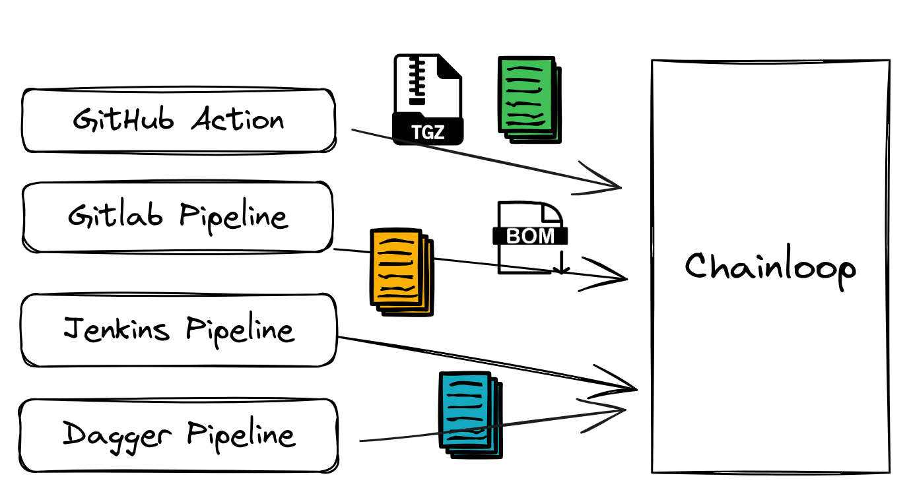
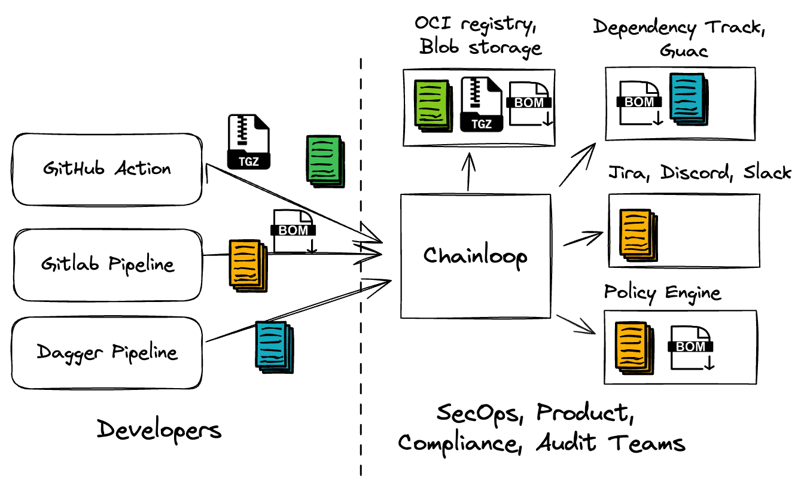

# Chainloop Core

> This is an early preview of the Chainloop Core project
> and you should expect breaking changes before the first stable release.

## Overview

**Chainloop Core (Chainloop)** is an open source project, a Control Plane for all your CI/CD engines.

Integration with existing pipelines is easy and requires only a few simple steps, including registration of a contract for the pipeline in the control plane, setup of the provided service account in the CI, and attestation crafting using Chainloop's CLI.

Chainloop provides:

- **Compliant Single Source of Truth.** A SLSA level 3 compliant single Source of truth for artifacts and attestation built on OSS standards such as Sigstore, in-toto, SLSA and OCI. Developers can craft and store attestation metadata and artifacts via a single integration point, regardless of their CI/CD provider choice.
- **Contract-based attestation.** Workflow Contracts give operators full control over what kind of data (build info, materials) must be received as part of the attestation and the environment where these workflows must be executed.
- **Third-Party Integration fan-out.** Operators can set up third-party integrations such as Dependency-Track for SBOM analysis or an OCI registry for storage of the received artifacts and attestation metadata.
- **Observability/Auditability**. The control plane provides org-wide workflow, attestation, and artifacts visibility, including error rates, and operational anomalies.
- Chainloop provides **a role-tailored experience**, clearly defining the responsibilities and functional scope of the Security/Operation (SecOps) and Development/Application teams.

To learn more, please visit the Chainloop project's documentation website, https://docs.chainloop.dev.

## Documentation

The documentation provides a getting started guide, FAQ, examples, and more.

To learn more, please visit the Chainloop project's documentation website, https://docs.chainloop.dev.

## Community / Discussion / Support

Chainloop is developed in the open and is constantly improved by our users, contributors and maintainers. Got a question, comment, or idea? Please don't hesitate to reach out via:

- GitHub [Discussions](https://github.com/chainloop-dev/chainloop/discussions),
- GitHub [Issues](https://github.com/chainloop-dev/chainloop/issues),
- or [Chainloop Discord Community Server](https://discord.gg/f7atkaZact).

## Contributing

Want to get involved? Contributions are welcome.

If you are ready to jump in and test, add code, or help with documentation, please follow the instructions on
our [Contribution](CONTRIBUTING.md) page. At all times, follow our [Code of Conduct](./CODE_OF_CONDUCT.md).

See the [issue tracker](https://github.com/chainloop-dev/chainloop/issues) if you're unsure where to start, especially the [Good first issue](https://github.com/chainloop-dev/chainloop/labels/good%20first%20issue) label.postpo

## Changelog

Take a look at the list of [releases](http://github.com/chainloop-dev/chainloop/releases) to stay tuned for the latest features and changes.

## License

Chainloop is released under the Apache License, Version 2.0. Please see the [LICENSE](./LICENSE.md) file for more information.
