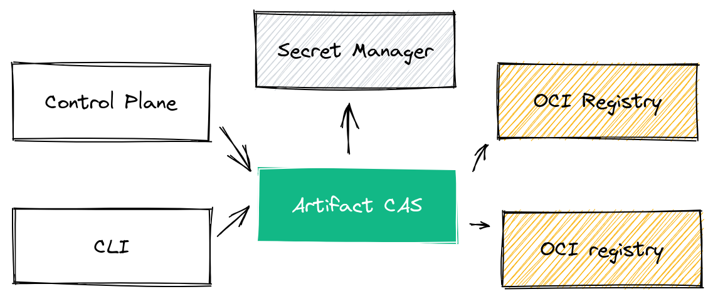

# Artifact Content Addressable Storage (CAS) Proxy

The artifact proxy is a **Content Addressable Storage (CAS) Proxy** that sits in front of different storage backends.

Clients such as the Chainloop Control Plane or the CLI can use this proxy to make sure that **immutable uploads are performed**. Files that later, on **can only be referenced by their content digest (sha256)**.

NOTE: At the moment of this writing, only an [OCI](https://opencontainers.org/) storage backend is supported. In the future you should potentially expect Object Storage Support (i.e AWS s3) as well.



The project is a [Go](https://go.dev/) service that leverages [protocol buffers](https://github.com/protocolbuffers/protobuf) and [gRPC](https://grpc.io/) for its streaming API, [wire](https://github.com/google/wire/) for dependency injection and the [Kratos framework](https://github.com/go-kratos/kratos) for additional utilities such middlewares, configuration management or error handling.

The proxy API implements [a bytestream](https://pkg.go.dev/google.golang.org/api/transport/bytestream) gRPC service. This enables an efficient, and modern, streaming API for chunk based operations on top of HTTP/2.

Its structure contains the following top to down layers.

- API definition layer `./api/`. proto definitions and generated code for the external gRPC API
- Server layer `./internal/server`. Definition and registration of the HTTP and gRPC servers and middlewares.
- Service layer `./internal/service`. Implementation of the protocol buffer services.

## System Dependencies

The CAS proxy **has only one running dependency**. A secret storage backend to retrieve the OCI repository credentials. Currently we support both [Hashicorp Vault](https://www.vaultproject.io/) and [AWS Secret Manager](https://aws.amazon.com/secrets-manager/).

This secret backend is used to download OCI repository credentials (repository path + key pair) during upload/downloads. This makes the Artifact CAS multi-tenant by default since the destination OCI backend gets selected at runtime.

## AuthN/AuthZ

The Artifact CAS API expects each request to contain a [JSON Web Token](https://auth0.com/docs/secure/tokens/json-web-tokens) with references to a) what operation is this token allowed to do (Download, Upload) and b) a reference to where the CAS can find the OCI credentials.

Currently, this token is generated by the Control Plane and used on demand. You can find the generator we use to craft those tokens [here](../../internal/robotaccount/cas/robotaccount.go).

The token gets signed by the control plane with a private key and verified by the CAS with the previously configured public key.

Note: there are plans to support [JWKS endpoints](https://auth0.com/docs/secure/tokens/json-web-tokens/json-web-key-sets) to enable easy rotation of credentials.

## Runbook

We leverage `make` for most development tasks. Run `make -C app/artifact-cas` to see a list of the available tasks.

### Run the project in development

Refer to [development guide](../../devel/README.md) for more information but in a nutshell.

```
# Run external dependency (Vault for secret management)

docker compose -f devel/docker-compose.yml up

# Run the service
make -C app/artifact-cas run
```

Next, follow the steps that can be found [here](../../devel/README.md#4---using-the-cli-pointing-to-the-local-environment) to configure the CLI

Once configured you can try to perform a file upload and download.

```sh
cd app/cli
go run main.go --insecure artifact upload -f [FILE] # will return a sha256 digest

# download
go run main.go --insecure artifact download -d [sha256:...]
```

### Run tests

```
make test
```

### Build binary

```
make build
```

### Generate API code from protocol buffer defintions (\*.proto)

We leverage buf.io to lint and generate proto files. Make sure you [install buf](https://docs.buf.build/installation) first. Once done, generating the API code is as easy as executing

```
make api
```

### Update configuration schema

The service runtime configuration is implemented by using [kratos built-in config module](https://go-kratos.dev/en/docs/component/config/).

Meaning that the configuration schema is defined at `internal/conf/conf.proto`.

To regenerate it run:

```
make config
```

### Update dependency injection

In order to enforce inversion of control and prevent import cycles we use [wire](https://github.com/google/wire/) for dependency injection.

Wire has a fairly steep learning curve, so we recommend taking a look [at their tutorial](https://github.com/google/wire/blob/main/_tutorial/README.md). In practice, in this project you will find a couple of wire_gen.go files (i.e `cmd/wire_gen.go`) and different provider defined.

If you need to re-generate the injection code after a change just run `make generate`

## Contribution guidelines

Please make sure to review the [Contribution guidelines](../../CONTRIBUTING.md) and feel free to reach out if you have any questions!

Welcome!
