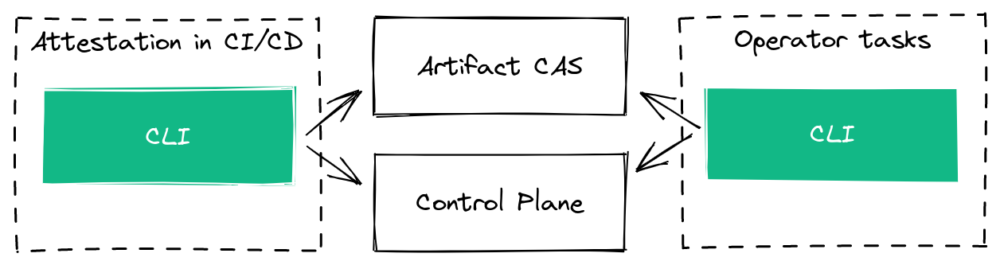

# Command Line Interface (CLI)

This Command Line Interface (CLI) is a local client that's used for two purposes:

a) Operator [Management Tasks](https://docs.chainloop.dev/getting-started/workflow-definition)

- operate on the [control plane](../controlplane/)
- upload/download artifacts to the [artifact proxy](../artifact-cas/).

b) [Attestation Crafting Process](https://docs.chainloop.dev/getting-started/attestation-crafting)

- Perform the [attestation process](https://docs.chainloop.dev/getting-started/attestation-crafting) inside a CI/CD system.



The project is a [Go](https://go.dev/) CLI that leverages [Cobra](https://github.com/spf13/cobra) for CLI scaffolding, [Viper](https://github.com/spf13/viper) for configuration handling, [gRPC](https://grpc.io/) to communicate with both the control plane and the Artifact CAS APIs, and the [cosign](https://github.com/sigstore/cosign), [in-toto](https://github.com/in-toto/in-toto), [DSEE](https://github.com/secure-systems-lab/dsse/) and [SLSA](https://github.com/slsa-framework/slsa) projects for the attestation process.

## Runbook

We use `make` for most development tasks. Run `make -C app/cli` to see a list of the available tasks.

### Run the project in development

Refer to [development guide](../../devel/README.md) for more information but in a nutshell.

```
go run app/cli/main.go --insecure
```

> NOTE: In development a --insecure flag must be provided to talk to the local APIs

### Configure the CLI to point to the local control plane and CAS services.

If you want to use this CLI pointing to a local or custom instance of Chainloop, you need to perform a config override this way.

```
go run app/cli/main.go config save --insecure --control-plane localhost:9000 --artifact-cas localhost:9001
```

### Run tests

```
make test
```

### Build binary

```
make build
```

### Generate API code from protocol buffer defintions (\*.proto)

We leverage buf.io to lint and generate proto files. Make sure you [install buf](https://docs.buf.build/installation) first. Once done, generating the API code is as easy as executing

```
make api
```

### Updating default values

By default CLI uses the following values for the Control Plane and Artifacts CAS API endpoints:

- Artifacts CAS: api.cas.chainloop.dev:443
- Control Plane API: api.cp.chainloop.dev:443

If you want to change them to your custom endpoints, you can do that at build time. We will use `ldflags` and the following variables: `defaultCASAPI` and `defaultCPAPI`. We assume in this example that we have our instance of Chainloop running at the following locations: `api.cas.acme.com:443` and `api.cp.acme.com:443`.

```
go build -ldflags "-X 'github.com/chainloop-dev/chainloop/app/cli/cmd.defaultCASAPI=api.cas.acme.com:443' -X 'github.com/chainloop-dev/chainloop/app/cli/cmd.defaultCPAPI=api.cp.acme.com:443'" app/cli/main.go
```

## Contribution guidelines

Please make sure to review the [Contribution guidelines](../../CONTRIBUTING.md) and feel free to reach out if you have any questions!

Welcome!
