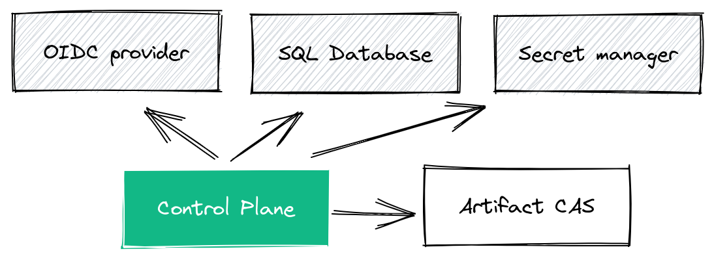

# Control Plane

## Structure overview

The control plane is a [Go](https://go.dev/) service that leverages [protocol buffers](https://github.com/protocolbuffers/protobuf) and [gRPC](https://grpc.io/) for its API, [ent](https://entgo.io) as ORM, [wire](https://github.com/google/wire/) for dependency injection and the [kratos framework](https://github.com/go-kratos/kratos) for additional utilities such middlewares, configuration management or error handling.

It's implemented following(ish) [Hexagonal architecture](https://netflixtechblog.com/ready-for-changes-with-hexagonal-architecture-b315ec967749) with the following top to down layers.

- API definition layer `./api/`. proto definitions and generated code for the external gRPC API
- Server layer `./internal/server`. Definition and registration of the HTTP and gRPC servers and middlewares.
- Service layer `./internal/service`. Implementation of the protocol buffer services.
- Business layer `./internal/biz`. Implementation of use-cases referenced by the service layer and definition of the data repository abstractions.
- Data layer `./internal/data`. Implementation of data repositories interfaces defined in the business layer.

## Plugins

The source code and documentation for the different supported plugins can be found at `./plugins`.

## System Dependencies

The control plane has 4 main dependencies



- OpenID Connect (OIDC) provider. Chainloop authentication backend is delegated to a OIDC provider (i.e Google, GitHub or [Auth0](https://auth0.com/)) for single sign on.
- The persistance layer requires a [PostgreSQL](https://www.postgresql.org/) database.
- Sensitive information provided by the user such as OCI registry credentials is sent to a secret storage backend. Currently we support [Hashicorp Vault](https://www.vaultproject.io/), [AWS Secret Manager](https://aws.amazon.com/secrets-manager/) and [GCP Secret Manager](https://cloud.google.com/secret-manager).
- In addition to those third party dependencies, the control plane also has a dependency on Chainloop own [Artifact CAS](../artifact-cas). It is used to upload the received attestation to the end-user storage backend.

> NOTE: The control plane does not store artifacts, these get forwarded to the user storage backend (i.e OCI registry) through the Artifact CAS.

## Runbook

We use `make` for most development tasks. Run `make -C app/controlplane` to see a list of the available tasks.

### Run the project in development

Refer to [development guide](../../devel/README.md) for more information but in a nutshell.

```
# Run external dependencies (Dex for OIDC, bitnami/postgreSQL container for persistence and Vault for secret management)

docker compose -f devel/compose.yml up

# Run the control plane
make -C app/controlplane run
```

Next, follow the steps that can be found [here](../../devel/README.md#4---using-the-cli-pointing-to-the-local-environment) to configure the CLI

### Run tests

We've implemented two kinds of tests, unit tests (`make run test-unit`) and integration tests. The latter launch a containerized database and hence they are expensive to run.

To run all the tests `make test`

### Build binary

```
make build
```

### Generate API code from protocol buffer defintions (\*.proto)

We use buf.io to lint and generate proto files. Make sure you [install buf](https://docs.buf.build/installation) first.

Once done, generating the API code is as easy as executing

```
make api
```

### Update Application data model

We use [ent](https://entgo.io) as database Object Relational Mapping (ORM).

The way a change in the data model is as follows

- Add a new/update an existing entity via a schema update. Schemas can be found at `internal/data/ent/schema`
- Generate the code changes associated with that schema change. `make generate`
- Restarting the control plane will cause the schema change to be automatically migrated.

### Update configuration schema

The service runtime configuration is implemented by using [kratos built-in config module](https://go-kratos.dev/en/docs/component/config/).

Meaning that the configuration schema is defined at `internal/conf/conf.proto`.

To regenerate it run:

```
make config
```

### Update dependency injection

In order to enforce inversion of control and prevent import cycles we use [wire](https://github.com/google/wire/) for dependency injection.

Wire has a fairly steep learning curve, so we recommend taking a look [at their tutorial](https://github.com/google/wire/blob/main/_tutorial/README.md). In practice, in this project you will find a couple of wire_gen.go files (i.e `cmd/wire_gen.go`) and different provider defined.

If you need to re-generate the injection code after a change just run `make generate`

## Contribution guidelines

Please make sure to review the [Contribution guidelines](../../CONTRIBUTING.md) and feel free to reach out if you have any questions!

Welcome!
