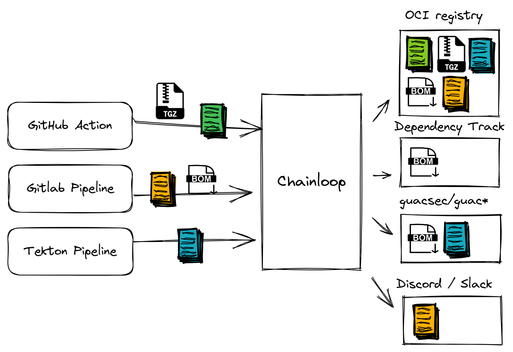

# Chainloop Extensions

Chainloop extensions are a way to add functionality to Chainloop by integrating with third-parties.

Currently we only support one type, fanOut extensions. FanOut extensions implement logic that will get executed when attestations or materials are received. This logic can be anything from sending an email, uploading an attestation to a storage backend and so on.



## Lifecycle

An fanOut extension goes through 4 different stages. Loading, Registration, Attachment and Execution.

### Loading

Loading is when the extension gets enabled in the Chainloop Control Plane. This is implemented via the extension constructor.

This is when you, as a extension developer, will define:

- The extension identifier, version and description.
- What kind of input you want your extension to receive, materials, attestations or both.
- Available input properties for the registration and attachment phases. These schemas will be shown to the user and will be used to validate the input.

Once loaded, the extension will be available to be registered on any organization and will be shown in the list of available extensions.

```console
$ chainloop integration available list
┌─────────────────┬─────────┬──────────────────────┬───────────────────────────────────────────────────────────┐
│ ID              │ VERSION │ MATERIAL REQUIREMENT │ DESCRIPTION                                               │
├─────────────────┼─────────┼──────────────────────┼───────────────────────────────────────────────────────────┤
│ dependencytrack │ 0.2     │ SBOM_CYCLONEDX_JSON  │ Send CycloneDX SBOMs to your Dependency-Track instance    │
├─────────────────┼─────────┼──────────────────────┼───────────────────────────────────────────────────────────┤
│ smtp            │ 0.1     │                      │ Send emails with information about a received attestation │
├─────────────────┼─────────┼──────────────────────┼───────────────────────────────────────────────────────────┤
│ oci-registry    │ 0.1     │                      │ Send attestations to a compatible OCI registry            │
├─────────────────┼─────────┼──────────────────────┼───────────────────────────────────────────────────────────┤
│ discord-webhook │ 0.1     │                      │ Send attestations to Discord                              │
└─────────────────┴─────────┴──────────────────────┴───────────────────────────────────────────────────────────
```

And the information of how to use it can be found in the describe command.

```console
$ chainloop integration available describe --id dependencytrack
┌─────────────────┬─────────┬──────────────────────┬────────────────────────────────────────────────────────┐
│ ID              │ VERSION │ MATERIAL REQUIREMENT │ DESCRIPTION                                            │
├─────────────────┼─────────┼──────────────────────┼────────────────────────────────────────────────────────┤
│ dependencytrack │ 0.2     │ SBOM_CYCLONEDX_JSON  │ Send CycloneDX SBOMs to your Dependency-Track instance │
└─────────────────┴─────────┴──────────────────────┴────────────────────────────────────────────────────────┘
┌──────────────────────────────────────────────────────────────────────────────────────┐
│ Registration inputs                                                                  │
├─────────────────┬──────────────┬──────────┬──────────────────────────────────────────┤
│ FIELD           │ TYPE         │ REQUIRED │ DESCRIPTION                              │
├─────────────────┼──────────────┼──────────┼──────────────────────────────────────────┤
│ allowAutoCreate │ boolean      │ no       │ Support of creating projects on demand   │
│ apiKey          │ string       │ yes      │ The API key to use for authentication    │
│ instanceURI     │ string (uri) │ yes      │ The URL of the Dependency-Track instance │
└─────────────────┴──────────────┴──────────┴──────────────────────────────────────────┘
┌───────────────────────────────────────────────────────────────────────────────────────────┐
│ Attachment inputs                                                                         │
├─────────────┬────────┬──────────┬─────────────────────────────────────────────────────────┤
│ FIELD       │ TYPE   │ REQUIRED │ DESCRIPTION                                             │
├─────────────┼────────┼──────────┼─────────────────────────────────────────────────────────┤
│ projectID   │ string │ no       │ The ID of the existing project to send the SBOMs to     │
│ projectName │ string │ no       │ The name of the project to create and send the SBOMs to │
└─────────────┴────────┴──────────┴─────────────────────────────────────────────────────────┘
```

In addition to the constructor 3 more handlers need to be implemented.

### Registration


Registration is when a specific instance of the extension is configured on a Chainloop organization. A registered instance is then available to be attached to any workflow, more on that later.

This handler will receive the input from the user, will validate it against the defined schema and run any custom logic.

The handler's return value will be stored in the extension state, which will make it available to the other handlers.

Examples:

- Register a Dependency-Track instance by receiving its URL and API key. At this stage, the extension will make sure that the provided information is valid and store it for later use.
- Register a Discord instance by receiving its webhook URL. The handler will store the webhook URL securely for later use.

### Attachment

In order for an user to use a registered instance, it needs to be attached to a workflow. This means that any attestations or materials that are received for the workflow will be sent to the attached extension for processing. This stage can be also used to optionally customize the behavior of the extension for a specific workflow.

This handler **will receive not only the input from the user but also the output from the registration state**.

Similarly to the registration handler, the handler returned output value will be stored in the state for later use.

Examples:

- Tell the already registered Dependency Track instance to send the SBOMs to a specific project.
- Tell the already registered Discord instance to send all attestations to the configured channel

### Execution

This is the actual execution of the extension. This is where the extension will do its work. i.e call a workflow or send a notification. 

This handler **will also have access to the outputs from the registration and attachment phases**.

Examples:

A Dependency-Track SBOM extension will

- Get the instance URL and API key from the state stored during the registration phase
- Get the specific project where we want to post the SBOMs from the attachment phase
- Send the SBOMs to the dependency track instance

A Discord webhook extension will

- Get the Webhook URL from the state stored during the registration phase
- Craft message to send to the Discord webhook

## How to create a new extension

We offer a starter template in `./core/template`. Just copy it to a new folder and follow the steps shown in its readme file.
