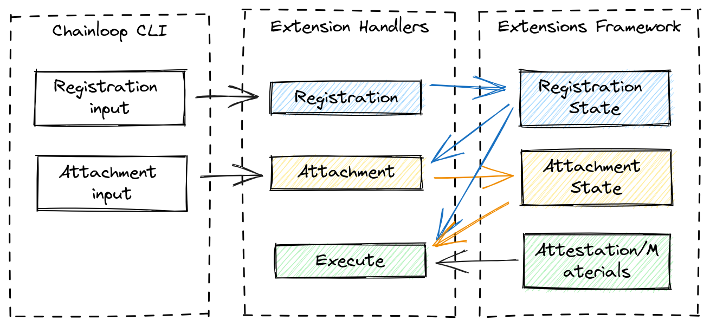

# Plugins Overview

Chainloop plugins are a way to add functionality to Chainloop by integrating with third-parties.

> NOTE: Currently, our plugin framework has the limitation that it requires any new plugin to be added to Chainloop's Control Plane source code and released with it. In other words, you can not develop a plugin on your end, and test it out in an existing instance of Chainloop. [There are plans](https://github.com/chainloop-dev/chainloop/issues/195) to change this behavior, stay tuned.

Currently we only support one type, fanOut plugins. A FanOut plugin implements logic that will get executed when attestations or materials are received. This logic can be anything from sending a Slack message, uploading the attestation to a storage backend or sending a Software Bill Of Materials (SBOMs) to Dependency-Track for analysis, for example.


## Lifecycle

An fanOut plugin goes through 4 different stages. Loading, Registration, Attachment and Execution.

### Loading Stage

The loading stage is when the plugin gets enabled in the Chainloop Control Plane. This is implemented via the plugin constructor. It is when you, as a plugin developer, will define:

- The plugin identifier, version and description.
- What kind of input you want your plugin to receive, materials, attestations or both.
- Available input properties for the registration and attachment phases. These schemas will be shown to the user and will be used to validate the input.

Example, excerpt from the [Dependency-Track plugin](https://github.com/chainloop-dev/chainloop/tree/main/app/controlplane/plugins/core/dependency-track/v1):

```go
base, err := sdk.NewFanOut(
    &sdk.NewParams{
        ID:          "dependency-track",
        Version:     "1.2",
        Description: "Send CycloneDX SBOMs to your Dependency-Track instance",
        // The input schema for both registration and attachment phases
        InputSchema: &sdk.InputSchema{
            Registration: registrationRequest{},
            Attachment:   attachmentRequest{},
        },
        // Subscribed to receive CycloneDX SBOMs in json format
    }, sdk.WithInputMaterial(schemaapi.CraftingSchema_Material_SBOM_CYCLONEDX_JSON))
```

Once loaded, the plugin will be available to be registered on any organization and will be shown in the list of available plugins.

```console
$ chainloop integration available list
┌─────────────────┬─────────┬──────────────────────┬───────────────────────────────────────────────────────────┐
│ ID              │ VERSION │ MATERIAL REQUIREMENT │ DESCRIPTION                                               │
├─────────────────┼─────────┼──────────────────────┼───────────────────────────────────────────────────────────┤
│ dependencytrack │ 0.2     │ SBOM_CYCLONEDX_JSON  │ Send CycloneDX SBOMs to your Dependency-Track instance    │
├─────────────────┼─────────┼──────────────────────┼───────────────────────────────────────────────────────────┤
│ smtp            │ 0.1     │                      │ Send emails with information about a received attestation │
├─────────────────┼─────────┼──────────────────────┼───────────────────────────────────────────────────────────┤
│ oci-registry    │ 0.1     │                      │ Send attestations to a compatible OCI registry            │
├─────────────────┼─────────┼──────────────────────┼───────────────────────────────────────────────────────────┤
│ discord-webhook │ 0.1     │                      │ Send attestations to Discord                              │
└─────────────────┴─────────┴──────────────────────┴───────────────────────────────────────────────────────────
```

And the information of how to use it can be found in the describe command.

```console
$ chainloop integration available describe --id dependencytrack
┌─────────────────┬─────────┬──────────────────────┬────────────────────────────────────────────────────────┐
│ ID              │ VERSION │ MATERIAL REQUIREMENT │ DESCRIPTION                                            │
├─────────────────┼─────────┼──────────────────────┼────────────────────────────────────────────────────────┤
│ dependencytrack │ 0.2     │ SBOM_CYCLONEDX_JSON  │ Send CycloneDX SBOMs to your Dependency-Track instance │
└─────────────────┴─────────┴──────────────────────┴────────────────────────────────────────────────────────┘
┌──────────────────────────────────────────────────────────────────────────────────────┐
│ Registration inputs                                                                  │
├─────────────────┬──────────────┬──────────┬──────────────────────────────────────────┤
│ FIELD           │ TYPE         │ REQUIRED │ DESCRIPTION                              │
├─────────────────┼──────────────┼──────────┼──────────────────────────────────────────┤
│ allowAutoCreate │ boolean      │ no       │ Support of creating projects on demand   │
│ apiKey          │ string       │ yes      │ The API key to use for authentication    │
│ instanceURI     │ string (uri) │ yes      │ The URL of the Dependency-Track instance │
└─────────────────┴──────────────┴──────────┴──────────────────────────────────────────┘
┌───────────────────────────────────────────────────────────────────────────────────────────┐
│ Attachment inputs                                                                         │
├─────────────┬────────┬──────────┬─────────────────────────────────────────────────────────┤
│ FIELD       │ TYPE   │ REQUIRED │ DESCRIPTION                                             │
├─────────────┼────────┼──────────┼─────────────────────────────────────────────────────────┤
│ projectID   │ string │ no       │ The ID of the existing project to send the SBOMs to     │
│ projectName │ string │ no       │ The name of the project to create and send the SBOMs to │
└─────────────┴────────┴──────────┴─────────────────────────────────────────────────────────┘
```

In addition to the constructor, 3 more handlers need to be implemented.



### Registration Handler

Registration is when a specific instance of the plugin is configured on a Chainloop organization. A registered instance is then available to be attached to any workflow, more on that later.

This handler will receive the input from the user, will validate it against the defined schema and run any custom logic. The handler's returned value will be stored in the plugin state, which will make it available to the other handlers.

Examples:

- Register a Dependency-Track instance by receiving its URL and API key. At this stage, the plugin will make sure that the provided information is valid and store it for later use.
- Register a Discord instance by receiving its webhook URL. The handler will store the webhook URL securely for later use.

### Attachment Handler

In order for an user to use a registered instance, it needs to be attached to a workflow. This stage can be also used to optionally customize the behavior of the plugin for a specific workflow.

This handler **will receive not only the input from the user but also the output from the registration state**. Similarly to the registration handler, the handler returned output value will be stored in the state for later use.

Examples:

- Tell the already registered Dependency Track plugin to send the SBOMs **to a specific project**.
- Tell the already registered Discord plugin to send all attestations to the configured channel.

### Execution Handler

This is the actual execution of the plugin. This is where the plugin will do its work. i.e forward the attestation/material data to a third-party API, send a notification and so on.

When an attestation is received, the attestation and any materials that match the list of material types the plugin supports will be sent to the execute handler. For example, if your plugin does not specify any supported material types, it will receive only the attestation information.


On another hand, if the plugin is subscribed to for example support SBOM_CYCLONEDX_JSON, and JUNIX_XML it will receive the attestation information and both materials **on a single execution**


In addition to the attestation and material data, this handler **will also have access to the outputs from the registration and attachment phases**.

Some important notes about the execution handler:

- If your plugin is subscribed to a specific material type, it will get executed on every attestation, even if such attestation does not contain any material of the supported type.
- It's up to the plugin developer to make sure the desired material is present and handle the case when it's not.

Some example use-cases:

A Dependency-Track SBOM plugin will

- Get the instance URL and API key from the state stored during the registration phase
- Get the specific project where we want to post the SBOMs from the attachment phase
- Send the SBOMs to the dependency track instance

A Discord webhook plugin will

- Get the Webhook URL from the state stored during the registration phase
- Craft message to send to the Discord webhook

## How to create a new plugin

We offer a [starter template](https://github.com/chainloop-dev/chainloop/tree/main/app/controlplane/plugins/core/template) that can be used as baseline. Just copy it to a new folder i.e `core/my-plugin/v1` to get started.

Next:

- Replace all the occurrences of `template` in the code with your plugin name.
- Add it to the list of available plugins [here](https://github.com/chainloop-dev/chainloop/blob/main/app/controlplane/plugins/plugins.go). This will make this plugin available the next time the control plane starts.
- Define the API request payloads for both Registration and Attachment.
- Implement the [FanOutPlugin interface](https://github.com/chainloop-dev/chainloop/blob/main/app/controlplane/plugins/sdk/v1/fanout.go#L80). The template comes prefilled with some commented out code as guideline.

Remember that you can find some examples of fully functional plugins in [here](https://github.com/chainloop-dev/chainloop/tree/main/app/controlplane/plugins/core).
