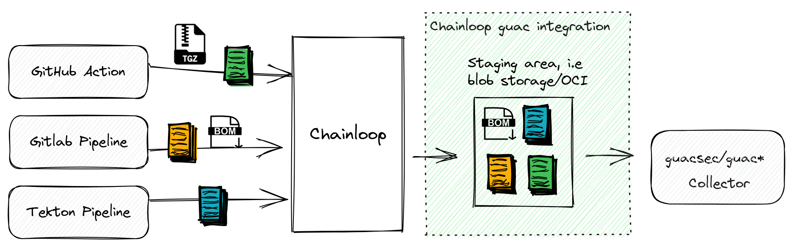

# GUAC integration

Graph for Understanding Artifact Composition ([GUAC](https://github.com/guacsec/guac)) aggregates software security metadata into a high fidelity graph database—normalizing entity identities and mapping standard relationships between them. Querying this graph can drive higher-level organizational outcomes such as audit, policy, risk management, and even developer assistance.

Chainloop users can **automatically send signed [in-toto](https://in-toto.io/) attestations and both [CycloneDX](https://cyclonedx.org/) and [SPDX](https://spdx.dev/) Software Bill Of Materials (SBOMs)** to a cloud storage bucket. From there, GUAC can be configured to continuously monitor and inject that data.



## Demo

You can see a demo of this integration in action in the following video:

<a href="http://www.youtube.com/watch?feature=player_embedded&v=XEeMeyC9ZJs" target="_blank">
  
</a>

## Configure Integration in Chainloop

There are two steps involved to enable this integration:

1. Register a Guac integration in your Chainloop account
2. Attach this integration to your workflow

### Registration

Currently, this integration only supports [Google Cloud Storage](https://cloud.google.com/storage) (GCS) as a storage provider, with more to come in the future. If you are interested in a specific provider, please [let us know](https://github.com/chainloop-dev/chainloop/issues/new)

#### Using Google Cloud Storage (GCS)

**Prerequisites**

- A Google Cloud Platform (GCP) account
- A GCP project with a GCS bucket
- A GCP service account with write access to the bucket. See [Creating and managing service accounts](https://cloud.google.com/iam/docs/creating-managing-service-accounts) for more information. 
- Once created, download the service account [JSON credentials file](https://developers.google.com/workspace/guides/create-credentials#create_credentials_for_a_service_account)

To get started, you need to register the plugin in your Chainloop organization.

```sh
$ chainloop integration registered add guac --opt bucket=[my-bucket-name] --opt credentials=[credentials-content] --opt provider=gcs

# Example
$ chainloop integration registered add guac --opt bucket=test-guac --opt credentials="$(cat ./service-account-devel.json)" --opt provider=gcs
```

### Attachment

Then, in order to use the integration, you need to attach it to a workflow by providing the IDs of the workflow and integration you just registered.

```sh
$ chainloop integration attached add --workflow $WID --integration $ID
```

That's all on the Chainloop side. Now all new attestation and SBOM metadata files will get uploaded to your Google Cloud Storage bucket.
## Configure Guac

Next, we need to configure Guac to pick up the files from the bucket and inject them into the graph. Please refer to [guacsec/guac](https://docs.guac.sh) documentation to learn more.

But in a nutshell, you need to:

- [Have a Guac instance up and running](https://docs.guac.sh/setup)
- Ingest the data from the bucket into the graph

> NOTE: Currently, importing GCS data into Guac requires manually running a `collect` command. The community [is discussing](https://github.com/guacsec/guac/issues/1005) how to run this process periodically and automatically.


```bash
# Build the guacone CLI
git clone https://github.com/guacsec/guac.git
cd guac && make build

# Ingest the data
guacone collect gcs test-guac --gcp-credentials-path service-account-devel.json 
```

That's all, now the data is available in the graph and you can query or visualize it.

## Registration Input Schema

|Field|Type|Required|Description|
|---|---|---|---|
|bucket|string|yes|Bucket name where to store the artifacts|
|credentials|string|yes|Credentials to access the bucket|
|provider|string|no|Blob storage provider: default gcs|

```json
{
  "$schema": "https://json-schema.org/draft/2020-12/schema",
  "$id": "https://github.com/chainloop-dev/chainloop/app/controlplane/plugins/core/guac/v1/registration-request",
  "properties": {
    "provider": {
      "type": "string",
      "enum": [
        "gcs"
      ],
      "minLength": 1,
      "description": "Blob storage provider: default gcs"
    },
    "bucket": {
      "type": "string",
      "minLength": 1,
      "description": "Bucket name where to store the artifacts"
    },
    "credentials": {
      "type": "string",
      "minLength": 2,
      "description": "Credentials to access the bucket"
    }
  },
  "additionalProperties": false,
  "type": "object",
  "required": [
    "bucket",
    "credentials"
  ]
}
```