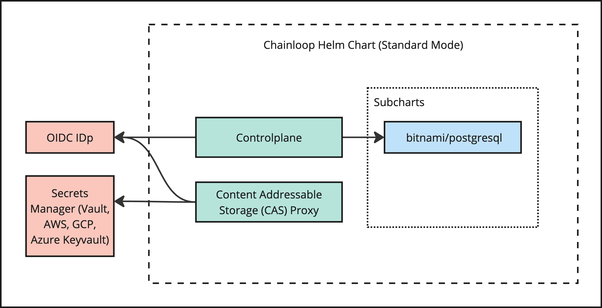
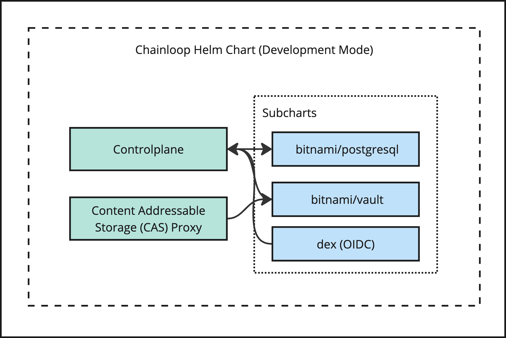

# Chainloop Helm Chart

[Chainloop](https://github.com/chainloop-dev/chainloop) is an open-source software supply chain control plane, a single source of truth for artifacts plus a declarative attestation crafting process.

## Introduction

This chart bootstraps a [Chainloop](https://github.com/chainloop-dev/chainloop) deployment on a [Kubernetes](https://kubernetes.io) cluster using the [Helm](https://helm.sh) package manager.

## Prerequisites

- Kubernetes 1.19+
- Helm 3.2.0+
- PV provisioner support in the underlying infrastructure
- ReadWriteMany volumes for deployment scaling

## TL;DR

Deploy Chainloop in [development mode](#development) by running

```console
helm install [RELEASE_NAME] . \
    --set development=true \
    --set controlplane.auth.oidc.url=[OIDC URL] \
    --set controlplane.auth.oidc.clientID=[clientID] \
    --set controlplane.auth.oidc.clientSecret=[clientSecret]
```

## Installing the Chart

This chart comes in **two flavors**, `standard` and [`development`](#development).

### Standard (default)



The default deployment mode relies on external dependencies to be available in advance.

The Helm Chart in this mode includes

- Chainloop [Controlplane](../../app/controlplane) 
- Chainloop [Artifact proxy](../../app/artifact-cas) 
- A PostgreSQL dependency enabled by default

During installation, you'll need to provide

- Open ID Connect Identity Provider (IDp) settings i.e [Auth0 settings](https://auth0.com/docs/get-started/applications/application-settings#basic-information)
- Connection settings for a secrets storage backend, either [Hashicorp Vault](https://www.vaultproject.io/) or [AWS Secret Manager](https://aws.amazon.com/secrets-manager)
- ECDSA (ES512) key-pair used for Controlplane <-> CAS Authentication

You can generate the ECDSA key-pair by running

```console
# Private Key (private.ec.key)
openssl ecparam -name secp521r1 -genkey -noout -out private.ec.key
# Public Key (public.pem)
openssl ec -in private.ec.key -pubout -out public.pem
```

#### Installation Examples

Deploy Chainloop configured to talk to the bundled PostgreSQL an external OIDC IDp and a Vault instance.

```console
helm install [RELEASE_NAME] . \
    # Open ID Connect (OIDC)
    --set controlplane.auth.oidc.url=[OIDC URL] \
    --set controlplane.auth.oidc.clientID=[clientID] \
    --set controlplane.auth.oidc.clientSecret=[clientSecret] \
    # Secrets backend
    --set secretsBackend.vault.address="https://[vault address]:8200" \
    --set secretsBackend.vault.token=[token] \
    # Server Auth KeyPair
    --set casJWTPrivateKey="$(cat private.ec.key)" \
    --set casJWTPublicKey="$(cat public.pem)"
```

Deploy using AWS secret manager instead of Vault

```console
helm install [RELEASE_NAME] . \
    # Open ID Connect (OIDC)
    # ...
    # Secrets backend
    --set secretsBackend.awsSecretManager.accessKey=[AWS ACCESS KEY ID] \
    --set secretsBackend.awsSecretManager.secretKey=[AWS SECRET KEY] \
    --set secretsBackend.awsSecretManager.region=[AWS region]\
    # Server Auth KeyPair
    # ...
```

Connect to an external PostgreSQL database instead

```console
helm install [RELEASE_NAME] . \
    # Open ID Connect (OIDC)
    # ...
    # Secrets backend
    # ...
    # Server Auth KeyPair
    # ...
    # External DB setup
    --set postgresql.enabled=false \
    --set controlplane.externalDatabase.host=[DB_HOST] \
    --set controlplane.externalDatabase.user=[DB_USER] \
    --set controlplane.externalDatabase.password=[DB_PASSWORD] \
    --set controlplane.externalDatabase.database=[DB_NAME]
```

### Development

To provide an easy way to give Chainloop a try, this Helm Chart has an **opt-in development** mode that can be enabled with the flag `development=true`

> IMPORTANT: DO NOT USE THIS MODE IN PRODUCTION



The Helm Chart in this mode includes

- Chainloop [Controlplane](../../app/controlplane) 
- Chainloop [Artifact proxy](../../app/artifact-cas) 
- A PostgreSQL dependency enabled by default
- **A pre-configured Hashicorp Vault instance running in development mode (unsealed, in-memory, insecure)**

During installation, you'll need to provide

- Open ID Connect Identity Provider (IDp) settings i.e [Auth0 settings](https://auth0.com/docs/get-started/applications/application-settings#basic-information)
- ~~Connection settings for a secrets storage backend, either [Hashicorp Vault](https://www.vaultproject.io/) or [AWS Secret Manager](https://aws.amazon.com/secrets-manager)~~
- ~~ECDSA (ES512) key-pair used for Controlplane <-> CAS Authentication~~

#### Installation Examples

Deploy by leveraging built-in Vault and PostgreSQL instances

```console
helm install [RELEASE_NAME] . \
    --set development=true \
    --set controlplane.auth.oidc.url=[OIDC URL] \
    --set controlplane.auth.oidc.clientID=[clientID] \
    --set controlplane.auth.oidc.clientSecret=[clientSecret]
```

## Parameters

### Common parameters

| Name                    | Description                                                                                                                                                            | Value        |
| ----------------------- | ---------------------------------------------------------------------------------------------------------------------------------------------------------------------- | ------------ |
| `kubeVersion`           | Override Kubernetes version                                                                                                                                            | `""`         |
| `development`           | Deploys Chainloop pre-configured FOR DEVELOPMENT ONLY. It includes a Vault instance in development mode and pre-configured authentication certificates and passphrases | `false`      |
| `GKEMonitoring.enabled` | Enable GKE podMonitoring (prometheus.io scrape) to scrape the controlplane and CAS /metrics endpoints                                                                  | `false`      |
| `sentry.enabled`        | Enable sentry.io alerting                                                                                                                                              | `false`      |
| `sentry.dsn`            | DSN endpoint https://docs.sentry.io/product/sentry-basics/dsn-explainer/                                                                                               | `""`         |
| `sentry.environment`    | Environment tag                                                                                                                                                        | `production` |

### Secrets Backend

| Name                                        | Description                                                          | Value       |
| ------------------------------------------- | -------------------------------------------------------------------- | ----------- |
| `secretsBackend.backend`                    | Secrets backend type ("vault" or "awsSecretManager")                 | `vault`     |
| `secretsBackend.secretPrefix`              | Prefix that will be pre-pended to all secrets in the storage backend | `chainloop` |
| `secretsBackend.vault.address`              | Vault address                                                        |             |
| `secretsBackend.vault.token`                | Vault authentication token                                           |             |
| `secretsBackend.awsSecretManager.accessKey` | AWS Access KEY ID                                                    |             |
| `secretsBackend.awsSecretManager.secretKey` | AWS Secret Key                                                       |             |
| `secretsBackend.awsSecretManager.region`    | AWS Secret Manager Region                                            |             |

### Authentication

| Name               | Description                                                            | Value |
| ------------------ | ---------------------------------------------------------------------- | ----- |
| `casJWTPrivateKey` | ECDSA (ES512) private key used for Controlplane <-> CAS Authentication | `""`  |
| `casJWTPublicKey`  | ECDSA (ES512) public key                                               | `""`  |

### Control Plane

| Name                            | Description                                                                         | Value                                           |
| ------------------------------- | ----------------------------------------------------------------------------------- | ----------------------------------------------- |
| `controlplane.replicaCount`     | Number of replicas                                                                  | `2`                                             |
| `controlplane.image.repository` | FQDN uri for the image                                                              | `ghcr.io/chainloop-dev/chainloop/control-plane` |
| `controlplane.image.tag`        | Image tag (immutable tags are recommended). If no set chart.appVersion will be used |                                                 |

### Control Plane Database

| Name                                     | Description                                                                                           | Value   |
| ---------------------------------------- | ----------------------------------------------------------------------------------------------------- | ------- |
| `controlplane.externalDatabase`          | External PostgreSQL configuration. These values are only used when postgresql.enabled is set to false |         |
| `controlplane.externalDatabase.host`     | Database host                                                                                         | `""`    |
| `controlplane.externalDatabase.port`     | Database port number                                                                                  | `5432`  |
| `controlplane.externalDatabase.user`     | Non-root username                                                                                     | `""`    |
| `controlplane.externalDatabase.database` | Database name                                                                                         | `""`    |
| `controlplane.externalDatabase.password` | Password for the non-root username                                                                    | `""`    |
| `controlplane.sqlProxy.enabled`          | Enable sidecar to connect to DB via Google Cloud SQL proxy                                            | `false` |
| `controlplane.sqlProxy.connectionName`   | Google Cloud SQL connection name                                                                      | `""`    |
| `controlplane.sqlProxy.resources`        | Sidecar container resources                                                                           | `{}`    |

### Control Plane Authentication

| Name                                    | Description                                                                                            | Value   |
| --------------------------------------- | ------------------------------------------------------------------------------------------------------ | ------- |
| `controlplane.auth.passphrase`          | Passphrase used to sign the Auth Tokens generated by the controlplane. Leave empty for auto-generation | `""`    |
| `controlplane.auth.oidc.url`            | Full authentication path, it should match the issuer URL of the Identity provider (IDp)                | `""`    |
| `controlplane.auth.oidc.clientID`       | OIDC IDp clientID                                                                                      | `""`    |
| `controlplane.auth.oidc.clientSecret`   | OIDC IDp clientSecret                                                                                  | `""`    |
| `controlplane.auth.redirectURLScheme` | Schema that will be used during authentication                                                         | `https` |

### Control Plane Networking

| Name                                       | Description                                                                                                                      | Value                    |
| ------------------------------------------ | -------------------------------------------------------------------------------------------------------------------------------- | ------------------------ |
| `controlplane.service.type`                | Service type                                                                                                                     | `ClusterIP`              |
| `controlplane.service.port`                | Service port                                                                                                                     | `80`                     |
| `controlplane.service.targetPort`          | Service target Port                                                                                                              | `http`                   |
| `controlplane.service.nodePorts.http`      | Node port for HTTP. NOTE: choose port between <30000-32767>                                                                      |                          |
| `controlplane.serviceAPI.type`             | Service type                                                                                                                     | `ClusterIP`              |
| `controlplane.serviceAPI.port`             | Service port                                                                                                                     | `80`                     |
| `controlplane.serviceAPI.targetPort`       | Service target Port                                                                                                              | `grpc`                   |
| `controlplane.serviceAPI.annotations`      | Service annotations                                                                                                              |                          |
| `controlplane.serviceAPI.nodePorts.http`   | Node port for HTTP. NOTE: choose port between <30000-32767>                                                                      |                          |
| `controlplane.ingress.enabled`             | Enable ingress record generation for %%MAIN_CONTAINER_NAME%%                                                                     | `false`                  |
| `controlplane.ingress.pathType`            | Ingress path type                                                                                                                | `ImplementationSpecific` |
| `controlplane.ingress.hostname`            | Default host for the ingress record                                                                                              | `cp.dev.local`           |
| `controlplane.ingress.ingressClassName`    | IngressClass that will be be used to implement the Ingress (Kubernetes 1.18+)                                                    | `""`                     |
| `controlplane.ingress.path`                | Default path for the ingress record                                                                                              | `/`                      |
| `controlplane.ingress.annotations`         | Additional annotations for the Ingress resource. To enable certificate autogeneration, place here your cert-manager annotations. | `{}`                     |
| `controlplane.ingress.tls`                 | Enable TLS configuration for the host defined at `controlplane.ingress.hostname` parameter                                       | `false`                  |
| `controlplane.ingress.selfSigned`          | Create a TLS secret for this ingress record using self-signed certificates generated by Helm                                     | `false`                  |
| `controlplane.ingress.extraHosts`          | An array with additional hostname(s) to be covered with the ingress record                                                       | `[]`                     |
| `controlplane.ingress.extraPaths`          | An array with additional arbitrary paths that may need to be added to the ingress under the main host                            | `[]`                     |
| `controlplane.ingress.extraTls`            | TLS configuration for additional hostname(s) to be covered with this ingress record                                              | `[]`                     |
| `controlplane.ingress.secrets`             | Custom TLS certificates as secrets                                                                                               | `[]`                     |
| `controlplane.ingress.extraRules`          | Additional rules to be covered with this ingress record                                                                          | `[]`                     |
| `controlplane.ingressAPI.enabled`          | Enable ingress record generation for %%MAIN_CONTAINER_NAME%%                                                                     | `false`                  |
| `controlplane.ingressAPI.pathType`         | Ingress path type                                                                                                                | `ImplementationSpecific` |
| `controlplane.ingressAPI.hostname`         | Default host for the ingress record                                                                                              | `api.cp.dev.local`       |
| `controlplane.ingressAPI.ingressClassName` | IngressClass that will be be used to implement the Ingress (Kubernetes 1.18+)                                                    | `""`                     |
| `controlplane.ingressAPI.path`             | Default path for the ingress record                                                                                              | `/`                      |
| `controlplane.ingressAPI.annotations`      | Additional annotations for the Ingress resource. To enable certificate autogeneration, place here your cert-manager annotations. | `{}`                     |
| `controlplane.ingressAPI.tls`              | Enable TLS configuration for the host defined at `controlplane.ingress.hostname` parameter                                       | `false`                  |
| `controlplane.ingressAPI.selfSigned`       | Create a TLS secret for this ingress record using self-signed certificates generated by Helm                                     | `false`                  |
| `controlplane.ingressAPI.extraHosts`       | An array with additional hostname(s) to be covered with the ingress record                                                       | `[]`                     |
| `controlplane.ingressAPI.extraPaths`       | An array with additional arbitrary paths that may need to be added to the ingress under the main host                            | `[]`                     |
| `controlplane.ingressAPI.extraTls`         | TLS configuration for additional hostname(s) to be covered with this ingress record                                              | `[]`                     |
| `controlplane.ingressAPI.secrets`          | Custom TLS certificates as secrets                                                                                               | `[]`                     |
| `controlplane.ingressAPI.extraRules`       | Additional rules to be covered with this ingress record                                                                          | `[]`                     |

### Controlplane Misc

| Name                                                         | Description                   | Value   |
| ------------------------------------------------------------ | ----------------------------- | ------- |
| `controlplane.resources.limits`                              | Container resource limits     | `{}`    |
| `controlplane.resources.requests`                            | Container resource requests   | `{}`    |
| `controlplane.autoscaling.enabled`                           | Enable deployment autoscaling | `false` |
| `controlplane.autoscaling.minReplicas`                       | Minimum number of replicas    | `1`     |
| `controlplane.autoscaling.maxReplicas`                       | Maximum number of replicas    | `100`   |
| `controlplane.autoscaling.targetCPUUtilizationPercentage`    | Target CPU percentage         | `80`    |
| `controlplane.autoscaling.targetMemoryUtilizationPercentage` | Target CPU memory             | `80`    |

### Artifact Content Addressable (CAS) API

| Name                   | Description                                                                         | Value                                          |
| ---------------------- | ----------------------------------------------------------------------------------- | ---------------------------------------------- |
| `cas.replicaCount`     | Number of replicas                                                                  | `2`                                            |
| `cas.image.repository` | FQDN uri for the image                                                              | `ghcr.io/chainloop-dev/chainloop/artifact-cas` |
| `cas.image.tag`        | Image tag (immutable tags are recommended). If no set chart.appVersion will be used |                                                |

### CAS Networking

| Name                              | Description                                                                                                                      | Value                    |
| --------------------------------- | -------------------------------------------------------------------------------------------------------------------------------- | ------------------------ |
| `cas.serviceAPI.type`             | Service type                                                                                                                     | `ClusterIP`              |
| `cas.serviceAPI.port`             | Service port                                                                                                                     | `80`                     |
| `cas.serviceAPI.targetPort`       | Service target Port                                                                                                              | `grpc`                   |
| `cas.serviceAPI.annotations`      | Service annotations                                                                                                              |                          |
| `cas.serviceAPI.nodePorts.http`   | Node port for HTTP. NOTE: choose port between <30000-32767>                                                                      |                          |
| `cas.ingressAPI.enabled`          | Enable ingress record generation for %%MAIN_CONTAINER_NAME%%                                                                     | `false`                  |
| `cas.ingressAPI.pathType`         | Ingress path type                                                                                                                | `ImplementationSpecific` |
| `cas.ingressAPI.hostname`         | Default host for the ingress record                                                                                              | `api.cp.dev.local`       |
| `cas.ingressAPI.ingressClassName` | IngressClass that will be be used to implement the Ingress (Kubernetes 1.18+)                                                    | `""`                     |
| `cas.ingressAPI.path`             | Default path for the ingress record                                                                                              | `/`                      |
| `cas.ingressAPI.annotations`      | Additional annotations for the Ingress resource. To enable certificate autogeneration, place here your cert-manager annotations. | `{}`                     |
| `cas.ingressAPI.tls`              | Enable TLS configuration for the host defined at `controlplane.ingress.hostname` parameter                                       | `false`                  |
| `cas.ingressAPI.selfSigned`       | Create a TLS secret for this ingress record using self-signed certificates generated by Helm                                     | `false`                  |
| `cas.ingressAPI.extraHosts`       | An array with additional hostname(s) to be covered with the ingress record                                                       | `[]`                     |
| `cas.ingressAPI.extraPaths`       | An array with additional arbitrary paths that may need to be added to the ingress under the main host                            | `[]`                     |
| `cas.ingressAPI.extraTls`         | TLS configuration for additional hostname(s) to be covered with this ingress record                                              | `[]`                     |
| `cas.ingressAPI.secrets`          | Custom TLS certificates as secrets                                                                                               | `[]`                     |
| `cas.ingressAPI.extraRules`       | Additional rules to be covered with this ingress record                                                                          | `[]`                     |

### CAS Misc

| Name                                                | Description                   | Value   |
| --------------------------------------------------- | ----------------------------- | ------- |
| `cas.resources.limits`                              | Container resource limits     | `{}`    |
| `cas.resources.requests`                            | Container resource requests   | `{}`    |
| `cas.autoscaling.enabled`                           | Enable deployment autoscaling | `false` |
| `cas.autoscaling.minReplicas`                       | Minimum number of replicas    | `1`     |
| `cas.autoscaling.maxReplicas`                       | Maximum number of replicas    | `100`   |
| `cas.autoscaling.targetCPUUtilizationPercentage`    | Target CPU percentage         | `80`    |
| `cas.autoscaling.targetMemoryUtilizationPercentage` | Target CPU memory             | `80`    |

### Dependencies 

| Name                                 | Description                                                                                            | Value          |
| ------------------------------------ | ------------------------------------------------------------------------------------------------------ | -------------- |
| `postgresql.enabled`                 | Switch to enable or disable the PostgreSQL helm chart                                                  | `true`         |
| `postgresql.auth.enablePostgresUser` | Assign a password to the "postgres" admin user. Otherwise, remote access will be blocked for this user | `false`        |
| `postgresql.auth.username`           | Name for a custom user to create                                                                       | `chainloop`    |
| `postgresql.auth.password`           | Password for the custom user to create                                                                 | `chainlooppwd` |
| `postgresql.auth.database`           | Name for a custom database to create                                                                   | `chainloop-cp` |
| `postgresql.auth.existingSecret`     | Name of existing secret to use for PostgreSQL credentials                                              | `""`           |
| `vault.server.dev.enabled`           | Enable development mode (unsealed, in-memory, insecure)                                                | `true`         |
| `vault.server.dev.devRootToken`      | Connection token                                                                                       | `notapassword` |


## License

Copyright &copy; 2023 The Chainloop Authors

Licensed under the Apache License, Version 2.0 (the "License");
you may not use this file except in compliance with the License.
You may obtain a copy of the License at

<http://www.apache.org/licenses/LICENSE-2.0>

Unless required by applicable law or agreed to in writing, software
distributed under the License is distributed on an "AS IS" BASIS,
WITHOUT WARRANTIES OR CONDITIONS OF ANY KIND, either express or implied.
See the License for the specific language governing permissions and
limitations under the License.