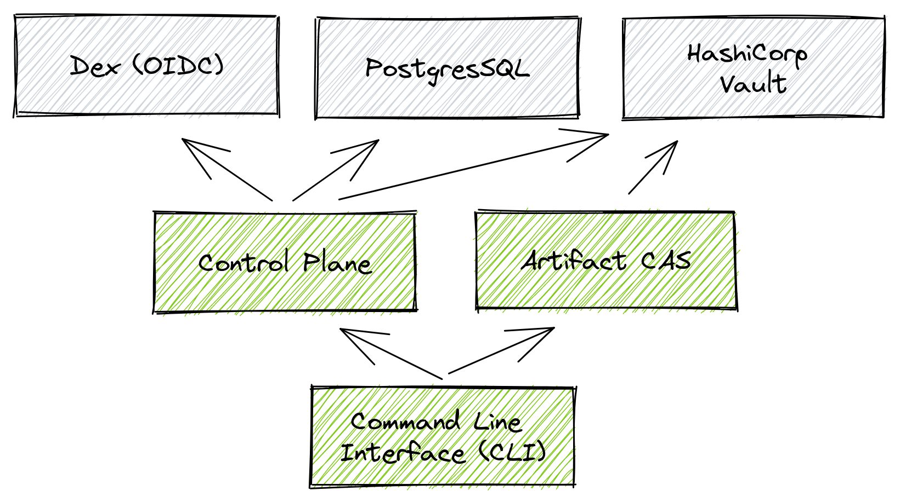

# Development Environment

## Local setup

For development, Chainloop components (Control Plane, Artifact CAS and CLI) come pre-configured to talk to a set of auxiliary services (Dex, PostgresSQL and Vault) that can be run using [Docker Compose](https://docs.docker.com/compose/), so you can start contributing in no time! :)



### 0 - Prerequisites

To get up and running you'll need

- Golang 1.20+ toolchain
- [Docker Compose](https://docs.docker.com/compose/)
- `make`

### 1 - Initialize your environment

This will download and install the CLI tools required to work with our code.

```sh
make init
```

### 2 - Run pre-required/auxiliary services

Chainloop requires some configuration to be in place such as

- PostgreSQL 14 connection from the Control plane
- Access to a secrets manager. Currently Hashicorp Vault, AWS Secrets Manager, GCP Secret Manager and Azure KeyVault are supported.
- Open ID connect (OIDC) single sign-on credentials.

Luckily, you can leverage the provided docker compose file that can be found in the `devel` directory to do all the setup for you.

```
cd devel
docker compose up
```

### 3 - Run Chainloop server-side components

Once you have the pre-required services up and running, you should be able to run the different Chainloop server-side components, in our case we have:

- The Control Plane [`app/controlplane`](../app/controlplane/)
- The Artifact Content Addressable Storage (CAS) Proxy [`app/artifact-cas`](../app/artifact-cas/)

These components are built using [Go](https://go.dev/), have a `Makefile` and a `make run` target for convenience.

- run controlplane `make -C app/controlplane run`
- run CAS `make -C app/cas run`

### 4 - Using the CLI pointing to the local environment

The [Command line interface (CLI)](../app/cli/) is used for both a) operate on the control plane and b) run the attestation process on your CI/CD.

You can run it by executing `go run app/cli/main.go`

4.1 - Configure the CLI to point to the local control plane and CAS services.

```
go run app/cli/main.go config save --insecure --control-plane localhost:9000 --artifact-cas localhost:9001
```

4.2 - Logging in the control-plane

You should now be ready to authenticate the CLI

> NOTE: In development a `--insecure` flag must be provided to talk to the local APIs

```
go run app/cli/main.go --insecure auth login
```

You will get redirected to the pre-configured local OIDC provider (DEX) where there are two configured users

- `sarah@chainloop.local`/`password`
- `john@chainloop.local`/`password`

Once logged in, please refer to our [Getting Started guide](https://docs.chainloop.dev/getting-started/setup) to learn how to setup an OCI registry.

## Developing Extensions / Integrations

Refer to the [Extensions](../app/controlplane/plugins/README.md) documentation for more information.


## Troubleshooting

### Integration tests failing on OSX with Docker Desktop

You might be getting the following error on OSX with Docker Desktop:

```
Cannot connect to the Docker daemon at unix:///var/run/docker.sock
```

```
$ cd chainloop
$ make test
[...]
   --- FAIL: TestVaultIntegration/TestReadWriteCredentials (0.00s)
        keyval_test.go:182:
                Error Trace:    projects/chainloop/chainloop/internal/credentials/vault/keyval_test.go:182
                                                        projects/chainloop/chainloop/internal/credentials/vault/keyval_test.go:207
                                                        go/pkg/mod/github.com/stretchr/testify@v1.8.2/suite/suite.go:187
                Error:          Received unexpected error:
                                Cannot connect to the Docker daemon at unix:///var/run/docker.sock. Is the docker daemon running?: failed to create container
                Test:           TestVaultIntegration/TestReadWriteCredentials
        suite.go:87: test panicked: runtime error: invalid memory address or nil pointer dereference
[...]
```

We use testcontainers for integration tests. You can check all requirements on [this page](https://www.testcontainers.org/supported_docker_environment/).

This is a known issue listed there:

"Docker Desktop Starting 4.13, run sudo ln -s $HOME/.docker/run/docker.sock /var/run/docker.sock"

Running the following command fixes the issue:

```
sudo ln -s $HOME/.docker/run/docker.sock /var/run/docker.sock
```

## Labs Environments

For quick testing you can use the provided `compose.labs.yml` file to run the Chainloop components and the auxiliary services.

### 0 - Prerequisites

- Docker and Docker Compose
- Add entry in `/etc/hosts` for the hostname `dex` pointing to `127.0.0.1`


### 1 - Run Containerized Environment

Run the labs environment

```sh
docker compose -f compose.labs.yml up
```


### 2 - Configure Chainloop CLI

Download Chainloop CLI

```sh
curl -sfL https://docs.chainloop.dev/install.sh | bash -s
```

Configure the CLI to point to the local control plane and CAS services.

```sh
chainloop config save --insecure --control-plane localhost:9000 --artifact-cas localhost:9001
```

and login

```
chainloop --insecure auth login 
```

you are now ready to use the CLI and follow the [quickstart guide](https://docs.chainloop.dev/quickstart) 
