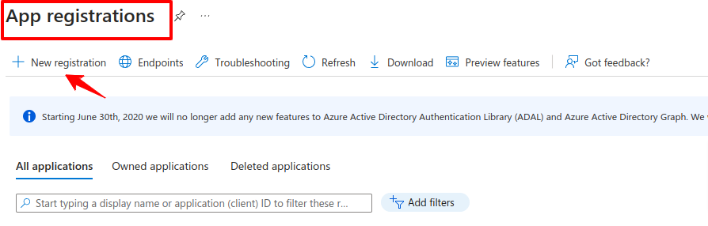
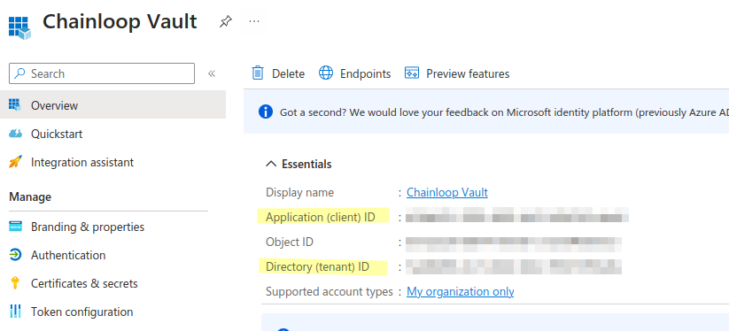
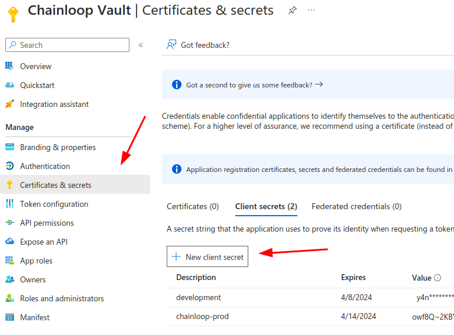
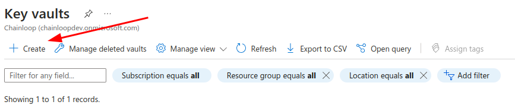
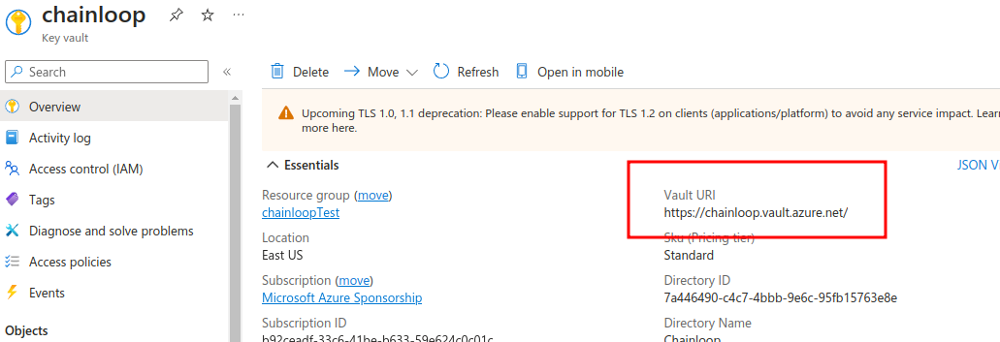
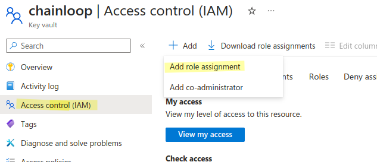
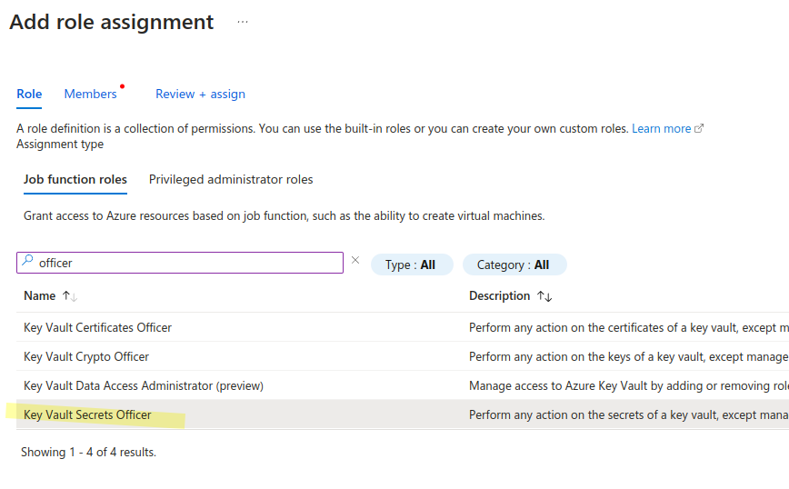
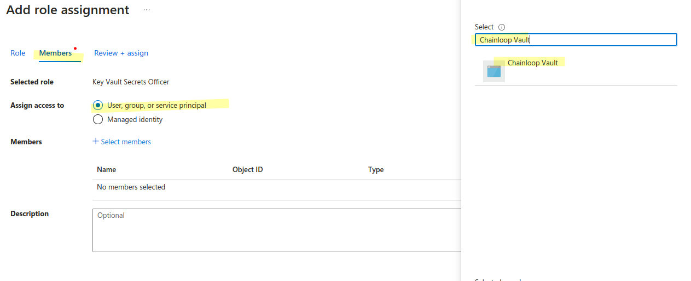

import Image from "@theme/IdealImage";

A requirement to run your own Chainloop instance, is to have a secure credentials backend where sensitive information such as API tokens can be stored. 

If you are running your instance in Azure, you might want to leverage the [Azure KeyVault](https://azure.microsoft.com/en-us/products/key-vault) secret backend for that purpose. 
During this guide we'll walk you through the process of a) create/retrieve credentials and configure the Key Vault in Azure and b) deploy Chainloop using that new configuration.

## Pre-requisites

To configure your Chainloop instance with Azure KeyVault you'll need the following information from your Azure account:

- Active Directory Tenant ID
- Service Principal ID
- Service Principal Secret
- Vault URI

We'll walk you through the process of how to find this information

## Register an application to create the service principal

First, you'll need to register an application in your Azure Active Directory tenant. You can do this using the Azure CLI or from the Azure portal



Once done, in the application overview you should be able to find the tenantID, and Service principal ID



Next, let's create a secret for the service principal.



## Create a Vault instance and give permissions

Next, we'll create a Key Vault (or you can use an existing one)



Take a note on the Vault URI



Next, in the Vault IAM section, let's give permissions to the service principal by clicking on Add Role Assignment.



on the role assignment role, select "Key Vault Secrets officer"



and in the members, search for the application we just registered



That's all, we got all the information we need, let's just to the deployment.

## Configure Chainloop deployment

As explained in the [deployment guide](../k8s), you can configure the credentials backend using the `secretsBackend` section of the `values.yaml` file.

Just put the information we gathered from the previous steps like this.

```yaml
secretsBackend:
  backend: azureKeyVault
  azureKeyVault:
    tenantID: [TENANT_ID] # Active Directory Tenant ID
    clientID: [CLIENT_ID] # Registered application / service principal client ID
    clientSecret: [CLIENT_SECRET] # Service principal client secret
    vaultURI: [VAULT URI] # Azure Key Vault URL
```

And deploy your Chainloop Control Plane with the update values to take effect.

Now your Chainloop instance will automatically store any sensitive information in the Azure KeyVault instance you just configured.