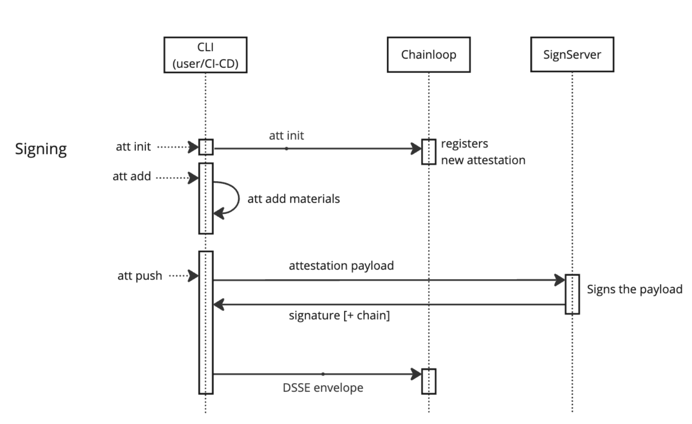

### Summary
Chainloop CLI can sign attestations using a preconfigured SignServer instance, by providing a key reference during the signing process:

```
chainloop attestation push --key signserver://mysignserver/PlainSigner --signserver-ca-path mysignserver-chain.pem
```

### Setting up SignServer 
If your organization doesn't have it already, you can follow these tutorials for a basic setup of Keyfactor's KPI solutions:

* [Quick Start Guide - Start EJBCA Container with Client Certificate Authenticated Access.](https://docs.keyfactor.com/ejbca/latest/quick-start-guide-start-ejbca-container-with-clien)
* [Quick Start Guide - Issue Client Authentication Certificate using EJBCA](https://docs.keyfactor.com/ejbca/latest/quick-start-guide-issue-client-authentication-cert)
* [Quick Start Guide - Start SignServer Container with Client Certificate Authenticated Access.](https://docs.keyfactor.com/signserver/latest/quick-start-guide-start-signserver-container-with-)

Finally, you must have a Crypto and Signing workers configured in SignServer. You can follow [this Cosign tutorial](https://docs.keyfactor.com/signserver/latest/tutorial-signserver-container-signing-with-cosign), since the steps for worker configuration are similar.

Once you have it configured, you can reach SignServer signer worker at, for example, `https://mysignserver/PlainSigner`.

Note that, at this moment, SignServer authentication is not implemented.

### Signing Chainloop attestations with SignServer
Using the CLI options above, Chainloop with prepare the signing In-toto payload and send it to SignServer for signing. The returned signature is then 
included in the final attestation and sent to Chainloop Vault for storage.



This is an example of a Chainloop session integrated with SignServer:

Crafting and signing an attestation.
```shell
➜ chainloop att init --name mywf
INF Attestation initialized! now you can check its status or add materials to it
┌───────────────────┬──────────────────────────────────────┐
│ Initialized At    │ 18 Jun 24 09:10 UTC                  │
├───────────────────┼──────────────────────────────────────┤
│ Attestation ID    │ 32c7eeed-ae4d-4a07-8a85-44a6b05458dc │
│ Name              │ mywf                                 │
│ Team              │                                      │
│ Project           │ myproject                            │
│ Contract Revision │ 1                                    │
└───────────────────┴──────────────────────────────────────┘

➜ chainloop att add --value evidence.txt
WRN API contacted in insecure mode
INF material kind detected kind=ARTIFACT
INF material added to attestation

➜ chainloop att push --key signserver://localhost:8443/PlainSigner --bundle mybundle.json --signserver-ca-path ../keyfactor/localhost-chain.pem
WRN API contacted in insecure mode
INF generating Sigstore bundle mybundle.json
INF push completed
┌───────────────────┬──────────────────────────────────────┐
│ Initialized At    │ 18 Jun 24 09:10 UTC                  │
├───────────────────┼──────────────────────────────────────┤
│ Attestation ID    │ 32c7eeed-ae4d-4a07-8a85-44a6b05458dc │
│ Name              │ mywf                                 │
│ Team              │                                      │
│ Project           │ myproject                            │
│ Contract Revision │ 1                                    │
└───────────────────┴──────────────────────────────────────┘
┌────────────────────────────────────────────────────────────────────────────────────┐
│ Materials                                                                          │
├──────────┬─────────────────────────────────────────────────────────────────────────┤
│ Name     │ material-1718701829813801000                                            │
│ Type     │ ARTIFACT                                                                │
│ Set      │ Yes                                                                     │
│ Required │ No                                                                      │
│ Value    │ evidence.txt                                                            │
│ Digest   │ sha256:e3b0c44298fc1c149afbf4c8996fb92427ae41e4649b934ca495991b7852b855 │
└──────────┴─────────────────────────────────────────────────────────────────────────┘
Attestation Digest: sha256:8b247c21e201e1bd1367add9ee8bfd12c5a0866add39225fda6240c0ef10a64e%
```
Verifying the attestation with the signing cert and root CA (both provided by your organization out-of-band):
```shell
➜ chainloop workflow run describe --digest sha256:8b247c21e201e1bd1367add9ee8bfd12c5a0866add39225fda6240c0ef10a64e --verify true --cert PlainSigner.pem --chain ManagementCA.pem
┌──────────────────────────────────────────────────────────────────────────────────────────┐
│ Workflow                                                                                 │
├────────────────┬─────────────────────────────────────────────────────────────────────────┤
│ ID             │ eb7b4633-96e2-4efe-b23f-f667f3f7acdc                                    │
│ Name           │ mywf                                                                    │
│ Team           │                                                                         │
│ Project        │ myproject                                                               │
├────────────────┼─────────────────────────────────────────────────────────────────────────┤
│ Workflow Run   │                                                                         │
├────────────────┼─────────────────────────────────────────────────────────────────────────┤
│ ID             │ ea1a7d69-21ef-406a-aef3-d6ccd360775c                                    │
│ Initialized At │ 18 Jun 24 09:25 UTC                                                     │
│ Finished At    │ 18 Jun 24 09:25 UTC                                                     │
│ State          │ success                                                                 │
│ Runner Link    │                                                                         │
├────────────────┼─────────────────────────────────────────────────────────────────────────┤
│ Statement      │                                                                         │
├────────────────┼─────────────────────────────────────────────────────────────────────────┤
│ Payload Type   │ application/vnd.in-toto+json                                            │
│ Digest         │ sha256:8b247c21e201e1bd1367add9ee8bfd12c5a0866add39225fda6240c0ef10a64e │
│ Verified       │ true                                                                    │
└────────────────┴─────────────────────────────────────────────────────────────────────────┘
┌────────────────────────────────────────────────────────────────────────────────────┐
│ Materials                                                                          │
├──────────┬─────────────────────────────────────────────────────────────────────────┤
│ Name     │ material-1718702726579398000                                            │
│ Type     │ ARTIFACT                                                                │
│ Filename │ evidence.txt                                                            │
│ Digest   │ sha256:e3b0c44298fc1c149afbf4c8996fb92427ae41e4649b934ca495991b7852b855 │
└──────────┴─────────────────────────────────────────────────────────────────────────┘

```