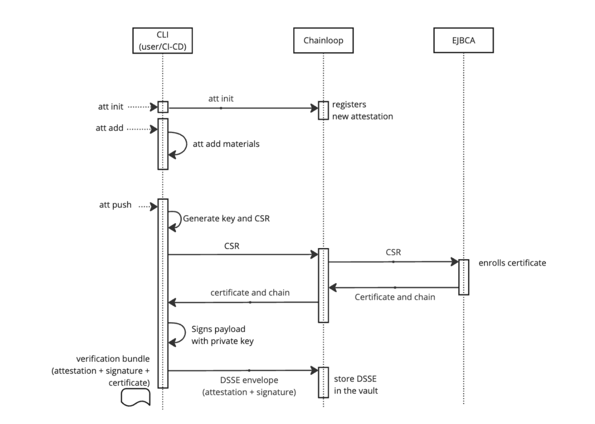

### Summary
Chainloop Evidence Store can be configured to generate signing certs by using EJBCA as the certificate authority, when signing in "key-less" mode:
EJBCA is a popular open source PKI, check it out at https://www.ejbca.org/.

### Prerequisites:
If your organization doesn't have it already, you can follow these tutorials for a basic setup of EJBCA PKI solution.

Requirements:
1. EJBCA is deployed following the [Quick Start Guide - Start EJBCA Container with Client Certificate Authenticated Access](https://docs.keyfactor.com/ejbca/latest/quick-start-guide-start-ejbca-container-with-clien)
2. EJBCA is configured for issuing signing certificates. Check the Step 2 at [Tutorial - SignServer Container Signing with Cosign](https://docs.keyfactor.com/signserver/latest/tutorial-signserver-container-signing-with-cosign#id-(6.3latest)Tutorial-SignServerContainerSigningwithCosign-Step2-Issuesigningcertificate)
3. EJBCA [Certificate Management APIs](https://doc.primekey.com/ejbca/ejbca-operations/ejbca-ca-concept-guide/protocols/ejbca-rest-interface#EJBCARESTInterface-GettingStartedgetting_started) are enabled.

### Configure Chainloop to use EJBCA as CA
Check `ejbca_cA` section in Chainloop configuration options. In particular, set these values in your [config.yaml](https://github.com/chainloop-dev/chainloop/blob/main/app/controlplane/configs/config.devel.yaml) (these values are also mapped to the [chart values.yaml](https://github.com/chainloop-dev/chainloop/blob/main/deployment/chainloop/values.yaml#L668) file):
```yaml
certificate_authorities:
  - ejbca_ca:
      # Where EJBCA service is located
      server_url: "https://localhost/ejbca"
      
      # Cert and private key for Client cert authentication against EJBCA
      key_path: "../../devel/devkeys/superadmin.key"
      cert_path: "../../devel/devkeys/superadmin.pem"
      
      # Certificate chain
      root_ca_path: "../../devel/devkeys/ManagementCA.pem"
    
      # EJBCA profile, end entity and CA names
      certificate_profile_name: "PlainSigner"
      end_entity_profile_name: "PlainSigner"
      certificate_authority_name: "ManagementCA"
    issuer: true
```

### Signing Chainloop attestations with EJBCA issued certificates

Using the following command (note that no `key` is provided), the following sequence of events will happen: 
1. Chainloop CLI creates a certificate request, and sends it to Chainloop
2. Chainloop forwards the request to EJBCA's `v1/certificate/pkcs10enroll` API, which generates a new short-lived certificate for signing
3. Chainloop CLI signs the In-toto payload, and sends the statement to Chainloop for storage.

```shell
> chainloop attestation push --bundle bundle.json
```



### Full example

#### Crafting and signing an attestation.
```shell
> chainloop att init --workflow mywf --project myproject
INF Attestation initialized! now you can check its status or add materials to it
┌───────────────────┬──────────────────────────────────────┐
│ Initialized At    │ 25 Jun 24 10:49 UTC                  │
├───────────────────┼──────────────────────────────────────┤
│ Attestation ID    │ 966b2426-e5a6-4805-91ff-e4ea1e95c5ea │
│ Name              │ mywf                                 │
│ Team              │                                      │
│ Project           │ myproject                            │
│ Contract Revision │ 1                                    │
└───────────────────┴──────────────────────────────────────┘

> chainloop att add --value evidence.txt
INF material kind detected kind=ARTIFACT
INF material added to attestation

> chainloop --debug att push --bundle bundle-with-ejbca.json
INF generating Sigstore bundle bundle-with-ejbca.json
INF push completed
┌───────────────────┬──────────────────────────────────────┐
│ Initialized At    │ 25 Jun 24 10:49 UTC                  │
├───────────────────┼──────────────────────────────────────┤
│ Attestation ID    │ 966b2426-e5a6-4805-91ff-e4ea1e95c5ea │
│ Name              │ mywf                                 │
│ Team              │                                      │
│ Project           │ myproject                            │
│ Contract Revision │ 1                                    │
└───────────────────┴──────────────────────────────────────┘
┌────────────────────────────────────────────────────────────────────────────────────┐
│ Materials                                                                          │
├──────────┬─────────────────────────────────────────────────────────────────────────┤
│ Name     │ material-1719312595918293000                                            │
│ Type     │ ARTIFACT                                                                │
│ Set      │ Yes                                                                     │
│ Required │ No                                                                      │
│ Value    │ evidence.txt                                                            │
│ Digest   │ sha256:e3b0c44298fc1c149afbf4c8996fb92427ae41e4649b934ca495991b7852b855 │
└──────────┴─────────────────────────────────────────────────────────────────────────┘
Attestation Digest: sha256:bafaffc629d5ffe4c3b6519b740459db6883a55c6092c438426ded7ec328f135
```

#### Storing and inspecting the generated certificate:
```shell
> cat bundle-with-ejbca.json | jq -r ".verificationMaterial.certificate.rawBytes" | base64 --decode | openssl x509 -inform DER -outform PEM > signingcert.pem

> cat signingcert.pem | openssl x509 -text
Certificate:
    Data:
        Version: 3 (0x2)
        Serial Number:
            6f:42:e2:ec:6d:b3:25:41:97:6d:66:3b:73:fc:dc:d2:cc:67:c7:ce
        Signature Algorithm: sha256WithRSAEncryption
        Issuer: UID=c-0kxd0tu03vo9bdv86, CN=ManagementCA, O=EJBCA Container Quickstart
        Validity
            Not Before: Jun 25 10:49:04 2024 GMT
            Not After : Jun 25 10:49:03 2025 GMT
        Subject: CN=fce05d49-b633-4862-be1d-3345081ecaea
...
```

#### Verifying the attestation

Verifying the attestation requires the signing cert extracted from the bundle and the root CA (provided by your organization out-of-band):
```shell
> chainloop wf run describe --digest sha256:bafaffc629d5ffe4c3b6519b740459db6883a55c6092c438426ded7ec328f135 --verify true --cert signingcert.pem --cert-chain ../keyfactor/ManagementCA.pem
WRN Both user credentials and $CHAINLOOP_TOKEN set. Ignoring $CHAINLOOP_TOKEN.
┌──────────────────────────────────────────────────────────────────────────────────────────┐
│ Workflow                                                                                 │
├────────────────┬─────────────────────────────────────────────────────────────────────────┤
│ ID             │ eb7b4633-96e2-4efe-b23f-f667f3f7acdc                                    │
│ Name           │ mywf                                                                    │
│ Team           │                                                                         │
│ Project        │ myproject                                                               │
├────────────────┼─────────────────────────────────────────────────────────────────────────┤
│ Workflow Run   │                                                                         │
├────────────────┼─────────────────────────────────────────────────────────────────────────┤
│ ID             │ 966b2426-e5a6-4805-91ff-e4ea1e95c5ea                                    │
│ Initialized At │ 25 Jun 24 10:49 UTC                                                     │
│ Finished At    │ 25 Jun 24 10:59 UTC                                                     │
│ State          │ success                                                                 │
│ Runner Link    │                                                                         │
├────────────────┼─────────────────────────────────────────────────────────────────────────┤
│ Statement      │                                                                         │
├────────────────┼─────────────────────────────────────────────────────────────────────────┤
│ Payload Type   │ application/vnd.in-toto+json                                            │
│ Digest         │ sha256:bafaffc629d5ffe4c3b6519b740459db6883a55c6092c438426ded7ec328f135 │
│ Verified       │ true                                                                    │
└────────────────┴─────────────────────────────────────────────────────────────────────────┘
┌────────────────────────────────────────────────────────────────────────────────────┐
│ Materials                                                                          │
├──────────┬─────────────────────────────────────────────────────────────────────────┤
│ Name     │ material-1719312595918293000                                            │
│ Type     │ ARTIFACT                                                                │
│ Filename │ evidence.txt                                                            │
│ Digest   │ sha256:e3b0c44298fc1c149afbf4c8996fb92427ae41e4649b934ca495991b7852b855 │
└──────────┴─────────────────────────────────────────────────────────────────────────┘

```
