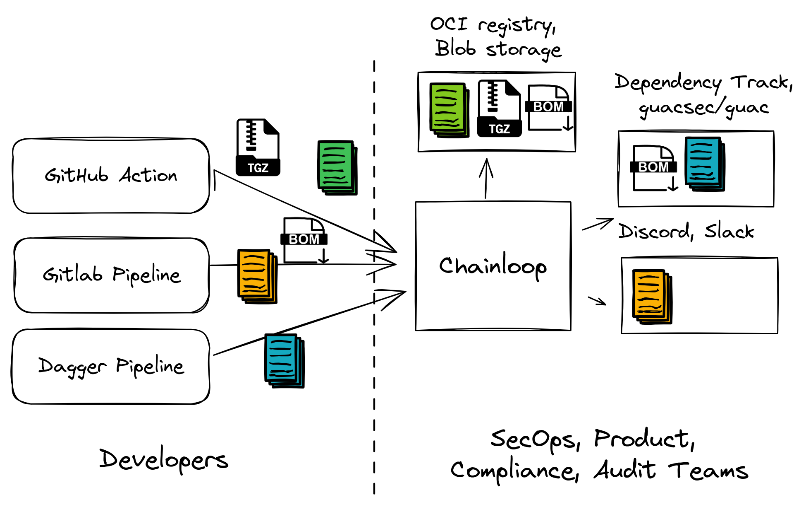
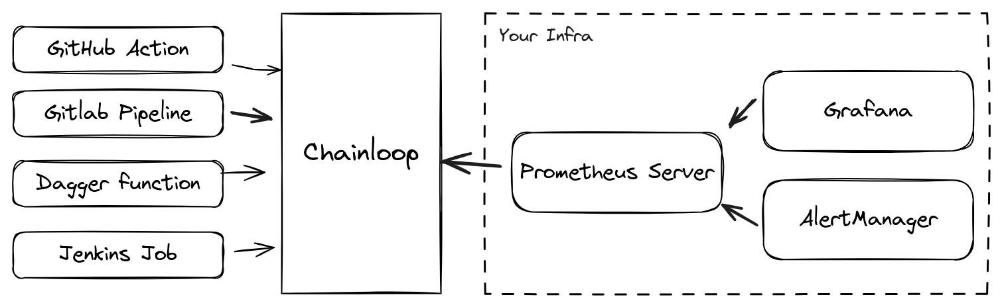
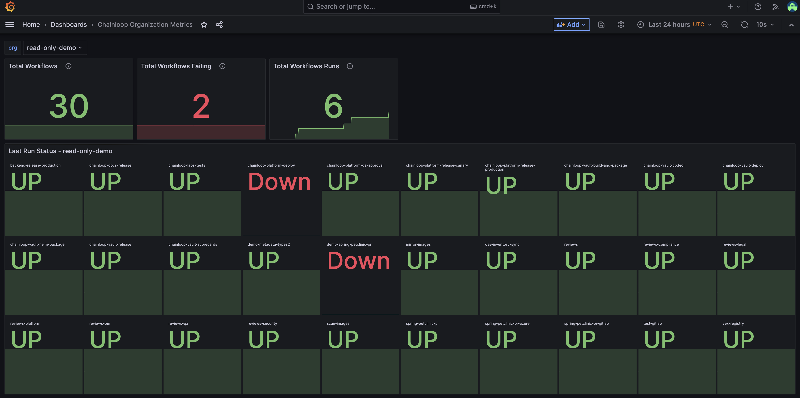

Chainloop is an open-source Software Supply Chain control plane, a single source of truth for metadata and artifacts, plus a declarative attestation process.



Using Chainloop, you can effortlessly integrate your CI/CD pipelines or processes by defining a Chainloop [Workflow](../../getting-started/workflow-definition.mdx#workflows). These workflows can include a Chainloop [Contract](../../getting-started/workflow-definition.mdx#workflow-contracts) if desired, based on your requirements. As a result, Chainloop can serve as the central authority for your CI/CD operational health.

## Prometheus Integration
Chainloop integrates with Prometheus, allowing end users to gain insights into their CI/CD pipelines automatically, in an standardized way.



For the moment, the following metrics are being exposed but, more can be expected:

- `chainloop_workflow_up`: Indicate if the last run was successful.
- `chainloop_workflow_run_duration_seconds`: Duration of a workflow runs in seconds.

Chainloop provides a dedicated endpoint for Prometheus instances to fetch metrics, which varies based on your instance settings. For example:
```bash
https://CHAINLOOP_CONTROLPLANE_URL/prom/ORG_NAME/metrics
```

Where:
- `CHAINLOOP_CONTROLPLANE_URL`: The URL of your Chainloop control plane.
- `ORG_NAME`: The name of the organization from which to gather metrics.

It's important to note that the endpoint is authenticated and can be accessed under two conditions for a given organization:

- Prometheus Integration is activated for the organization.
- A valid API Token is included in the metrics request.

### How to activate Prometheus Integration?
In order to use the Prometheus integration there a few steps that need to be performed:

1. Create or use an existing Chainloop organization.
2. Generate an API Token for the organization.
3. Update Chainloop Controlplane configuration to activate prometheus endpoint for that org.

#### Create or use an existing Chainloop organization
If you already have a Chainloop Organization, you only need to know its name. If you don't have an existing Chainloop Organization, log in and run the following command:
```bash
chainloop organization create --name cyberdyne
```

#### Generate an API Token for the organization
Make sure your current organization is the one you want to create an API Token for and run the following replacing `API_TOKEN_NAME` with your desired API Token name:
```bash
chainloop organization api-token create --name API_TOKEN_NAME
```
Save the output token for later.

#### Update Chainloop Controlplane configuration
When using the Chainloop Open Source Chart, there are a few configurations you can tweak to activate the integration of an existing organization. On your values.yaml add:
```yaml
controlplane:
  # existing or previous values.yaml configuration
  prometheus_org_metrics:
    - org_name: cyberdyne
```

In the example above, we have added the `prometheus_org_metrics` entry to the top level `controlplane` key. The value `org_name: cyberdyne` refers to the fact that we want to activate the metrics for the organization with the name `cyberdyne`.

If you want to activate it for more organizations, simply add them below:

```yaml
controlplane:
  # existing or previous values.yaml configuration
  prometheus_org_metrics:
    - org_name: cyberdyne	
    - org_name: acme-corp
```

### Test the metrics endpoint

With the generated API Token and changed configuration, we can test that everything works as expected by making a request to the Chainloop’s Controlplane to gather metrics for cyberdyne organization:
```bash
curl -H 'Authorization: Bearer API_TOKEN' \
     'https://CHAINLOOP_CONTROLPLANE_URL/prom/cyberdyne/metrics'
```

Which, will return similar metrics in [Prometheus compatible format](https://github.com/prometheus/docs/blob/main/content/docs/instrumenting/exposition_formats.md):
```text
# HELP chainloop_workflow_up Indicate if the last run was successful.
# TYPE chainloop_workflow_up gauge
chainloop_workflow_up{org="cyberdyne",workflow="backend-release-production"} 1
chainloop_workflow_up{org="cyberdyne",workflow="chainloop-docs-release"} 1
chainloop_workflow_up{org="cyberdyne",workflow="chainloop-labs-tests"} 1
chainloop_workflow_up{org="cyberdyne",workflow="chainloop-platform-deploy"} 0
chainloop_workflow_up{org="cyberdyne",workflow="chainloop-platform-qa-approval"} 1
chainloop_workflow_up{org="cyberdyne",workflow="chainloop-platform-release-canary"} 1
chainloop_workflow_up{org="cyberdyne",workflow="chainloop-platform-release-production"} 1
chainloop_workflow_up{org="cyberdyne",workflow="chainloop-vault-build-and-package"} 1
```

### How to connect to your Prometheus instance?

Depending on how Prometheus is deployed in your infrastructure, there could be several ways to do it, the most common way is by updating the configuration yaml of Prometheus:
```yaml
scrape_configs:
  - job_name: chainloop-metrics
    metrics_path: /prom/cyberdyne/metrics
    scheme: https
    bearer_token: CHAINLOOP_API_TOKEN
    static_configs:
      - targets:
          - https://CHAINLOOP_CONTROLPLANE_URL
```
In the previous configuration we can see how we have added a new scrape config called `chainloop-metrics` with several options, the most important ones:
- metrics_path: `/prom/cyberdyne/metrics`
- bearer_token: The Chainloop API Token previously generated
- target: `https://CHAINLOOP_CONTROLPLANE_URL`

With the configuration we will retrieve the metrics for cyberdyne using an authenticated API Token against the installation of Chainloop’s Controlplane.

On another hand you are using the [Prometheus Operator](https://prometheus-operator.dev), you can also leverage almost the same configuration using a [ScrapeConfig](https://prometheus-operator.dev/docs/api-reference/api/#monitoring.coreos.com/v1alpha1.ScrapeConfig):
```yaml
apiVersion: monitoring.coreos.com/v1alpha1
kind: ScrapeConfig
metadata:
 name: test
spec:
 scrapeInterval: 15s
 authorization:
   type: Bearer
   credentials:
     name: cyberdyne-metrics-token
     key: token
 staticConfigs:
   - targets:
       - https://CHAINLOOP_CONTROLPLANE_URL
 metricsPath: /prom/cyberdyne/metrics
```

Where we have created a scrape entry to be added to the global Prometheus configuration with Chainloop’s Controlplane as target and the API Token as secret used for authentication.

## What's next?
Having these metrics is quite powerful, as they enable you to consider further integrations and data visualization methods, such as using Grafana. You can also set up alerts based on these metrics with Alertmanager. Below is an example of visualization using Grafana within a real Chainloop organization.



Here, we can observe how we monitor the latest status of workflows across our CI pipelines and processes.

And in Alertmanager we can set up alerts based on the metrics we have gathered, for example, if a workflow fails, we can send an alert to the responsible team.
```yaml
# previous or existing configuration
groups:
- name: WorkflowDownAlerts
  rules:
  - alert: WorkflowDown
    expr: sum by (org, workflow) (avg_over_time(chainloop_workflow_up[30m])) == 0
    for: 30m
    labels:
      severity: critical
    annotations:
      summary: "Workflow {{ $labels.workflow }} has been down for at least 30 minutes"
      description: "The workflow {{ $labels.workflow }} in organization {{ $labels.org }} has been down for at least 30 minutes."
```