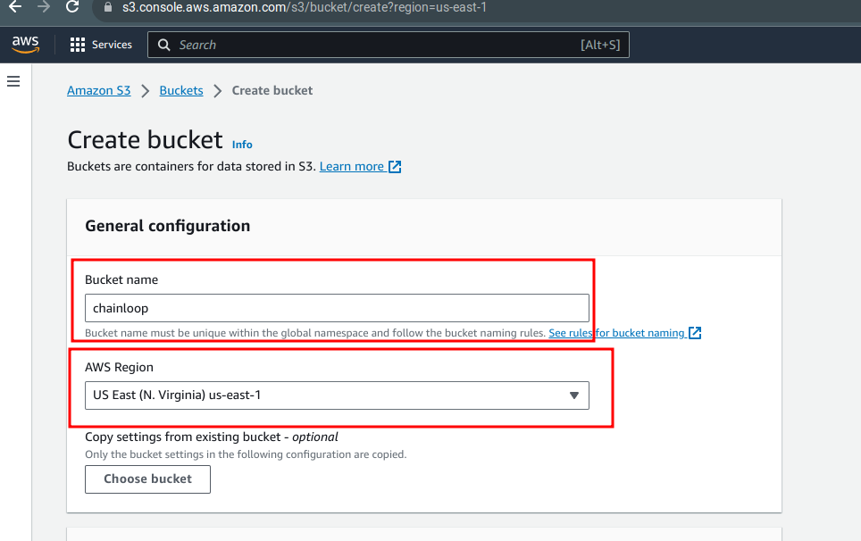
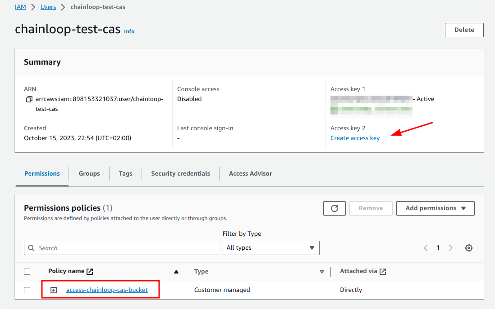
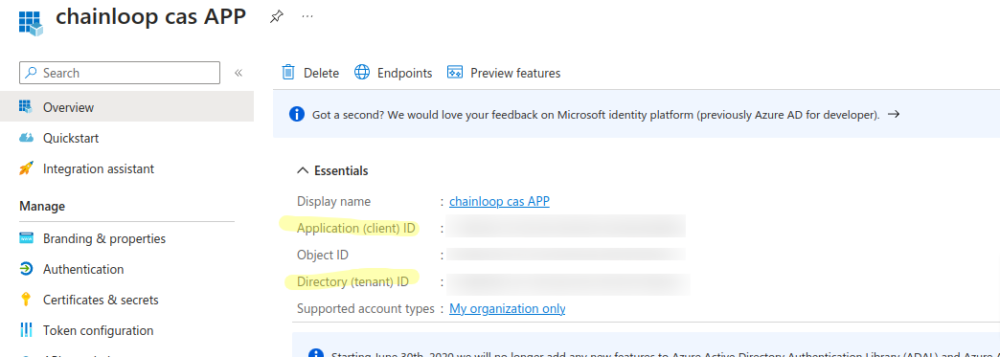
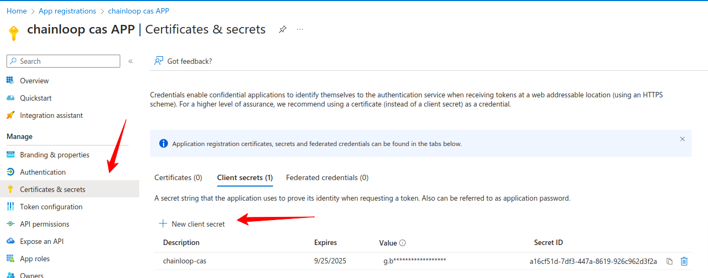
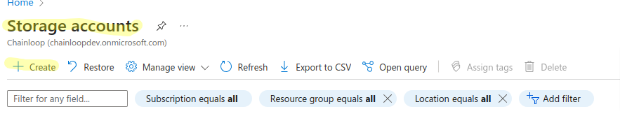
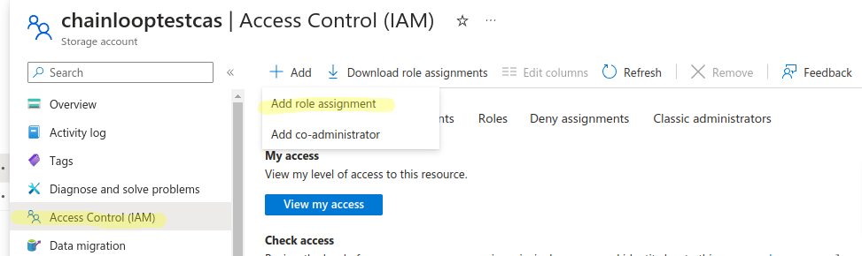
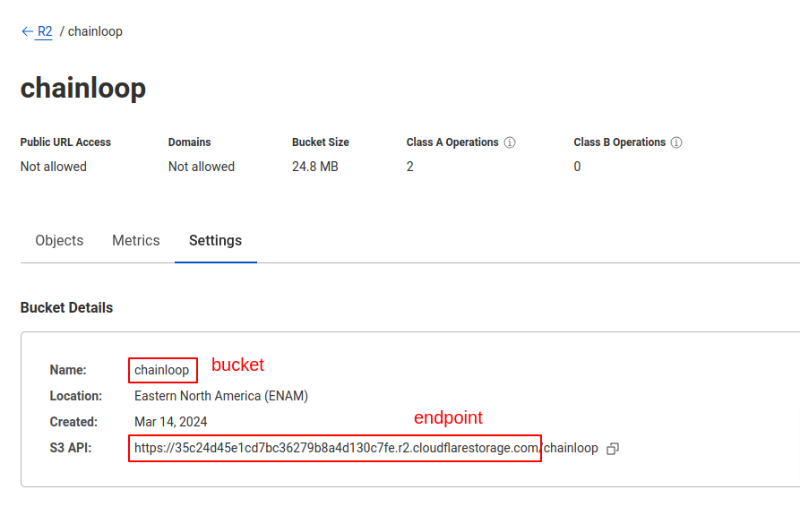
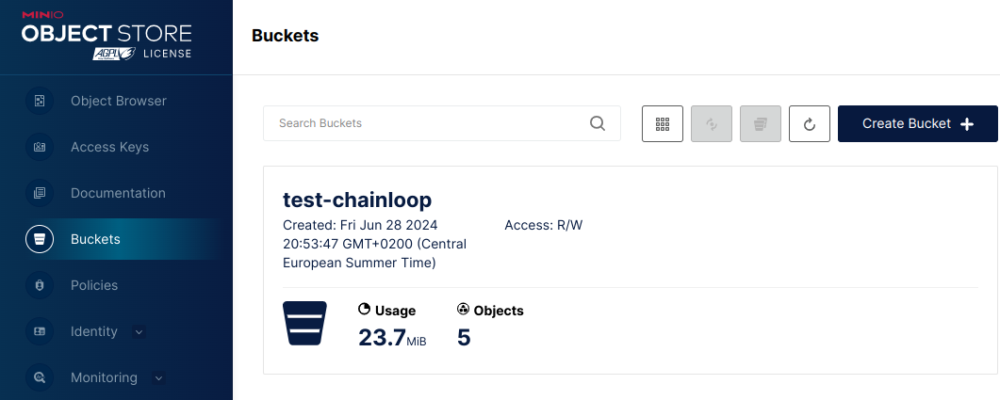

import Image from "@theme/IdealImage";
import Tabs from "@theme/Tabs";
import TabItem from "@theme/TabItem";
import CodeBlock from "@theme/CodeBlock";

As part of an attestation process, you might want to collect different pieces of evidence such as Software Bill Of Materials (SBOMs), test results, runner logs, etc and then attach them to the final in-toto attestation.

Chainloop helps with this process by providing a Content Addressable Storage API proxy that:

- **Abstracts away the underlying storage backend**. Currently, we support OCI registries as storage backends but you can expect blob storage, Artifactory and other storage backends to be supported in the future.
- Makes sure that the pieces of evidence are stored **in a tamper-proof manner**. This is achieved by storing the evidences named after their SHA256 content digest, which is calculated by the client, verified by the CAS server.
- **Enables support of large pieces of evidence** since the content digest reference is what will be stored in the attestation.

<Image img={require("./cas-backend.png")} className="light-mode-only" />
<Image img={require("./cas-backend-dark.png")} className="dark-mode-only" />

## Manage backends

You can setup as many CAS backends as you want, but you can only have **one enabled as default at the time**. This **default backend will be used** during the attestation process **to store the pieces of evidence**.

In Chainloop, CAS backends can be managed with the `chainloop cas-backend` command.

```bash
$ chainloop cas-backend ls
┌─────────────────────────────────┬──────────┬─────────────────────────────────────┬───────────────┬─────────┐
│ LOCATION                        │ PROVIDER │ DESCRIPTION                         │ LIMITS        │ DEFAULT │
├─────────────────────────────────┼──────────┼─────────────────────────────────────┼───────────────┼─────────┤
│                                 │ INLINE   │ Embed artifacts content in the atte │ MaxSize: 500K │ false   │
│                                 │          │ station (fallback)                  │               │         │
├─────────────────────────────────┼──────────┼─────────────────────────────────────┼───────────────┼─────────┤
│ ghcr.io/cyberdyne/chainloop-lab │ OCI      │                                     │ MaxSize: 100M │ true    │
└─────────────────────────────────┴──────────┴─────────────────────────────────────┴───────────────┴─────────┘
```

## Backend providers

:::info
New CAS Backends will be added over time. If yours is not implemented yet, please [let us know](https://chainloop.dev/contact)
:::

### Inline (fallback)

Chainloop comes pre-configured with what we call an `inline` backend.

The inline backend **embeds** the pieces of evidence in the resulting attestations. This is useful to get started quickly but since the metadata is embedded in the attestation, its max size is limited.

We recommend that once you get closer to a production-ready setup, you switch to a more robust backend such as an OCI registry.

### OCI registry

#### Add a new OCI registry backend

<Tabs>
  <TabItem value="gar" label="Google Artifact Registry" default>

```bash
  # Using json-based service account
  # https://console.cloud.google.com/iam-admin/serviceaccounts

  $ chainloop cas-backend add oci \
    # i.e us-east1-docker.pkg.dev/my-project/chainloop-cas-devel
    --repo [region]-docker.pkg.dev/[my-project]/[my-repository] \
    --username _json_key \
    --password "$(cat service-account.json)" \
    --default
```

  </TabItem>

  <TabItem value="acr" label="Azure Container Registry">

```bash
  # Using token-auth with push (content/read + content/write) permissions
  # https://learn.microsoft.com/en-us/azure/container-registry/container-registry-repository-scoped-permissions

  $ chainloop cas-backend add oci \
    # i.e chainloopcas.azurecr.io/cas
    --repo [registry-name].azurecr.io/[my-repository] \
    --username [token-name] \
    --password [token-password] \
    --default
```

  </TabItem>

  <TabItem value="github" label="GitHub packages" default>

```bash
  # Using personal access token with write:packages permissions
  # https://github.com/settings/tokens

  $ chainloop cas-backend add oci \
    # i.e ghcr.io/chainloop-dev/chainloop-cas
    --repo ghcr.io/[username or org]/[my-repository] \
    --username [username] \
    --password [personal access token] \
    --default
```

  </TabItem>
  <TabItem value="dockerhub" label="DockerHub" default>

```bash
# Create a personal access token at
# https://hub.docker.com/settings/security

$ chainloop cas-backend add oci \
    --repo index.docker.io/[username] \
    --username [username] \
    --password [personal access token] \
    --default
```

  </TabItem>
  <TabItem value="ecr" label="AWS Container Registry" default>

:::caution
**AWS Container Registry is not supported yet**.
:::

  </TabItem>
</Tabs>

#### Rotate credentials

```bash
chainloop cas-backend update oci --name [BACKEND_NAME] --username [NEW_USERNAME] --password [NEW_PASSWORD]
```

#### Set as default

```bash
chainloop cas-backend update oci --name [BACKEND_NAME] --default=true
```

### AWS S3

Chainloop also supports storing artifacts in [AWS S3 Blob Storage](https://aws.amazon.com/s3/).

#### Pre-requisites

To connect your AWS account to Chainloop you'll need:

- **S3 Bucket Name**
- **Bucket Region**
- **AccessKeyID**
- **SecretAccessKey**

**Create an S3 bucket**

Create an S3 bucket and take note of the bucket name and region



**Create an IAM user with access to that bucket**

Next we are going to create a policy that has write/read permissions to the bucket. 

You can use the snippet below by just replacing `[bucketName]` with the actual name of the bucket you created in the step before.

```json
{
	"Version": "2012-10-17",
	"Statement": [
		{
			"Effect": "Allow",
			"Action": [
				"s3:ListBucket"
			],
			"Resource": "arn:aws:s3:::[bucketName]"
		},
		{
			"Effect": "Allow",
			"Action": [
				"s3:GetObject",
				"s3:PutObject"
			],
			"Resource": "arn:aws:s3:::[bucketName]/*"
		}
	]
}
```

Then create an user, attach the policy to it and click on "create access Key"



Then select third-party service and copy the access key ID and secret access key

We are now ready to connect our AWS account to Chainloop

```bash
 $ chainloop cas-backend add aws-s3 \
    --access-key-id [accessKeyID] \
    --secret-access-key [secretAccessKey] \
    --region [region] \
    --bucket [bucketName]
```

#### Rotate credentials

```bash
chainloop cas-backend update aws-s3 --name [BACKEND_NAME] --access-key-id [new-accessKeyID] --secret-access-key [new-secretAccessKey] --region [new-region]
```

### Azure Blob Storage

Chainloop also supports storing artifacts in [Azure Blob Storage](https://azure.microsoft.com/en-us/products/storage/blobs).

#### Pre-requisites

To connect your Azure storage account you'll need the following information

- **Active Directory Tenant ID**
- **Service Principal ID**
- **Service Principal Secret**
- **Storage account name**

We'll walk you through the process of how to find this information

**Register an application to create the service principal**

First, you'll need to register an application in your Azure Active Directory tenant. You can do this using the Azure CLI or from the Azure portal


Once done, in the application overview you should be able to find the tenantID, and Service principal ID



Next, let's create a secret for the service principal



**Create a storage account and give permissions to the service principal**

Next, we'll create a storage account (or you can use an existing one), take a note on the storage account name.



And once created, we'll give permissions to the service principal, go to IAM assign-roles.



Search for the application we just registered and assign the Storage Blob Data Contributor role


At thi point we have all the information we need to connect our Azure storage account to Chainloop

```bash
 $ chainloop cas-backend add azure-blob \
    --client-id [servicePrincipalID] \
    --client-secret [servicePrincipalSecret] \
    --tenant [Active directory tenant] \
    --storage-account [Storage Account name] \
    --container [optional Storage account container]
```

#### Rotate credentials

```bash
chainloop cas-backend update azure-blob --name [BACKEND_NAME] --client-id [new-clientID] --client-secret [new secret] --tenant [updated tenant]
```

### Cloudflare R2

[Cloudflare R2](https://www.cloudflare.com/developer-platform/r2/) is compatible with AWS S3 and can be configured in Chainloop by providing a custom endpoint.

Pre-requisites

- **AccessKeyID**
- **SecretAccessKey**
- **Bucket Name**
- **Endpoint**

Follow [this instructions](https://developers.cloudflare.com/r2/api/s3/tokens/) to create a compatible AccessKeyID and SecretAccessKey. Then copy the bucket name and endpoint from the bucket settings.



Finally register the Cloudflare R2 bucket using the `aws-s3` provider and providing the custom endpoint.

```bash
 $ chainloop cas-backend add aws-s3 \
    --access-key-id [accessKeyID] \
    --secret-access-key [secretAccessKey] \
    --bucket [bucketName] \
    --endpoint [endpoint] # provide the custom endpoint
```

### Minio

[Minio](https://min.io/) is an S3-compatible blob storage that can be configured in Chainloop by providing a custom endpoint.

Pre-requisites

- **AccessKeyID**
- **SecretAccessKey**
- **Bucket Name**
- **Minio Endpoint**


You can create a new AccessKey from the Minio console.


Then copy the bucket name and Minio endpoint.



Finally register the Minio bucket using the `aws-s3` provider and providing the custom endpoint

```bash
 $ chainloop cas-backend add aws-s3 \
    --access-key-id [accessKeyID] \
    --secret-access-key [secretAccessKey] \
    --bucket [bucketName] \
    --endpoint [endpoint] # provide the custom endpoint
```

## Give it a try

If everything went well, you should be able to upload and download artifact materials, let's give it a try

```bash title="Upload a file to your OCI repository"
$ chainloop artifact upload -f myfile
myfile@sha256:c5cc0a2c712497c29f29c3ba11e7fcc0c3cc725ab591720db595e5d6469f3f37 ... done! [1.03KB in 0s; 5.48KB/s]
```

```bash title="Download by content digest (sha256)"
$ chainloop artifact download -d sha256:c5cc0a2c712497c29f29c3ba11e7fcc0c3cc725ab591720db595e5d6469f3f37
INF downloading file name=myfile to=/tmp/myfile
INF file downloaded! path=/tmp/myfile
```
