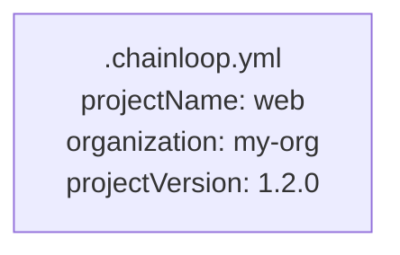
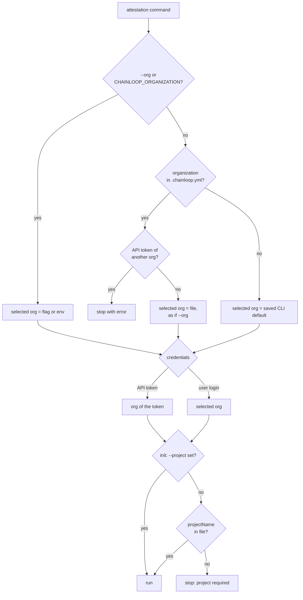

# Spec 001: Project and Organization from .chainloop.yml in Attestations

## Summary

The attestation commands will read the project name and the organization from the repository file `.chainloop.yml`. The `chainloop trace init` command already writes these values to the file, with the keys `projectName` and `organization`. Today the attestation commands read only `projectVersion` from the file. With this change, a repository owner can pin the project and the organization for every attestation made from the repository. CI jobs then do not need to repeat them on each command. Command-line flags and environment variables continue to take precedence over the file.

## Problem

- The file can pin only the project version for attestations. Each CI job must also pass `--project`.
- The organization comes from the credentials. An API token belongs to one organization, and the control plane always uses it. A user can be a member of more than one organization. For a user login, the CLI uses `--org` or the organization that the CLI saved as the default. A user who omits `--org` can attest into the wrong organization.
- With an API token, the CLI ignores `--org` without a message. A job that names one organization and uses a token of a different organization attests into the organization of the token.
- The trace commands already read `projectName` and `organization` from the same file, but the attestation commands ignore them. One file has two different meanings, which depend on the command that reads it.
- The attestation commands and the trace commands read the file in different ways. When a directory has both `.chainloop.yml` and `.chainloop.yaml`, each command picks a different file.
- When the file does not exist, `attestation init` skips some of its flag checks. For example, it accepts `--latest-version` together with `--version`.

## Goals and Non-Goals

- Goal: A repository that has `projectName` and `organization` in `.chainloop.yml` gets attestations in that project and organization with no extra flags.
- Goal: The attestation commands and the trace commands find and read the file in the same way.
- Goal: Flags and environment variables always take precedence over the file.
- Non-goal: Read `workflowName` from the file for attestations. The workflow stays a required flag.
- Non-goal: Make other CLI commands, such as the workflow or project commands, follow the organization in the file.
- Non-goal: Change how `chainloop trace` resolves its values.

## Requirements

### R-001: Project from the file
When `--project` is not set, `attestation init` MUST use `projectName` from `.chainloop.yml`.
- Done when: `attestation init --workflow build` in a repository with `projectName: web` creates the attestation in the project `web`.

### R-002: Project is still required
When the flag and the file give no project, `attestation init` MUST stop with an error. The error MUST name both sources: the `--project` flag and `projectName` in `.chainloop.yml`.

### R-003: Organization from the file
The `organization` value in `.chainloop.yml` MUST have the same effect as `--org`. It applies when `--org` and `CHAINLOOP_ORGANIZATION` are not set. It applies to each attestation command that contacts the control plane: `init`, `add`, `push`, `status`, and `reset`. The file MUST take precedence over the organization that the CLI saved as the default.
- Done when: a user who is a member of two organizations gets the attestation in the organization of the file, with no `--org`.

### R-004: Flags take precedence
A value from a flag or an environment variable MUST take precedence over the same value in the file. This applies to the project, the organization, and the version.

### R-005: API token for a different organization
The credentials can be an API token of organization A while the file names organization B. In that case, the command MUST stop before it contacts the control plane. The error MUST name both organizations. It MUST tell the user to use a token of organization B or to remove the value from the file.

### R-006: Saved CLI default stays the same
An organization that comes from the file MUST NOT change the default organization that the CLI saved. When the user is not a member of the organization in the file, the command MUST stop with an error that names the file. The command MUST NOT clear the saved default.

### R-007: One way to find the file
The attestation commands and the trace commands MUST find the same file. The search starts in the current directory and moves up to the root of the git repository. In each directory, `.chainloop.yml` MUST take precedence over `.chainloop.yaml`.

### R-008: Flag checks without a file
`attestation init` MUST check its flags in the same way when the file is missing, when it cannot be read, and when it exists. For example, it MUST refuse `--latest-version` together with `--version` in each case.

### R-009: Notice when the file changes the organization
When the organization from the file is different from the saved CLI default, the command MUST print one line. The line names the organization and the file.

## Constraints

- Compatibility: repositories that have only `projectVersion` in the file MUST get the same result as today.
- Compatibility: the file format does not change. The keys are the keys that `chainloop trace init` writes today.
- Public repository: the repository owner commits the file to the repository. It MUST NOT contain credentials, and this spec adds none.

## Proposal

The user adds two keys to `.chainloop.yml`, or runs `chainloop trace init`, which writes them:

After that, `chainloop attestation init --workflow build` creates the attestation in the project `web` of the organization `my-org`, for version `1.2.0`. The later `add`, `push`, `status`, and `reset` commands also use `my-org`. A flag or an environment variable changes one value for one run and leaves the file as it is.

**One file reader.** The CLI gets one reader for `.chainloop.yml`, and the attestation commands and the trace commands both use it. The reader finds the file as R-007 describes and returns all known keys. A file without `projectName` is still a valid file, because it can hold only a version. Each command then takes the keys it needs.

**The file works like `--org`.** The CLI selects the organization when it opens the connection to the control plane, before the command runs. For the attestation commands, the CLI reads the file at that step. When `--org` and the environment variable are not set, the CLI uses the organization from the file as if the user gave it with `--org`. The order is the flag, then the environment variable, then the file, then the saved default. The CLI uses the result for that run only, and does not save it. For a user login, this selects one of the organizations of the user.

**Why every attestation command reads the file.** The attestation state records the organization, but the later commands cannot rely on the state. With remote state, the command must connect to the correct organization before it can load the state. So each command reads the file itself. The file is at the repository root, so all commands of one CI job find the same file.

**API tokens.** An API token belongs to one organization, and the control plane always uses that organization. Today the CLI ignores `--org` with an API token. The file works like `--org` with one addition: when the file names a different organization than the token, the CLI stops early with the R-005 error. Without this check, the attestation goes into the organization of the token, and the user gets no message. The file is a statement from the repository owner, so a different organization is an error in the setup. The trace commands already do this check.

## Decision Record

| ID | Decision | Choice | Why (and what we rejected) | Source |
|----|----------|--------|----------------------------|--------|
| D-001 | Key names in the file | `projectName` and `organization` | `chainloop trace init` already writes these keys. We rejected a new `project` key (proposed in PR #3065): the same file would then need two keys for one value. | drafting |
| D-002 | Order for the organization | Flag, environment variable, file, saved default | The file pins the organization for the repository, as issue #3063 asks. We rejected "saved default before file": most users have a saved default, so the file would almost never apply. | drafting |
| D-003 | No project from the flag or the file | Stop with an error | The project is a required flag today. We rejected a warning without an error (PR #3065): it removes a rule that users have now. | drafting |
| D-004 | Commands that read the organization from the file | All attestation commands that contact the control plane | With remote state, a command must connect to the correct organization before it can load the state. We rejected "only init reads the file, and later commands use the organization in the state" for this reason. | drafting |
| D-005 | Both `.chainloop.yml` and `.chainloop.yaml` in one directory | `.chainloop.yml` first | It is the name that the trace commands write and that the documentation uses. We rejected an error: it breaks repositories that have both files today. | drafting |
| D-006 | API token for a different organization | Stop early with a clear error | The trace commands do the same check. We rejected sending the request: the control plane uses the token organization and gives an error that does not name the file. | drafting |
| D-010 | Effect of the organization in the file | The same effect as `--org`, plus the R-005 check for API tokens | One rule for users: the file is a `--org` that the repository keeps. We rejected an exact copy of `--org`: with an API token, it ignores a different organization without a message. We also rejected a warning only: CI logs often hide it. | drafting |
| D-007 | File readers | One reader for attestation and trace | Two readers already disagree on file order. We rejected a second change to the attestation reader only. | drafting |
| D-008 | Workflow name from the file | Out of scope | The workflow is a different choice for each CI job in one repository. | drafting |
| D-009 | Notice when the file changes the organization | Print one line that names the organization and the file | Without it, a user who runs a command locally can attest into an organization that they did not expect. We rejected a debug log only: most users never see it. | drafting |

## Open Questions

None.

## Risks

| Risk | Mitigation |
|------|------------|
| A repository has an old `organization` value from a trace setup, and its CI now attests into that organization. | The value comes from `trace init` and so is the organization the owner selected. The release notes describe the change. R-009 adds a visible line. |
| A repository has both files with different values, and `attestation init` now reads `.chainloop.yml` instead of `.chainloop.yaml`. | This setup is rare. The release notes describe the change. |
| A user runs a command from a subdirectory that has its own `.chainloop.yml`. | This is the expected result, and it matches the trace commands. The search stops at the repository root. |
