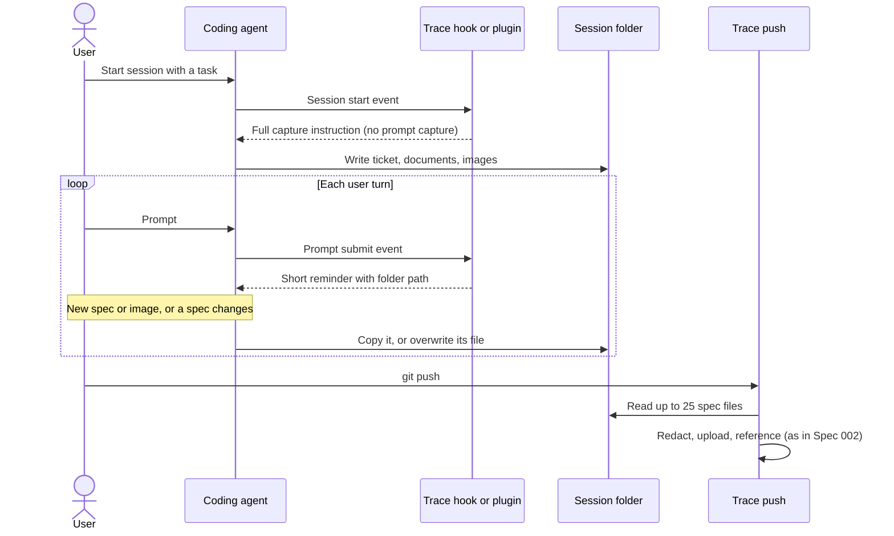

# Spec 003: Spec capture during the session

## Summary
This spec changes the spec capture of [Spec 002](002-session-spec-capture.md). It does not replace it. Today the agent captures the spec only at session start. It also captures the user prompt, which the transcript already holds. With this change, the agent does not capture the user's request prompt, because the transcript holds it. A short reminder at each user turn tells the agent to capture a new spec or image from the user. It also tells the agent to capture a changed spec again. The limit on spec files for each session goes from 10 to 25.

## Problem
- The agent captures the user prompt as a spec of kind `text`. The prompt is the first message of the transcript, so the spec material adds no information. The spec list then shows a duplicate as if it were external context.
- The agent receives the capture instruction only at session start. The push does not record a spec that the session creates or changes later. Example: the agent writes a design note in a local notes folder outside the repository. It edits the note many times, and subagents use it as their plan. The evidence does not hold this note, but it holds the prompt and the screenshots.
- A resumed session gets no instruction when the spec folder already holds a file.
- The limit of 10 files keeps the oldest files. In a long session, a spec added late is the first one that the push drops.

## Goals and Non-Goals
- Goal: the spec materials of a session do not hold the user's request prompt.
- Goal: the evidence holds each spec or image that the user gives after the start. It holds each changed spec with its content at push time.
- Goal: the reminder is short and narrow, so that it does not overload the session.
- Goal: the agent still decides what a spec is, as Spec 002 decided (D-001 of Spec 002).
- Non-goal: a list of known spec locations, or rules in the CLI that decide if a file is a spec.
- Non-goal: a new attestation when only the specs changed. A push records new specs only with a new AI-assisted commit, as today.
- Non-goal: a spec for a push after the session ends. Spec 002 accepted this loss, and this spec keeps it.
- Non-goal: changes to the materials, the redaction, or the storage that Spec 002 defines.

## Requirements

### R-001: No request prompt
The capture instruction MUST tell the agent not to capture the user's request prompt. A spec that the user pastes, for example ticket text or a design document, is still a spec. The agent MUST still use kind `text` for a plan that the session approved.
- Done when: a session that starts from a one-line prompt and no other source pushes no spec material.

### R-002: Reminder at each user turn
The system MUST give the agent a short capture reminder at each user prompt, in each agent that has a channel for it. The reminder MUST include the absolute path of the session folder.
- Done when: a resumed session receives the reminder at its next user prompt, also when the folder already holds files.

### R-003: Three cases only
The reminder MUST tell the agent to capture in these cases only:
- The user pastes or gives a new spec.
- The user pastes or gives an image.
- A spec changes, also when the session itself edits it.

For a changed spec, the agent MUST overwrite its spec file with the current content. A local document has its local path as the source address.
- Done when: a session writes a design note outside the working tree and works from it. The push records that note as a `document` spec with its final content.

### R-004: Higher file limit
The push MUST record at most 25 spec files for each session. When there are more, it MUST keep the oldest files and record a warning, as Spec 002 does today.

## Constraints
- The repository is public. The instruction and the reminder text are visible to all users.
- The reminder goes into the agent context at each turn. It must stay short, so that it costs few tokens and does not distract the agent from the task.
- Each agent has its own hook channels. An agent without a channel for the prompt-submit event gets only the session-start instruction.

## Proposal
The user does nothing new.

At session start, the trace hook gives the full capture instruction, as in Spec 002. The instruction no longer lists "a written prompt" as a source. It tells the agent that the transcript already holds the conversation, so a prompt is not a spec. Kind `text` stays for a plan that the user approved in the session and for spec text that came from outside the conversation.

At each user prompt, the trace hook adds a short reminder to the agent context. The reminder names the session folder and covers three cases. When the user pastes or gives a new spec, copy it. When the user pastes or gives an image, copy it. When a spec changes, copy it again. The reminder says nothing else. A spec that the session writes, for example a design note in a local notes folder, is a spec that changes. Its local path is the source address. The push records the content on disk at push time, so the final version of a plan replaces its drafts.

The reminder replaces the old rule that gave the session-start instruction only while the folder was empty. A resumed session gets the reminder at its first user prompt, so it does not need the full instruction again.

The push keeps the rules of Spec 002, with a limit of 25 files instead of 10. A push with no new AI-assisted commits still sends no attestation. The next AI-assisted commit records a spec that the agent added after the last push. The session-end hook still deletes the folder.

Each agent receives the reminder through its own channel:

| Agent | Channel at each user prompt |
|-------|-----------------------------|
| Claude Code | The additional context of the prompt-submit hook response. |
| Cursor | None today. The agent gets the session-start instruction only (D-008). |
| OpenCode | The Chainloop plugin adds a context-only message, as it does at session start. |

## Decision Record

| ID | Decision | Choice | Why (and what we rejected) | Source |
|----|----------|--------|----------------------------|--------|
| D-001 | Capture of a user prompt | Do not capture the user's request prompt. Capture a spec that the user pastes | The transcript is already part of the session evidence, so the spec material is a duplicate. Rejected: keep it and label it "prompt" in the user interface (more data and UI work for no new information). | drafting |
| D-002 | How the system finds specs after session start | A short reminder at each user prompt, with three cases: a new spec, a new image, a changed spec. The agent decides what a spec is | Simple, and it keeps D-001 of Spec 002. It covers resumed sessions. Three narrow cases keep the reminder short, so it does not overload the session. Rejected: a general rule to capture anything that looks like a spec (too much capture). Rejected: a list of known spec locations that a hook watches (a new configuration, and it misses specs at other paths). Rejected: the hook copies matching files itself (the CLI decides what a spec is, and captures noise). Rejected: a check at push time against the transcript (needs transcript analysis for each agent). Rejected: a reminder after each Markdown write (misses a spec that the agent only reads, and more hook logic). | drafting |
| D-003 | A spec added after the last push, with no new AI-assisted commit | Record it with the next AI-assisted commit, as today | An attestation with no new commit is a duplicate of the session. Rejected: push a new attestation when the set of spec digests changed. | drafting |
| D-004 | A push after the session ends | No change: the session-end hook deletes the folder, and that push holds no spec | Accepted in Spec 002. Rejected: keep the folder until the next push, with an age limit (state to track and clean for a rare case). | drafting |
| D-005 | Spec file limit | Raise from 10 to 25 and keep the oldest files | The reminder makes more spec files likely in a long session. The oldest files are the sources the session started from. Rejected: keep the newest files (the start ticket can drop). | drafting |
| D-006 | Relation to Spec 002 | This spec changes Spec 002 and does not supersede it | Most of the capture design does not change. | drafting |
| D-007 | Control of overcapture from the reminder | Measure the number of spec files for each session after release. Make the reminder narrower if the number grows | The three cases are already narrow. Data from real sessions shows if more limits are necessary. | drafting |
| D-008 | Cursor | The session-start instruction only, until Cursor documents a channel that adds context at prompt submit | No channel to use today. | drafting |

## Open Questions
None.

## Risks

| Risk | Mitigation |
|------|------------|
| The agent ignores the reminder, as it ignored the instruction to add a file when the task changed. | The reminder comes at each turn, near the work, and not only at session start. The capture rate of Spec 002 (R-010) stays measurable. |
| A spec written and pushed in the same turn is not captured, because the next reminder comes later. | The session-start instruction still says to update the folder when the task changes. The next push with a new commit records it. |
| The reminder adds tokens to each turn. | Keep it to a few lines. The full instruction stays at session start only. |