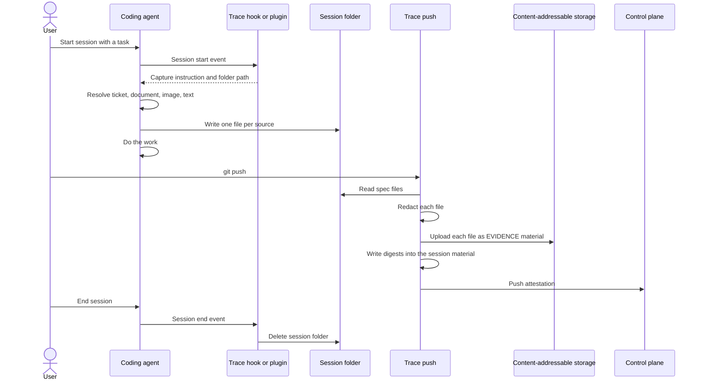

<!--
AGENT INSTRUCTIONS. Keep this comment. Read it before you change this file.

This spec records a design that humans reviewed and approved. Do not change it as part of other work. Find the status of the parent ticket (the `ticket:` field) before you change anything. If you cannot find the status, or you are not sure which case below applies, do not change the spec. Ask the human first.

- Ticket in design, and the spec PR is open: change the spec only through the br:eng-spec skill (`--revise`). Never renumber or reuse an R-xxx or D-xxx ID.
- Ticket in progress: do not rewrite the requirements, the Proposal, or existing Decision Record rows. Record a changed decision as a new Decision Record row. The owner records the differences with the shipped work through br:eng-spec (`--done`).
- Ticket done or canceled: the spec is frozen. Do not change, delete, or strike through any text. The only allowed edits are typo fixes, broken links, and the "Superseded by" line under the title. For a design change, write a new spec with br:eng-spec that supersedes this one.

When your code goes against this spec, say so in your PR. Do not edit the spec to match the code.
-->

# Spec issue-3495: Spec capture for AI coding sessions

## Summary
An AI coding session record shows what the agent changed, but not what the user asked for. This spec adds the spec of the session to its evidence. At session start, the trace hook tells the agent to write each source that sets the task into a session folder. At push time, the CLI stores each file as its own material in the attestation. The session material keeps only references to these materials. Reviewers and scoring tools can then compare the change with the request.

## Problem
- The session evidence has the diff, the transcript and the usage, but not the intent. A reviewer can see what changed, but not if it matches the request.
- The spec usually lives outside the session: an issue tracker ticket, a design document, a page in a notes vault. The transcript keeps a link or a short reference, not the content.
- A first version stores the spec text inside the session material. The same ticket is then copied into each session that uses it. Nobody can refer to it, download it or verify it alone.
- Only Claude Code receives the capture instruction today. Cursor and OpenCode sessions have no spec.

## Goals and Non-Goals
- Goal: a traced session that started from a spec pushes that spec as part of its attestation.
- Goal: each spec source is a separate material in content-addressable storage, addressed by its digest.
- Goal: the same capture works for Claude Code, Cursor and OpenCode.
- Goal: the capture rate is measurable from the pushed evidence.
- Non-goal: Chainloop resolves sources itself. The CLI makes no calls to issue trackers or document tools.
- Non-goal: extraction of the spec from the transcript by rules. The agent decides what the spec is.
- Non-goal: the user interface that shows the spec, and the use of the spec in AI scoring. Other products consume the materials this spec defines.
- Non-goal: redaction of images.

## Requirements

### R-001: Instruction at session start
The system MUST give the agent the capture instruction and the absolute path of the session folder when a traced session starts.
- Done when: a new session in each supported agent receives the instruction before its first turn.

### R-002: Folder in the working tree, never committed
The session folder MUST be inside the working tree and MUST be ignored by git without a change to the repository's own ignore file.
- Done when: a file in the folder never shows as a change in the repository status.

### R-003: One file per source
The agent MUST write one file for each source. A text file starts with a short header that gives the kind and an optional source address. The actual content follows the header. Images and other files that are not text, such as a PDF, are the exception. The agent copies such a file into the folder as it is, with no header. The system takes its kind from its content: `image` for an image, `document` for any other file. The kinds are:
- `ticket`: an issue tracker item (Linear, Jira).
- `document`: a written specification (a design doc, a vault page, an RFC).
- `image`: a mockup or screenshot. The file is the image itself when the agent can reach it as a file. For a pasted image, it is a description that the agent writes.
- `text`: a spec stated in the session itself, including a plan the session wrote and the user approved.

### R-004: Nothing to capture
The instruction MUST tell the agent to write nothing when the task has no spec, for example a typo fix or a question.

### R-005: Detached storage
At push time, the system MUST upload each spec file to content-addressable storage as a separate attestation material of kind EVIDENCE. The stored file MUST be the file in the session folder, header included. Redaction (R-007) is the only change the system makes to it.
- Done when: the attestation lists one EVIDENCE material for each spec file, and the digest of each material downloads that file.

### R-006: References in the session material
The session material MUST list each spec source by kind, source address, digest and capture time. The digest MUST be the one that content-addressable storage uses for the stored file. The session material MUST NOT hold the spec content.

### R-007: Redaction before upload
The system MUST apply the same secret redaction to text spec files that it applies to the session material, before it uploads them. An image, or a file that is not text, has no text to redact, so the system stores it as it is. The redaction covers the whole file, so it takes secrets out of the source address and out of the text. The system MUST NOT redact a spec file again when the file did not change since an earlier push of the same session. The system detects a change by the digest of the source file on disk, before redaction. This digest is not the one that R-006 records.
- Done when: a second push runs no secret scan on an unchanged spec file. It records the same digest as the first push.

### R-008: Failure never blocks the push
A missing, empty or unreadable spec folder MUST NOT stop the push of the session. The system SHOULD record a warning in the session material when it drops spec content.

### R-009: Keep the spec until the session ends
The system MUST keep the session folder after a push. Each push that sends an attestation for the session MUST record all the spec files that are in the folder at that time. A push with no new AI-assisted commits sends no attestation, so it records nothing. The system MUST delete the session folder and the redacted copies of R-007 when the session ends.
- Done when: a second push of the same session holds its current spec files, including files that did not change. The folder is gone after the session ends.

### R-010: Capture rate
The system SHOULD make it possible to count the sessions that have spec materials, from the pushed evidence only.

## Constraints
- The repository is public. The spec format and the instruction text are visible to all users.
- A write to the session folder must not cause a permission prompt in any permission mode of the agent. A path inside the git directory does cause prompts, and it is not an option.
- The hook output of each agent is one document per hook call. The capture instruction and the user banner go into the same document.

## Proposal
The user does nothing new. When a traced session starts, the trace hook adds the capture instruction to the context of the agent. The agent then resolves the sources that the task points at. It uses the tools it already has: an issue tracker connector, a web fetch, a local file read. It writes the actual text of each source into the session folder. If the task changes, the agent overwrites a file or adds one. The version on disk at push time is the one Chainloop records, so a reviewed plan replaces its draft.

When the user pushes, the trace push command reads the session folder. It redacts each file, uploads it as an EVIDENCE material, and records the digest. It then writes the references into the session material and adds that material last. The attestation now holds the session material and one material for each source. Content-addressable storage keeps one copy of a ticket that ten sessions use. Redaction runs in the client and is expensive. The CLI keeps the redacted copy of each file in the trace state, with the digest of the source file. A later push reuses that copy when the source file did not change. The session folder stays after the push, because a session can push more than one time. Each later push records the spec again, and storage keeps one copy of each file. The session-end hook deletes the folder.

Each agent receives the instruction through its own channel:

| Agent | Channel at session start |
|-------|--------------------------|
| Claude Code | The additional context of the session-start hook response. |
| Cursor | The additional context of the session-start hook response. Cursor documents this field. The current Cursor integration does not use it yet. |
| OpenCode | The Chainloop plugin adds a context-only message to the session when OpenCode creates the session. The OpenCode SDK documents this mode as a message with no model reply. |

The material names use the session ID as a prefix, so two sessions in one attestation never collide. Each spec material also carries annotations with the session ID, the kind and the source address. Policies can select spec materials by these annotations.



### Example: the spec field in the session material
The session material lists one reference for each source. The text of each source is in the EVIDENCE material with that digest.

```json
"spec": [
  { "kind": "ticket",   "uri": "https://tracker.example.com/issue/ENG-1234",
    "digest": "sha256:e4c2...", "captured_at": "2026-09-16T10:12:03Z" },
  { "kind": "document", "uri": "file://docs/design.md",
    "digest": "sha256:f5d9...", "captured_at": "2026-09-16T10:12:05Z" },
  { "kind": "image",
    "digest": "sha256:c2a1...", "captured_at": "2026-09-16T10:31:40Z" },
  { "kind": "text",
    "digest": "sha256:d3e7...", "captured_at": "2026-09-16T10:38:37Z" }
]
```

### Example: the attestation
One session that captured a ticket, a design document, a screenshot description and an approved plan:

```text
in-toto Statement (predicateType: chainloop.dev/attestation/v0.2)
├── subject
│   └── git.head  sha1:d7e1c3b9...
└── predicate.materials
    ├── ai-coding-session-fd4e67        CHAINLOOP_AI_CODING_SESSION   sha256:a9b3...
    │     data.session, data.usage, data.code_changes, ...
    │     data.spec[]  ──────────────────┐  references by digest
    │     data.raw_session               │
    │                                    │
    ├── spec-fd4e67-ticket-eng-1234      EVIDENCE  ticket-eng-1234.md   sha256:e4c2...  ◄┤
    ├── spec-fd4e67-design-proposal      EVIDENCE  design-proposal.md   sha256:f5d9...  ◄┤
    ├── spec-fd4e67-dedup-screenshot     EVIDENCE  dedup-screenshot.md  sha256:c2a1...  ◄┤
    └── spec-fd4e67-approved-plan        EVIDENCE  approved-plan.md     sha256:d3e7...  ◄┘
```

Each spec material in the predicate:

```json
{
  "name": "ticket-eng-1234.md",
  "digest": { "sha256": "e4c2..." },
  "annotations": {
    "chainloop.material.name": "spec-fd4e67-ticket-eng-1234",
    "chainloop.material.type": "EVIDENCE",
    "chainloop.material.cas": true,
    "chainloop.spec.session_id": "fd4e6754-3b26-4f54-9807-13c58465bb35",
    "chainloop.spec.kind": "ticket",
    "chainloop.spec.uri": "https://tracker.example.com/issue/ENG-1234"
  }
}
```

## Decision Record

| ID | Decision | Choice | Why (and what we rejected) | Source |
|----|----------|--------|----------------------------|--------|
| D-001 | Who decides what the spec is | The agent, told by an instruction at session start | Only the agent knows which input sets the task, and it reaches sources that the transcript never holds. Rejected: extraction from the transcript by the CLI (needs rules to pick the spec, misses sources the agent never opened, one extractor per agent). Rejected: extraction on the server after ingestion (the spec is not in the attestation). Both stay as a fallback if the capture rate is poor. | drafting |
| D-002 | Where the spec content goes | One EVIDENCE material per source, with references in the session material | Content-addressable storage keeps one copy for all sessions, each source is verifiable alone, and policies can select it. Rejected: text inside the session material (copies in each session, no digest per source). | drafting |
| D-003 | File format | Markdown with a short header for kind and source address | A model writes long Markdown reliably. Long text escaped inside JSON fails completely when one character is wrong. A bad header still keeps the content, and an unknown kind falls back to text. Rejected: JSON files. | drafting |
| D-004 | Folder location | A folder in the working tree that ignores itself | The agent writes there without a permission prompt. Rejected: a folder in the git directory (write prompts, and the agent did not attempt the write in tests). | drafting |
| D-005 | OpenCode channel | A context-only session message from the plugin | Documented in the OpenCode SDK. Rejected: the experimental system prompt hook (a reported bug drops plugin changes). | drafting |
| D-006 | Skills as the trigger | Not used as the trigger | The model decides when to load a skill, no agent can make a skill always apply, and a skill cannot hold the session path. | drafting |
| D-007 | User interface and scoring | Out of scope for this repository | They live in other products and consume the materials that this spec defines. | drafting |
| D-008 | Material type for spec files | EVIDENCE | A spec file is supporting evidence for the session, not an output of the work. Rejected: ARTIFACT. | owner review |
| D-009 | When the session folder is deleted | When the session ends | A session can push more than one time, and each attestation must hold its spec. Content-addressable storage keeps one copy of each file, so a new push adds no storage. Rejected: delete after each push (a later push of the same session would have no spec). | owner review |
| D-010 | Images | An image that the agent can reach as a file is copied into the folder and stored byte for byte. Its kind comes from its content. A pasted image becomes a description that the agent writes | The agent writes files through its tools, so it can copy an image from disk, download one, or store generated output. It cannot recover the bytes of a pasted image from what it sees, and the only copy of those bytes is in the session transcript. A later version takes them from the transcript at push time. A binary file skips the text redaction, because it has no text to scan and a rewrite would break it. | [PR comment](https://github.com/chainloop-dev/chainloop/pull/3491#discussion_r4138700249) |
| D-011 | Redaction on later pushes | Keep the redacted copy of each file, keyed by the digest of the source file, and reuse it while the file does not change | Redaction runs in the client before the upload and is expensive. Rejected: scan again on each push (repeated cost for the same result). Rejected: write the redacted text back into the session folder (the agent sees its own file change). | [PR comment](https://github.com/chainloop-dev/chainloop/pull/3491#discussion_r4138546059) |
| D-012 | Size of a spec file | No cut in the CLI. A limit on the number of files for each session stays | The stored file must be the file on disk, and the storage backend configuration already limits the size of a material. The file limit protects the session material from an agent that writes one file per turn. Rejected: cut the text at a fixed size (the stored file would differ from the file on disk). | owner review |

## Open Questions
- [ ] **Do Cursor and OpenCode keep the bytes of a pasted image in their transcripts?** D-010 depends on it for these agents. Proposed: test both agents before the image work starts.
- [ ] **Do we add one shared skill that holds the long instruction text?** Proposed: not in the first version. Each hook injects the full instruction. A shared skill would give one copy of the text for all agents and fewer tokens for each session.

## Milestones
1. **Detached storage for Claude Code.** Claude Code sessions push each spec file as an EVIDENCE material, with references in the session material.
2. **Cursor.** The Cursor session-start hook sends the instruction. Done after a test in Cursor shows that the model receives it.
3. **OpenCode.** The OpenCode plugin sends the instruction as a context-only message. Done after a test shows that the model receives it and that the user sees no extra reply.

## Risks

| Risk | Mitigation |
|------|------------|
| The agent ignores the instruction, so capture is not guaranteed. | R-010 makes the rate measurable. |
| The model paraphrases the source instead of copying it. | The instruction asks for the actual text. The source address lets a reviewer compare with the original. |
| A workflow contract rejects materials that it does not declare. | Test how trace workflows handle extra materials before milestone 1. |
| An agent changes or drops the documented channel. | Each agent integration declares if it supports the instruction. A session without the channel pushes as it does today, without a spec. |
| A contract policy for all EVIDENCE materials also runs on the spec files. It receives Markdown where it expects JSON. | A policy author can limit the policy to named materials with a name selector. The spec material names start with `spec-`, so they do not match a selector for other materials. |
| The user pushes after the session ends. The session-end hook already deleted the folder, so that push holds no spec. | Accepted for the first version. Every push during the session holds the spec. |
| Spec content contains customer names or internal details. | The same redaction as the session material applies (R-007). A session that must not be recorded is one where trace is off. |
