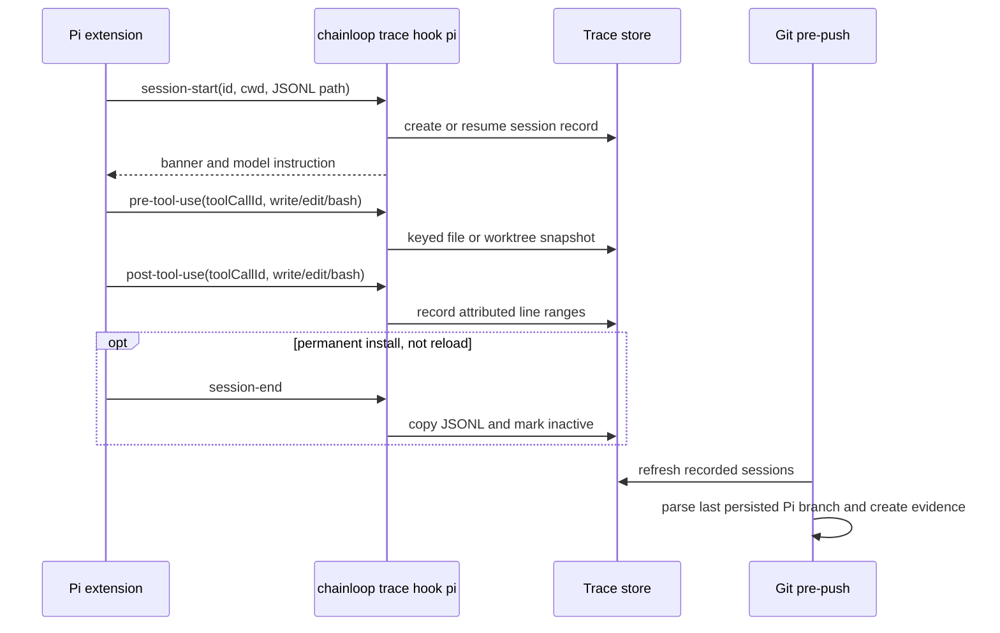

<!--
AGENT INSTRUCTIONS. Keep this comment. Read it before you change this file.

This spec records a design that humans reviewed and approved. Do not change it as part of other work. Find the status of the parent ticket (the `ticket:` field) before you change anything. If you cannot find the status, or you are not sure which case below applies, do not change the spec. Ask the human first.

- Ticket in design, and the spec PR is open: change the spec only through the br:eng-spec skill (`--revise`). Never renumber or reuse an R-xxx or D-xxx ID.
- Ticket in progress: do not rewrite the requirements, the Proposal, or existing Decision Record rows. Record a changed decision as a new Decision Record row. The owner records the differences with the shipped work through br:eng-spec (`--done`).
- Ticket done or canceled: the spec is frozen. Do not change, delete, or strike through any text. The only allowed edits are typo fixes, broken links, and the "Superseded by" line under the title. For a design change, write a new spec with br:eng-spec that supersedes this one.

When your code goes against this spec, say so in your PR. Do not edit the spec to match the code.
-->

# Spec issue-3520: Pi coding agent support in Chainloop Trace

## Summary

Chainloop Trace will support [Pi](https://pi.dev) as a coding agent. `chainloop trace init --pi` and `chainloop trace run --pi` will install one project-local Pi extension. The extension will translate Pi session and tool lifecycle events into the existing Chainloop Trace hook protocol. The CLI will copy and parse Pi's persisted JSONL session, attribute file changes, and emit the existing AI coding-session evidence type. No control-plane API or attestation schema changes are required.

## Problem

- Chainloop Trace supports Claude Code, Cursor, and OpenCode, but not Pi. A contribution produced with Pi cannot provide native Chainloop AI coding-session evidence.
- Pi records a structured session and exposes lifecycle events, but Chainloop does not install an extension, receive those events, or parse Pi JSONL.
- Contributors using Pi currently need the `skip-ai-session` bypass even when their work otherwise follows the repository's Trace policy.
- Treating Pi as Claude Code or OpenCode would be incorrect. Pi has its own session tree, extension lifecycle, concurrent tool events, project-trust model, and transcript format.

## Goals and Non-Goals

- Goal: Pi users can select Pi during `trace init` or with `--pi` and produce the same AI coding-session evidence type as other providers.
- Goal: Pi lifecycle and built-in file mutation events use the existing best-effort Trace hook pipeline.
- Goal: The captured transcript follows the selected Pi session branch and includes model, usage, tool, and conversation summaries.
- Goal: The extension works without corrupting Pi's stdout in TUI, RPC, JSON, or print mode.
- Non-goal: Change Pi itself or require a Chainloop-maintained Pi fork.
- Non-goal: Publish or install a separate Pi package. Chainloop owns one generated project extension.
- Non-goal: Attribute arbitrary custom Pi tools in the first version. Tools outside the documented `write`, `edit`, and `bash` paths remain visible in the transcript but do not get file-line attribution.
- Non-goal: Capture a transcript for `pi --no-session`. A persisted Pi session is required for session evidence.
- Non-goal: Recover a Pi session when no Pi hook ever created a Chainloop session record. Tool hooks recover a missed session-start hook, but pre-push does not scan every provider for untracked sessions.
- Non-goal: Parse Pi JSONL v1 or v2. Pi migrates those sessions to v3 when it opens them.
- Non-goal: Change the default Trace provider. Claude Code remains the default when no provider is selected.

## Requirements

### R-001: Provider selection

Pi MUST be registered as the provider `pi`. `trace init` and `trace run` MUST accept `--pi`, and interactive initialization MUST list Pi with the other providers. Multiple provider flags MUST continue to work, and existing default-provider behavior MUST remain unchanged.

- Done when: provider registry, flag, prompt, next-step, capability, and generated CLI-reference tests include Pi while no-flag commands still select Claude Code.

### R-002: Project-local extension lifecycle

Initialization MUST install exactly one Chainloop-owned file at `.pi/extensions/chainloop-trace.ts`. The generated file MUST carry a stable Chainloop ownership marker. Installation MUST leave identical content unchanged, upgrade a file with that marker, and stop without modifying an unrecognized file at the same path. Pi's `UninstallHooks` MUST remove only a marked Chainloop file, preserve sibling and unrecognized files, and tolerate an absent file. `trace run` MUST restore any previous file byte for byte when it finishes and MUST remove the temporary file when none existed before.

- Done when: install, reinstall, marked upgrade, unknown-file collision, uninstall, partial-init rollback, and both trace-run restoration cases pass without changing another file under `.pi/`.

### R-003: Session lifecycle

For permanent installation, the extension MUST send Pi's session-header `id`, `ctx.cwd`, and persisted session-file path to the existing session-start action. It MUST send session-end for shutdown reasons `quit`, `new`, `resume`, and `fork`, but MUST NOT end the session for `reload`. A tool event MUST be able to create the session record when session-start was missed, so every recovery-capable tool payload MUST include the same session ID, working directory, and session-file path. Every Chainloop subprocess MUST run with `cwd: ctx.cwd` so state is located in the current Pi repository. The temporary `trace run` installation MUST omit session-end because `trace run` owns final attestation and cleanup after Pi exits.

- Done when: tests cover start, quit, reload, new, resume, fork, a missed start followed by a tool call, and switching between two repositories without writing to the first repository's Trace store.

### R-004: File attribution and concurrent calls

The provider MUST give Pi's built-in `write` and `edit` tools paired before/after file snapshots and MUST give `bash` before/after working-tree snapshots. Relative `event.input.path` values MUST be resolved against `ctx.cwd` before they reach Chainloop. Pi's `toolCallId` MUST map to the existing optional `tool_use_id` field and `HookInput.ToolUseID`; a second correlation field MUST NOT be added, and the value MUST NOT be stored as `agent_id`. File-snapshot keys MUST include `ToolUseID` when it is present, as command-snapshot keys already do. This changes file-snapshot keys for any provider that supplies a tool-use ID; events without one retain the current fallback key.

Tool-call IDs prevent one concurrent call from overwriting another call's snapshot; they do not isolate overlapping mutations. Attribution remains best-effort when concurrent calls touch the same file or working tree.

- Done when: interleaved `bash` calls and interleaved same-path `write`/`edit` calls consume their own snapshots, do not leak snapshot files, and do not assume isolated diffs.

### R-005: Transcript ownership

Every lifecycle and tracked-tool payload MUST report `ctx.sessionManager.getSessionFile()` when it exists. The reported path MUST be stored on the session record and MUST take precedence over a derived location. Before parsing, the Pi provider MUST remove or quarantine its previous raw copy, copy the current JSONL through a temporary file, and atomically rename it into the Trace store. A failed refresh MUST leave no stale Pi transcript for the shared pre-push path to parse. A missing source, `--no-session`, or failed copy MUST skip Pi session evidence with a sanitized warning and MUST NOT block Pi or Git push. This freshness behavior MUST stay inside the Pi provider and MUST NOT change existing-provider copy failures.

The current `Provider` interface still requires `DiscoverSession` and `SessionDirForRepo`, but no production code calls either method through the interface. Until #3536 removes them, Pi MUST implement only the minimum needed to satisfy the interface and MUST NOT add unused discovery logic. If #3536 merges before implementation, Pi MUST omit those methods. In either case, the first version MUST NOT add a pre-push scan that invents session records for providers whose hooks never ran.

- Done when: a reported non-default path is used, a failed refresh cannot attest a cached raw file, a live file is never parsed in place, and missing/no-session cases remain non-blocking.

### R-006: Pi JSONL v3 and session trees

The extension MUST append a Chainloop plain `custom` entry after `session_tree`. Pi appends that marker as a child of the newly selected leaf and makes it the current leaf. The parser MUST therefore select the last persisted tree entry in file order, follow `parentId` links to the root, and reverse that path. Later work descends from the marker; a later tree selection appends a new marker on the newly selected branch. The parser MUST exclude Chainloop's plain tree markers from raw evidence.

The parser MUST require a valid v3 session header. It MUST reject duplicate IDs, cycles, or a selected path with a missing parent. It MUST retain valid unknown entry types on the selected raw timeline and ignore unknown fields while aggregating known types. An invalid header, unsupported or absent version, or malformed interior JSON line MUST skip that session with a useful sanitized warning. A single truncated final line after a valid header MAY be ignored and recorded in `data.warnings`.

- Done when: fixtures cover `/tree`, later turns, a second `/tree`, compaction, an abandoned malformed-but-valid unknown entry, duplicate IDs, a selected orphan, a cycle, an invalid header, an interior malformed line, and a truncated final line.

### R-007: Evidence mapping

The provider MUST emit the existing AI coding-session evidence schema with:

- agent name `pi`;
- Pi session ID;
- start time from the session header;
- end time from the last selected entry, falling back to the header time, and duration as their non-negative difference;
- primary model and provider from the last selected assistant message;
- a sorted unique list of models used by selected assistant messages;
- input, output, cache-read, cache-write, total-token, and cost totals from all selected assistant messages, including persisted error or aborted responses;
- tool invocation counts from assistant `toolCall` content blocks, sorted by tool name;
- user and assistant message counts from messages with those roles, excluding Chainloop custom messages, tool results, summaries, and custom entries; and
- selected raw entries under `RawSession["main"]`, excluding the header and Chainloop's plain tree markers while retaining messages that entered model context.

Invalid negative, non-finite, or overflowing usage values MUST be ignored with an evidence warning. Missing optional usage or agent-version data MUST produce best-effort evidence rather than fail the Git push. Output ordering MUST be deterministic.

- Done when: golden fixtures pin mixed models, cached tokens, costs, tools, errors, aborted responses, custom messages, summaries, missing usage, invalid numbers, ordering, and the resulting schema validation.

### R-008: Session-start communication

The Pi extension MUST deliver the full session-start instruction to the model once for each persisted Pi session ID. On the first `before_agent_start`, it MUST return a hidden persistent `custom_message` whose marker includes the current session-header ID. On reload or resume, it MUST scan all session entries for a marker matching the current ID and MUST keep an in-memory guard against duplicate full-instruction injection. A fork or clone has a new header ID, so a marker copied from its parent MUST NOT suppress the new session's instruction.

As required by Spec issue-3515, every `before_agent_start` MUST also add the short per-turn spec-capture reminder, including after resume and after the full instruction has already been recorded. The first turn MAY combine the full instruction and reminder into one hidden message.

When `ctx.hasUI` is true, the extension MUST show the existing Trace banner and all pending post-push session links through Pi's UI. Without UI, it MUST write all pending post-push session links to stderr, never stdout. JSON mode MUST remain valid JSONL, and neither JSON nor print mode may receive extension diagnostics on stdout.

- Done when: first start, reload, resume, fork/clone, an abandoned branch containing a marker, a spec introduced or changed after the first turn, TUI/RPC messages, clean JSON/print stdout, and JSON/print stderr delivery of every pending link follow these rules.

### R-009: Compatibility and failure safety

The first supported Pi baseline MUST be version 0.80.10 with JSONL v3. Older or incompatible persisted formats MUST fail as unsupported session evidence without blocking Pi or Git push. Initialization output MUST explain Pi project trust; non-interactive Pi requires saved trust or `--approve` for the project extension to load. Chainloop MUST NOT bypass Pi's trust mechanism.

The generated extension MUST execute `chainloop` directly without a shell. Every child process MUST run in `ctx.cwd`, use a 60-second timeout, and cap each captured stdout and stderr stream at 64 KiB. At timeout the extension MUST send SIGTERM, allow a five-second grace period, and send SIGKILL only if the child remains alive. Spawn errors, timeouts, non-zero exits, malformed hook responses, and extra output MUST be absorbed by the extension and MUST NOT throw from any lifecycle, `tool_call`, or `tool_result` handler. A `tool_call` handler MUST always return `undefined` and MUST never return `{ block: true }`.

The generic Trace notification path clears pending post-push links after writing its hook response. If a child is terminated after that clear but before the extension receives and decodes the response, those links are lost. This remains best-effort, single-attempt notification behavior; the extension MUST NOT block the tool or reconstruct an unacknowledged link.

Pi hooks MUST require no credentials, and local session recording MUST not depend on the session-start banner's best-effort network lookup. Outside R-004's shared file-snapshot correlation change, adding Pi MUST NOT change Claude Code, Cursor, or OpenCode behavior, the default provider, the control-plane API, protobufs, or the attestation schema.

- Done when: generated-source tests cover argv/cwd, the 60-second timeout, SIGTERM grace and SIGKILL fallback, output handling, and the pending-link loss window; a live smoke test against Pi 0.80.10 exercises start/write/edit/bash/shutdown in TUI and one headless mode; and a hanging or failing fake `chainloop` neither blocks a tool indefinitely nor corrupts stdout.

## Constraints

- Pi extensions run with the user's operating-system permissions. The generated file contains only the documented Chainloop hook bridge.
- Provider instances are stateless registry singletons. Repository and session state stays in the existing Trace store.
- The existing normalized `ToolUseID` (`tool_use_id`) and its file-snapshot-key use are local Trace changes; they do not change evidence or control-plane schemas.
- Hook diagnostics stay off stdout. Sanitized user-facing warnings MUST NOT expose raw local transcript paths.
- Pi can execute sibling tool calls concurrently. Correlation uses `toolCallId`, not event order.
- The 60-second bound and SIGTERM grace reduce forced interruption, but store writes are not made atomic by this spec; SIGKILL and process crashes remain best-effort cases.
- Pending post-push links retain the existing single-attempt delivery semantics and can be lost if a child exits after Trace clears them but before Pi receives the response.

## Proposal

`trace init --pi` writes a dependency-free TypeScript extension into the repository. Pi loads it after the user trusts the project. The extension invokes provider-specific `chainloop trace hook pi` commands with JSON on stdin. Chainloop reuses generic session tracking, attribution, commit trailers, pre-push aggregation, and evidence upload.

**Extension installation.** Chainloop generates one marked TypeScript file using Node built-ins only. Permanent init upgrades only a recognized Chainloop file and refuses an unknown collision. The extension handles Pi's documented `session_start`, `session_shutdown`, `session_tree`, `before_agent_start`, `tool_call`, and `tool_result` events. Permanent installation ends sessions except on reload; temporary trace-run installation omits session-end.

**Session identity.** The Pi session manager supplies the header ID, current working directory, and optional session-file path. The extension sends them on lifecycle and tracked-tool calls. The model instruction marker carries the current header ID. A plain custom tree marker persists an otherwise in-memory `/tree` selection without entering model context.

**Tool attribution.** The extension recognizes `write`, `edit`, and `bash`, resolves file paths, and sends Pi's tool-call ID as the existing `tool_use_id`. Command snapshots already use `HookInput.ToolUseID`; file snapshots will use it too. Any provider event that supplies the field therefore gets a call-keyed file snapshot, while events without it keep the fallback path.

**Transcript capture.** A hook-reported session file is copied to Trace state before parsing. The Pi provider removes or quarantines its prior copy first, so a refresh failure cannot fall through to stale evidence in the shared pre-push loop. Because every normal persisted Pi session exposes that path, the first version does not add speculative provider-wide discovery during pre-push. `--no-session` has no source file and cannot produce session evidence.

**Transcript parsing.** The parser reads the v3 header and tree entries as typed structures while retaining raw valid unknown entries. The last persisted entry is the terminal leaf because each `/tree` event immediately appends a marker to the selected branch. Following parents excludes abandoned branches. Aggregation uses selected assistant and user messages; malformed selected structure skips only that session, never the push.

**User and model messages.** Session-start returns one JSON response. Before the first agent turn, the extension returns the full instruction and Spec issue-3515 reminder as hidden model context; later turns receive only the reminder. The extension shows the start banner and all pending post-push links through Pi UI when available, and sends the links to stderr in headless modes.

## Decision Record

| ID | Decision | Choice | Why (and what we rejected) | Source |
|----|----------|--------|----------------------------|--------|
| D-001 | Pi integration point | Project-local TypeScript extension | Pi documents lifecycle and tool events. Rejected: a Pi fork or file watcher. | drafting |
| D-002 | Installed artifact | Marked `.pi/extensions/chainloop-trace.ts` | Pi auto-discovers this trusted project location. A marker permits safe upgrades and prevents init/uninstall from overwriting or deleting an unrelated extension. | Pi extension docs |
| D-003 | Provider identifier | `pi` | It matches the command and product name. | drafting |
| D-004 | Session identifier | Pi session-header `id` | It is stable across restart and available through the session manager. | Pi session format |
| D-005 | Attribution scope | Built-in `write`, `edit`, and `bash` | They have documented payloads and map to existing snapshot paths. Custom tools have no common mutation contract. | Pi extension docs |
| D-006 | Transcript source | Copied Pi JSONL v3 | It is authoritative for provider, model, usage, tool, and conversation data. Rejected: a duplicate extension transcript. | Pi session format |
| D-007 | Branch selection | Append a plain custom marker on `session_tree`, then parse from the last persisted entry | The marker makes `/tree` durable before later work and naturally becomes an ancestor of later entries. Rejected: treating the marker's parent as the terminal leaf, which drops later work; and a new Trace-store active-leaf protocol. | Pi session manager |
| D-008 | Model communication | Full hidden instruction once per session ID, short Spec issue-3515 reminder every turn | The marker avoids duplicate full instructions across reload while forks receive their own. The per-turn reminder preserves the behavior required for all agents with a prompt-submit channel. | Pi extension docs; Spec issue-3515 |
| D-009 | Headless behavior | Hooks run; UI-only banners are omitted and pending links use stderr | JSON stdout stays valid JSONL, print stdout receives no extension diagnostics, and links still reach the user. | Pi mode docs |
| D-010 | Evidence schema | Existing AI coding-session material | Provider differences fit the existing model. | Chainloop provider architecture |
| D-011 | Sessions whose hooks never ran | Do not discover them at pre-push; add only temporary interface stubs if #3536 has not removed them | Pre-push starts from recorded sessions and has no provider identity for an untracked session. Production does not call the current discovery methods through `Provider`. Rejected: implementing unused discovery logic or scanning every provider and guessing which session belongs to a push. | Chainloop hook architecture; #3536 |
| D-012 | Concurrent correlation | Reuse `HookInput.ToolUseID` (`tool_use_id`) and extend its existing command-snapshot behavior to file-snapshot keys | It prevents overwrite without giving one meaning two names or misusing subagent identity. Existing provider events that already carry the field also gain call-keyed file snapshots; events without it keep the fallback key. | #3521; review |
| D-013 | Hook process bound | Direct execution, 60 seconds, then SIGTERM with five seconds of grace before SIGKILL; 64 KiB per stream | A large checkout can need more than five seconds to hash, while a hung hook still must not hang Pi indefinitely. The grace period avoids an immediate hard kill. Rejected: the original five-second hard kill and unbounded child execution. Pending links can still be lost in the existing narrow clear-before-receive window. | review |
| D-014 | Compatibility baseline | Pi 0.80.10 and JSONL v3 | The event and session contracts were verified against this release. Older session versions are migrated by Pi when opened. | Pi 0.80.10 docs and types |
| D-015 | Post-push session link | Pi UI when available, stderr otherwise | Pi has no safe extension stdout channel in JSON/print modes. Rejected: declaring announcements unsupported, which would leave links pending despite the extension having UI and stderr channels. | Chainloop provider contract; Pi mode docs |

## Open Questions

None.

## Milestones

1. **Provider and parser.** Add the Pi provider, copied-session handling, JSONL v3 fixtures, deterministic evidence mapping, and provider-contract tests without registering unfinished user-facing support.
2. **Extension and attribution.** Add the generated extension, map Pi's call ID to existing tool-use correlation, extend file-snapshot keys, handle lifecycle reasons and failure bounds, and add action-level attribution regressions.
3. **CLI and compatibility.** Register Pi, add init/run flags and prompt/help/docs coverage, run the Pi 0.80.10 smoke matrix, and document trust and `--no-session` limitations.

## Risks

| Risk | Mitigation |
|------|------------|
| Pi changes an extension event or JSONL field. | Set a 0.80.10 baseline, ignore unknown fields, keep golden fixtures, and test generated source against the documented API. |
| A user has not trusted the repository. | Initialization names the generated file and trust prerequisite. Non-interactive Pi needs saved trust or `--approve`. |
| A user already owns `.pi/extensions/chainloop-trace.ts`. | Permanent init refuses content without Chainloop's marker; trace-run restores any prior bytes. |
| Pi is killed before session-end. | Tracked tool events establish the record, and pre-push refreshes its reported transcript path. Inactive state remains advisory. |
| A custom tool changes files. | Its transcript entry remains; file attribution is a first-version non-goal. |
| Parallel tools mutate the same file or working tree. | Per-call snapshots prevent overwrite, but attribution is explicitly best-effort for overlapping mutations. |
| The `session_tree` marker hook fails and Pi exits before another entry. | The extension never blocks navigation; that immediate branch selection remains best-effort and is covered by a warning/limitation. |
| `--no-session` supplies no transcript. | Do not block Pi; document that persisted sessions are required for evidence. |
| A hook hangs or emits excessive output. | After 60 seconds send SIGTERM, wait five seconds, then use SIGKILL; cap both streams and discard malformed responses without throwing. |
| A timed-out notification child has already consumed pending links. | Accept the existing single-attempt behavior: the links can be lost in this narrow window, and the extension never delays the tool to reconstruct them. |
