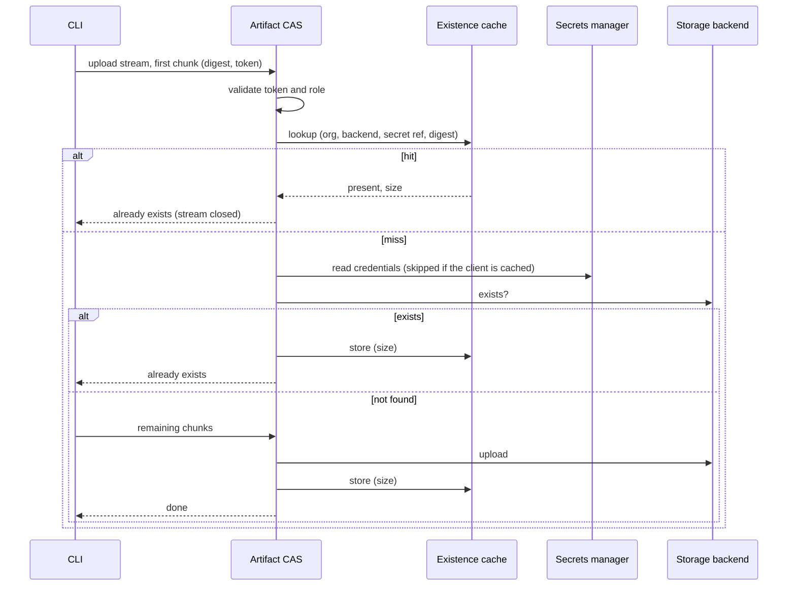

# Spec issue-3543: Existence cache in the Artifact CAS

## Summary
When a user adds evidence that is already in storage, the Artifact CAS still asks the storage backend if the blob exists. Before it can ask, it reads the backend credentials from the secrets manager and builds a new storage client. This spec adds a cache of positive existence results to the Artifact CAS, and a short-lived cache of storage clients. A repeated `attestation add` of the same evidence then completes without a call to the secrets manager or to the storage backend.

## Problem
- The CLI does not check if a blob exists before it uploads. It always opens an upload stream. The Artifact CAS does the existence check when the first chunk arrives, and closes the stream early when the blob is already there.
- For each upload, the Artifact CAS reads the credentials from the secrets manager and builds a new storage client. Then it asks the backend if the blob exists. For an OCI registry, this check fetches the manifest and the config. For an S3 access point, a new client probably also assumes a role again. When audit events are on, the CAS makes a second backend call to fetch the size.
- The Artifact CAS keeps nothing from one upload to the next. Pipelines often add the same evidence again: the same base image SBOM, the same policy bundle, a retried job. Each time, they pay the full cost. The cost is latency for the user and load on the secrets manager and the storage backend.
- A blob in the CAS is content-addressed and immutable. Chainloop has no way to delete one. A positive existence answer therefore stays valid, and it is safe to keep for a bounded time.

## Goals and Non-Goals
- Goal: a second upload of the same digest to the same backend and organization skips the storage backend and the secrets manager.
- Goal: the cache is shared between Artifact CAS replicas when the deployment has NATS, and works without NATS.
- Goal: no change to the CLI, the API, or the stored data.
- Non-goal: a check in the CLI before it streams the first chunk. The CLI still sends the first chunk of up to 1 MB.
- Non-goal: fewer calls from the CLI to the control plane for upload credentials. This is a separate cost, and a separate spec.
- Non-goal: a cache of "does not exist" answers. A missing blob can appear at any moment.
- Non-goal: a cache for downloads. Downloads always read the backend.

## Requirements

### R-001: Skip the backend on a cached hit
An upload can start for a digest that the cache marks as present for the same organization and backend. The Artifact CAS MUST then end the upload as "already exists", with no call to the secrets manager or the storage backend.
- Done when: the second of two uploads of the same file makes no backend or secrets manager call. The CLI shows the same result as today.

### R-002: Only positive results are cached
The Artifact CAS MUST cache a digest only after the backend check finds the blob, or after an upload of that blob succeeds. It MUST NOT cache a "not found" answer.

### R-003: Tenant namespace
Each cache entry MUST belong to the namespace of one organization and one CAS backend. An upload from a different organization, or to a different backend, MUST NOT match it. This MUST hold also when two organizations use the same storage. The organization comes from the signed upload token, never from client input.
- Done when: a digest that organization A uploaded is still checked against the backend when organization B uploads it, also on shared storage.
- Done when: the same digest in backend A is still checked against backend B of the same organization.

### R-004: Bounded lifetime
A cached existence result MUST expire after a configurable time. The default is 24 hours. An operator MUST be able to turn the cache off.

### R-005: Same authorization as today
A cached hit MUST NOT bypass any check that runs today. The Artifact CAS checks the upload token, its role, and its limits before it reads the cache.

### R-006: Audit events stay complete
When the CAS emits an audit event for an existing blob, the event MUST keep its size. The cache stores the size, so a hit needs no extra backend call.

### R-007: Reuse of storage clients
The Artifact CAS SHOULD reuse the credentials and the storage client of a backend for a short time (minutes). A cache miss then also costs less. The credentials MUST stay in the process memory and MUST NOT be written to a shared store.

### R-008: Failure is a miss
If the cache is not available (for example, NATS is down), the Artifact CAS MUST use the backend check. The upload MUST NOT fail because of the cache.

### R-009: Observability
The Artifact CAS SHOULD expose metrics for cache hits and misses.

## Constraints
- Public repository. The design must work for self-hosted deployments with and without NATS.
- Backend credentials are secrets. They must not leave the Artifact CAS process.
- No change to the upload protocol, so old CLI versions also become faster.

## Proposal
Nothing changes for the user, except speed. `chainloop attestation add` for evidence that is already stored returns after the first round trip to the Artifact CAS.

Inside the Artifact CAS, the upload handler uses two caches.

**Existence cache.** Each organization has its own namespace in the cache. The key starts with the organization ID from the signed upload token. Then come the backend type, the hashed backend secret reference, and the digest. The hash keeps the secret path out of the key. The namespace is necessary also when two organizations share storage. Without it, organization B could learn that organization A stored a file with a given digest. With it, the cache tells a tenant nothing that the tenant's own backend check does not already tell. The existence cache has its own NATS bucket, separate from the other caches. The value holds the blob size. The handler reads the cache after it checks the token and reads the first chunk. On a hit, it closes the stream as "already exists", which is the response the CLI receives today. On a miss, it continues as today. When the backend says the blob exists, or when an upload succeeds, the handler writes the entry.

The existence cache uses the shared cache library that the control plane already uses for attestation and policy bundles. The Artifact CAS can have a NATS connection, which today sends only audit events. With that connection, the cache is a NATS key-value bucket that all replicas share. Without NATS, each replica has an in-memory LRU cache with expiry. The CAS selects the store one time, at startup. The entry holds only a digest and a size, never the artifact content and never credentials. An entry is less than 200 bytes, so its size is never a problem for NATS. If a NATS read or write fails at runtime, the CAS does not use the in-memory cache. It treats the failure as a miss and checks the backend (R-008). When the bucket is full, NATS deletes its oldest entries.

**Client cache.** A small in-memory cache keyed by backend type and secret reference holds the loaded storage client for a few minutes. A miss in the existence cache then needs one backend call instead of a secrets manager read plus a new client plus a backend call. Credentials can change behind the same secret reference. The short lifetime limits how long an old client stays in use. If the backend rejects the old credentials, the handler drops the client and loads it again one time.

## Decision Record

| ID | Decision | Choice | Why (and what we rejected) | Source |
|----|----------|--------|----------------------------|--------|
| D-001 | Cache store | Shared cache library: NATS KV when connected, in-memory LRU otherwise | Shared hits across replicas when NATS is there, and no new dependency when it is not. Rejected: memory only (hit rate drops as replicas grow). Rejected: NATS required (a hard dependency for a speed gain). | drafting |
| D-002 | Scope | Existence results and a short-lived client cache | A client cache makes misses cheaper too. Rejected: existence only (misses keep the full cost). Rejected: a CLI pre-check and fewer control plane calls in the same spec (more scope, needs CLI and API changes). | drafting |
| D-003 | Where the cache lives | Artifact CAS, server side | Works for all CLI versions and all clients, with no API change. Rejected: a cache in the CLI (a new process for each command, so nothing to reuse). | drafting |
| D-004 | Cache key and tenant namespace | Organization namespace first, then backend type, hashed secret reference, digest. A separate bucket for this cache. | The organization prefix keeps one tenant's entries away from all other tenants, also on shared storage. The secret reference separates backends in one organization. Rejected: digest alone (one tenant's upload would answer for another tenant, and would show that the other tenant has the file). Rejected: backend and digest without the organization (a shared backend would leak the same information). | drafting |
| D-005 | Negative results | Not cached | A missing blob can appear at any time, and a stale "not found" only causes a second upload. The gain is small. | drafting |
| D-006 | Credentials in a shared store | Never. The client cache stays in memory | Credentials must not leave the process. | drafting |
| D-007 | Default lifetime of an existence entry | 24 hours, configurable | Blobs cannot be deleted through Chainloop. The only risk is a purge outside Chainloop, and 24 hours limits it. Rejected: 7 days (a longer exposure to a purge). | drafting |
| D-008 | Describe endpoint | Does not read the existence cache | Only the download command uses it, and the download reads the blob from the backend next. Downloads stay without a cache. | drafting |
| D-009 | Client cache lifetime | 5 minutes, and one reload on an authentication error | A short window for rotated credentials. Rejected: 1 minute (less reuse for a small gain). | drafting |

## Open Questions
None at drafting time. D-007 to D-009 record the answers to the drafting questions.

## Milestones
1. **Existence cache.** R-001 to R-006, R-008 and R-009. Repeated uploads skip the backend.
2. **Client cache.** R-007. Cache misses skip the secrets manager.

## Risks
| Risk | Mitigation |
|------|------------|
| A blob is purged outside Chainloop, and the cache still says it exists. An attestation then references a missing blob. | Bounded lifetime, configurable per deployment, and a switch to turn the cache off. Downloads never use the cache. |
| Rotated credentials behind the same secret reference. The client cache keeps the old client. | Short lifetime, and one reload when the backend rejects the credentials. |
| A cache entry crosses tenants, or shows that another tenant has a file. | Each organization has its own namespace, taken from the signed token. Tests cover two organizations on shared storage (R-003). |
