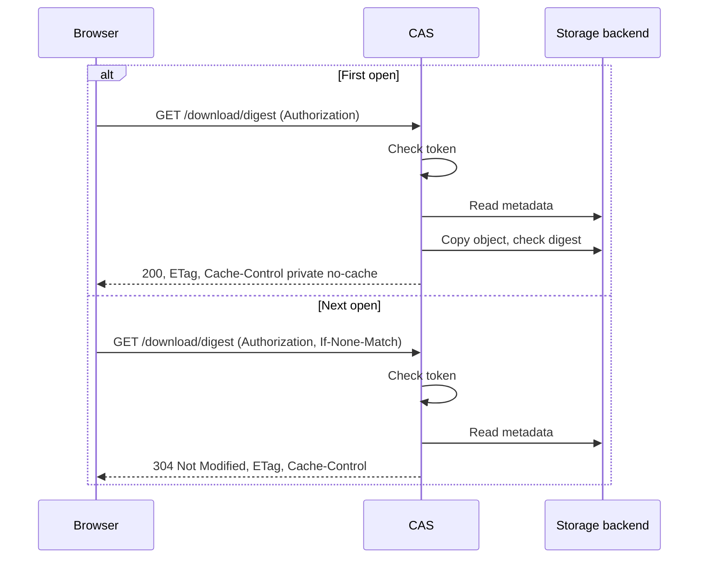

# Spec issue-3549: Browser cache for CAS downloads

## Summary

The CAS download endpoint will let a browser keep a copy of a downloaded artifact and check that copy before each use. The endpoint will accept the download token in an `Authorization: Bearer` header, so that the download URL stays the same for a given digest. The response will tell the browser the digest of the content and how to cache it. When the browser already has the content, the CAS will answer "not modified" and will not copy the object from the storage backend. The Chainloop platform viewers need this change to show large artifacts, such as AI coding session transcripts, with no full download on each open.

## Problem

- Each open of the same artifact in a browser downloads it again in full. The CAS copies the object from the storage backend and checks its digest before it sends the first byte. For a large artifact, the user waits each time.
- The download URL holds a new token in the query on each call. The browser cache uses the URL as its key, so it never finds a match.
- The download response has no validator and no cache instructions. The browser cannot ask the CAS if its copy is still good.

## Goals and Non-Goals

- Goal: a browser that has a copy of an artifact gets a "not modified" answer with no content on the next open.
- Goal: the CAS does not copy the object from the storage backend for a "not modified" answer.
- Goal: the CAS checks the token on every request, also when the browser uses its copy.
- Goal: the CLI and the download links that use the query token work as before.
- Non-goal: a cache in the CAS or the controlplane. The cache is in the browser only.
- Non-goal: changes to the CLI, the controlplane, or the CORS settings.
- Non-goal: range requests or partial downloads.

## Requirements

### R-001: Token in the Authorization header
The download endpoint MUST accept a token in an `Authorization: Bearer` header. When the header is present, the CAS MUST use the header token and MUST NOT use the query token. When the header is not present, the CAS MUST use the `t` query parameter, as before.
- Done when: a request with a valid header token and no query token downloads the artifact. A request with only a valid query token works as before. A request with a bad header token and a valid query token gets a 401.

### R-002: Cache headers on the download
A successful download MUST send `ETag` with the digest in quotes (for example `"sha256:abc..."`) and `Cache-Control: private, no-cache`.

### R-003: Not modified answer
When the request has an `If-None-Match` value that matches the digest, the CAS MUST answer `304 Not Modified` with no content. The 304 MUST send the same `ETag` and `Cache-Control` headers as R-002. The CAS MUST NOT copy the object from the storage backend for a 304.
- Done when: a request with a matching `If-None-Match` gets a 304 with no content, and the storage backend gets no download call.

### R-004: Checks before a 304
Before it answers 304, the CAS MUST check the token. It MUST also check with a metadata call that the object exists in the storage backend. A bad or missing token MUST get a 401. An object that is not in the storage backend MUST NOT get a 304.

### R-005: No audit event for a 304
A 304 answer MUST NOT record a download audit event. A 200 download MUST record the event as before.

## Constraints

- The repository is public. A CAS of an earlier version sends no cache headers, and clients must still work with it. They then download the content each time.
- The CLI and the existing download links keep the query token and their current URLs.
- The CORS preflight already allows the `Authorization` header and sends a 24-hour max age. A cross-origin viewer thus does not send a preflight on each open.

## Proposal

The browser viewer gets a download URL and a token from the controlplane, as today. It takes the token out of the URL and sends it in the `Authorization` header to `/download/<digest>`. That URL does not change, so the browser cache can find its copy. On the next open, the browser adds `If-None-Match` from its stored `ETag`.

The CAS reads the token from the header, or from the query when there is no header. It then does the checks that it does today: the token role, the storage backend, and a metadata call for the object. If `If-None-Match` matches the digest, the CAS stops here and answers 304. If not, it continues as today: it copies the object, checks its digest, and sends it with the new headers.

The `ETag` is the digest. The digest identifies the bytes, so the `ETag` never goes stale. `no-cache` makes the browser check with the CAS before each use, so the CAS checks access each time. `private` stops shared proxies from storing the content.

## Decision Record

| ID | Decision | Choice | Why (and what we rejected) | Source |
|----|----------|--------|----------------------------|--------|
| D-001 | Where to cache | The browser HTTP cache | The browser downloads straight from the CAS, so a cache there skips the backend copy and the transfer. Rejected: a server cache in the controlplane (the controlplane never sees the bytes, and its message size limit is too small). | drafting |
| D-002 | How the browser checks its copy | `ETag` set to the digest, with `Cache-Control: private, no-cache` | The CAS checks access on each open, and a check costs no backend copy. Rejected: `max-age` with no check (a user who loses access keeps the copy until it expires). | drafting |
| D-003 | How the URL stays the same | Token in an `Authorization` header | The browser cache uses the URL as its key, and the token changes on each call. Rejected: reuse one token for a user and a digest (the URL stays the same only for the life of the token). | drafting |
| D-004 | Token source when both are present | The header wins | A client that sends a header sets its intent. A bad header fails, and the CAS does not fall back to the query. Rejected: reject a request with both (the viewer must then strip the query). Rejected: the query wins (the header has no effect for a URL that still holds a token). | drafting |
| D-005 | Check that the object exists before a 304 | Yes, with a metadata call | A deleted object stops showing at once. The metadata call is cheap. Rejected: answer 304 from the digest alone (a browser can show a deleted object until it discards its copy). | drafting |
| D-006 | Audit event for a 304 | None | The download event records bytes sent, and a 304 sends none. The first download from that browser already recorded the access. Rejected: the same event on each 304. | drafting |

## Open Questions

None.

## Risks

| Risk | Mitigation |
|------|------------|
| A browser keeps evidence on disk. | The copy is private to the browser, and the CAS checks the token before each use. |
| The storage backend lost an object that a browser still holds. | The metadata call before a 304 finds the missing object, and the CAS does not answer 304. |
| A shared proxy stores a download. | `Cache-Control: private` tells shared proxies not to store it. |
