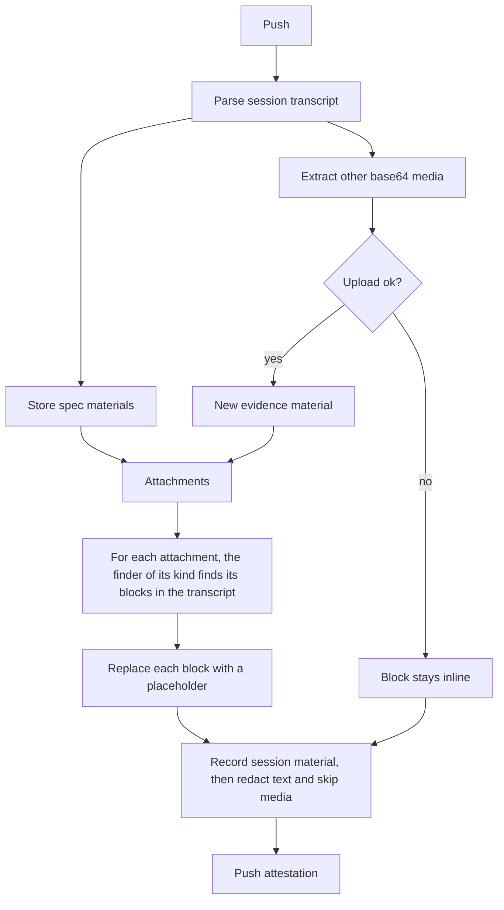

# Spec issue-3556: Attachment placeholders in the AI coding session transcript

## Summary
Today the AI coding session evidence keeps the content of each file that the agent reads inline in the transcript. A file can also be an attachment of the same attestation, for example a spec material ([Spec 002](002-session-spec-capture.md)). Then the evidence holds the same content two or three times. Images make this worse: they are large base64 text, and the secret redaction scans them. With this change, the CLI never keeps inline content that is also an attachment. At push time, it replaces that content with a placeholder that holds the digest of the attachment. This applies to all file types. The CLI also moves other base64 media, for example pasted images, to new attachments when it can. The session evidence gets smaller, the secret redaction does not scan media bytes, and the transcript view can show each attachment from its placeholder. This change also does the work that D-010 of Spec 002 left for "a later version": it keeps the bytes of pasted images.

## Problem
- Inline media makes the session evidence too large. In one measured session, the evidence was 13.4 MB, and base64 images were 7.1 MB (53%) of it. The transcript view does not show evidence of this size inline.
- A file that the agent reads with its file tool is in the transcript two times. One copy is in the tool result content, and one is in the tool result metadata.
- Some of these files are also spec materials of the same attestation. The evidence then holds the same content three times.
- The secret redaction scans all transcript text, base64 media included. This is slow. It also gives false matches in base64 data. In one session, the redactor wrote a redaction marker into a JPEG, and the image does not decode now.
- The bytes of a pasted image are only in the transcript. A reader cannot download the image as a file.

## Goals and Non-Goals
- Goal: the evidence never holds the same content both inline in the transcript and as an attachment, for any file type.
- Goal: the evidence holds as little base64 media inline as possible. Most media moves to attachments.
- Goal: the secret redaction does not scan base64 media, so it is faster and does not break media.
- Goal: each replaced block keeps its position in the transcript as a placeholder. A transcript view can link the placeholder to the attachment in the CAS.
- Non-goal: the change to the transcript view that shows the attachments. It is in a different repository. This spec defines only what the view gets.
- Non-goal: a change to evidence that an earlier CLI pushed. That evidence keeps its inline content.
- Non-goal: moving text files that are not attachments out of the transcript. They stay inline, so reviewers and policies can read them. A later spec can move large text files out, with redaction of the new attachment.
- Non-goal: other duplicate data in the transcript, for example repeated attachment blocks in subagent streams.
- Non-goal: image redaction, for example blurring a secret in a screenshot. The CLI stores media as it is, as in Spec 002.

## Requirements

### R-001: No inline copy of an attachment
The CLI MUST NOT keep inline transcript content that is also an attachment of the same attestation. It MUST replace each copy of that content with a placeholder before it records the session material. This applies to all file types: images, documents, and text.
- Done when: the agent reads a JSON file and a screenshot that are also in the spec folder. The session material holds a placeholder for each copy of both files, and no inline content of them.

### R-002: Placeholder content
A placeholder MUST stay at the position of the replaced block in the transcript, with the same block type. It MUST hold the digest of the attachment in the CAS, the media type, and the origin (`file` or `pasted`). It SHOULD hold the original size. A transcript view MUST be able to tell a placeholder from inline content without other data.

### R-003: Match with spec materials
When the agent read a full file that is still on disk at push time, the CLI MUST compute the digest of the file. When the digest is equal to the source digest of a spec material of the same push, the placeholder MUST reference that material. The CLI MUST NOT upload a second copy. A partial read of a file, for example a range of lines, is not a copy of the attachment and stays inline.
- Done when: a screenshot that the agent read and also copied into the spec folder gives one material, and the placeholder holds its digest.

### R-004: Upload of other base64 media
Some base64 media blocks are not specs, for example a pasted image. For each of these blocks, the CLI SHOULD upload the bytes as an evidence material of the same attestation. Then the placeholder MUST hold its digest. The material MUST be linked to the session by an annotation. Content that is in the transcript more than one time MUST give one material.

### R-005: No secret scan of base64 media
The secret redaction MUST NOT scan base64 media data, also when the data stays inline. An uploaded media file MUST be stored byte for byte.
- Done when: a pasted image whose base64 text matches a secret pattern decodes after the push.

### R-006: Failures do not block the push
When the CLI cannot upload a media block, the block MUST stay inline, and the push MUST continue. This does not break R-001, because the content is not an attachment.

### R-007: All agents
The CLI SHOULD apply this to each supported agent that keeps file content or media in its transcript.

### R-008: Extensible placeholder
The placeholder format MUST NOT be specific to images or files. It MUST hold a content kind and a format version. A later version MUST be able to add a content kind with no change to the existing kinds. An example is a code snippet that is a range of an attachment. A transcript view MUST show a general placeholder for a kind that it does not know, and MUST ignore fields that it does not know.

### R-009: Remove only known attachments
The CLI MUST NOT remove data from the transcript unless the data is with certainty an attachment of the same attestation. The attachment MUST exist in the CAS before the CLI replaces the block. The digest MUST match exactly. When the CLI is not sure, for example the file is gone, the file changed, or the upload failed, the data MUST stay inline.
- Done when: a screenshot that the agent read and then changed on disk stays inline, or goes up as a new material. It never becomes a placeholder for the spec material.

## Constraints
- The repository is public. The placeholder format is visible to all users and to external transcript viewers.
- The change is additive. The session schema does not type transcript entries, so the placeholder needs no schema change. A consumer that does not know the placeholder MUST still read the session.
- The transcript view must keep support for evidence that an earlier CLI pushed with inline content.
- The CAS backend limits the size of each material. A media block over the limit follows R-006.
- Policies read the session evidence. Text that is not an attachment stays inline, so these policies keep working.
- The push runs in a git hook. The extra work must stay small: one digest for each full file read, and one upload for each new media block.

## Proposal
The user does nothing new. The attachments drive the change. At push time, after the CLI parses the session, it works in three steps:

1. **Collect the attachments.** The spec materials of this push are attachments ([Spec 002](002-session-spec-capture.md)). The CLI also extracts each base64 media block that is not a spec, for example a pasted image, and uploads it as an evidence material. It keeps one material for each digest, so a second copy of the same content gives no second upload. When an upload fails, that block is not an attachment and stays inline.
2. **Find each attachment in the transcript, and replace it.** For each attachment, the CLI finds the transcript blocks that hold its content. It replaces each block with a placeholder. For a file that the agent read, the tool call keeps the file path. The CLI computes the digest of the file at that path. It compares this digest with the source digest of the attachment. The agent's file tool can change the content, for example it resizes images and adds line numbers to text. So the CLI cannot compare the transcript copy. For an extracted media block, the CLI already knows the block. Text that is not an attachment stays inline, as today.
3. **Redact.** The CLI records the session material, and the secret redaction scans it. The attachment copies are gone, so the redaction scans less text. It also skips base64 media data that stays inline.

Each placeholder keeps the type and the position of the replaced block. Its data holds a Chainloop reference in place of the content:

| Field | Value |
|-------|-------|
| type | A reference marker, for example `chainloop_material` |
| version | The placeholder format version |
| kind | The content kind: `media` or `file` in this version. A later version can add kinds, for example `snippet` |
| digest | `sha256:...` of the attachment in the CAS |
| media_type | For example `image/png` or `application/json` |
| origin | `file` or `pasted` |
| size | The original size in bytes |

The second copy of a file read, in the tool result metadata, gets the same reference.

For each content kind, the CLI has one finder. A finder takes an attachment and returns the transcript blocks that hold its content. A new kind, for example a code snippet from a file, adds a finder. When necessary, it also adds its own fields in the placeholder, such as a line range. The other kinds and the transcript view do not change (R-008).

A transcript view reads a placeholder, finds the material with that digest in the same attestation, and shows it from the CAS. For evidence from an earlier CLI, it shows the inline content as today.

## Decision Record

| ID | Decision | Choice | Why (and what we rejected) | Source |
|----|----------|--------|----------------------------|--------|
| D-001 | What to do with media bytes | Move them to the CAS, and keep a placeholder with the digest in the transcript | The transcript gets small and keeps the position of each block. The media stays in the evidence. Rejected: drop the media (the evidence loses what the agent saw). Rejected: remove only the second copy of read files (the transcript is still large, and the redaction still scans the bytes). | drafting |
| D-002 | Where the change runs | In the CLI at push time, before the CLI records the session material | Only the CLI can read the file on disk for the match. The redaction runs when the CLI records the material, so it never sees the replaced bytes. Rejected: in the control plane after the upload (the bytes are already uploaded and scanned, and the file is not on disk). | drafting |
| D-003 | Shape of the placeholder | Replace the content in place, and keep the block type | A transcript view finds each block where it was, with no join to other data. Rejected: a separate list of attachments in the session material (a schema change, and the view must join the list to the transcript). | drafting |
| D-004 | Match with spec materials | Digest of the file at the path of the read tool call | The match is exact. Rejected: match by size (a guess). Rejected: digest of the transcript copy (the file tool changes the content, so the digest is different). | drafting |
| D-005 | Main rule | No inline copy of an attachment, for all file types. Moving other media out is a SHOULD | A full image cleanup is not always possible, for example when an upload fails. A duplicate is never necessary. Rejected: images only (a JSON or PDF spec file has the same duplicate). Rejected: no media bytes inline as a MUST (a failed upload would lose the media). | owner review |
| D-006 | Failed upload | The media block stays inline | The content is not an attachment, so the inline copy is the only copy. R-005 keeps the redaction from breaking it. Rejected: a placeholder with no digest (the evidence loses the media). | owner review |
| D-007 | Text that is not an attachment | Stays inline | Reviewers read it in the transcript, and policies check it. Rejected: move all read text files to redacted attachments (policies lose the content, and the view must download each file). A later spec can move large text files. | owner review |
| D-008 | Extensibility | A placeholder with a content kind and a version, and one finder for each kind | Other inputs, for example code snippets, can use the same mechanism later. Rejected: an image-only placeholder (each new kind would need a new format and a new view). | owner review |
| D-009 | Direction and order | Start from the attachments: for each one, find its copies in the transcript and replace them. Then redact | The set of attachments is small and known. The rule of R-001 is about attachments, so the code follows the rule directly. The redaction runs last, on less text. Rejected: walk each transcript block and decide what it is (each block type needs a rule, also blocks that are never attachments). | owner review |
| D-010 | Certainty before removal | Replace a block only after the attachment is in the CAS and its digest matches exactly | The transcript is evidence. A wrong placeholder loses content with no way back. Rejected: a best-effort match, for example by size or by file name (a wrong match removes content that is not stored anywhere). | owner review |

## Open Questions
- [ ] **Which bytes does the CLI upload for read media that is not a spec?** Proposed: the transcript bytes. The agent saw these bytes. They are always present, also when the file is gone. The original file can have a higher resolution. But the file can change after the read.
- [ ] **Is there a limit on the number of uploaded media files for each push?** Proposed: yes, 50. Over the limit, the block stays inline (R-006). A long session with many screenshots must not add hundreds of materials to one attestation.
- [ ] **Do uploaded transcript media also become spec entries, with kind `image` and role `reference`?** Proposed: no. They are not specs that the agent chose (D-009 of [Spec 003](003-spec-capture-during-session.md)). They get their own material annotations, so a tool can list them apart from the specs.

## Milestones
1. **Claude Code.** The CLI replaces attachment copies and media with placeholders, and uploads other media. The evidence gets smaller, and the redaction skips media.
2. **Transcript view.** The view shows each attachment from its placeholder. This is in a different repository.
3. **Other agents.** The same change for each other agent that keeps file content or media in its transcript (R-007).

## Risks

| Risk | Mitigation |
|------|------------|
| An attestation gets many new materials, and the materials view gets long. | Each new material has an annotation that links it to the session, so a view can group or hide them. The limit in the open questions caps the number. |
| The file changed after the read, so the match with the spec fails. | Media goes up as a new material, and text stays inline. The evidence holds one more copy, but it is correct. |
| A policy reads a spec file from the transcript, and now finds a placeholder. | The spec material holds the same content. The policy can read the material by its digest. Text that is not an attachment stays inline (D-007). |
| A very large transcript line, with a large image, stops the session parse before the CLI can replace the image. | The parse limit is separate from this change. The CLI can raise it or skip the media data while it reads the line. |
| A transcript view does not know the placeholder and shows raw data. | The placeholder keeps the block type and holds a clear marker, so a view that ignores it shows nothing wrong. Milestone 2 adds the support. |
| An image holds a secret, for example a screenshot of a terminal. | The CLI did not redact images before this change either. It stores media as it is (Spec 002, non-goal). |
