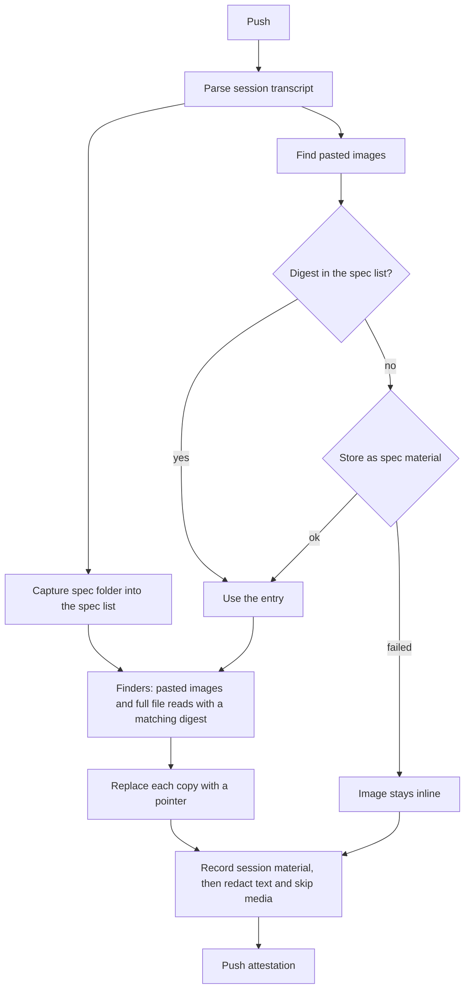

# Spec issue-3556: Attachment placeholders in the AI coding session transcript

## Summary
The session material lists its sources in a spec list: each spec, skill, and image that the session captured ([Spec 002](002-session-spec-capture.md)). Each entry holds the digest of a sibling material in the same attestation. Today the transcript also holds the content of many of these sources inline. A screenshot that the agent read and captured is in the evidence three times: two base64 copies in the transcript and one material. With this change, the CLI replaces each transcript copy of a source in the spec list with a small pointer to its sibling material. The CLI also captures images that the user pastes as spec sources, so their bytes become files and their transcript copies become pointers too. Content that is not in the spec list stays inline. The secret redaction skips base64 media. The session evidence gets smaller, the redaction is faster and no longer breaks images, and the transcript view can show each source from its pointer.

## Problem
- Inline media makes the session evidence too large. In one measured session, the evidence was 13.4 MB, and base64 images were 7.1 MB (53%) of it. The transcript view does not show evidence of this size inline.
- A file that the agent reads with its file tool is in the transcript two times. One copy is in the tool result content, and one is in the tool result metadata.
- When the agent also captures that file as a spec, the evidence holds the same content three times.
- The secret redaction scans all transcript text, base64 media included. This is slow. It also gives false matches in base64 data. In one session, the redactor wrote a redaction marker into a JPEG, and the image does not decode now.
- The bytes of a pasted image are only in the transcript. A reader cannot download the image as a file, and the spec list does not show it. D-010 of Spec 002 left this for "a later version".

## Goals and Non-Goals
- Goal: the evidence never holds a source of the spec list both inline in the transcript and as a material, for any file type.
- Goal: each image that the user pastes becomes a spec source, with its own material.
- Goal: the secret redaction does not scan base64 media, so it is faster and does not break media.
- Goal: each replaced block keeps its position in the transcript as a pointer. A transcript view can link the pointer to the sibling material.
- Goal: the mechanism can take other content kinds later, for example code snippets.
- Non-goal: content that is not in the spec list. For example, a screenshot that the agent read but did not capture stays inline. The agent decides what to capture (Spec 002 D-001).
- Non-goal: the change to the transcript view that shows the pointers. It is in a different repository. This spec defines only what the view gets.
- Non-goal: a change to evidence that an earlier CLI pushed. That evidence keeps its inline content.
- Non-goal: other duplicate data in the transcript, for example the rendered copies of agent attachment entries.
- Non-goal: image redaction, for example blurring a secret in a screenshot. The CLI stores media as it is, as in Spec 002.

## Requirements

### R-001: No inline copy of a spec source
The CLI MUST NOT keep inline transcript content that is also a source in the spec list of the session. It MUST replace each copy of that content with a pointer before it records the session material. This applies to all file types: images, documents, and text.
- Done when: the agent reads a screenshot and a JSON file, and captures both as specs. The session material holds a pointer for each copy of both files, and no inline content of them.

### R-002: Pointer content
A pointer MUST stay at the position of the replaced block in the transcript, with the same block type. It MUST hold only a `chainloop.replaced` marker and the digest of the sibling material. That digest MUST also be in the spec list of the session. The pointer MUST NOT repeat data that the material or the spec list already holds, for example the name, the size, or the role. A reader MUST be able to see from the marker alone that Chainloop replaced the content.

### R-003: Match with spec sources
When the agent read a full file that is still on disk at push time, the CLI MUST compute the digest of the file. When the digest is equal to the source digest of an entry in the spec list, the CLI MUST replace the copies of that read. A partial read of a file, for example a range of lines, is not a copy of the source and stays inline.
- Done when: the agent reads a screenshot and copies it into the spec folder. The push gives one material, and both transcript copies hold its digest.

### ~~R-004: Upload of other base64 media~~
Dropped. See D-013 and R-010.

### R-005: No secret scan of base64 media
The secret redaction MUST NOT scan base64 media data, also when the data stays inline. A media material MUST be stored byte for byte.
- Done when: a pasted image whose base64 text matches a secret pattern decodes after the push.

### R-006: Failures do not block the push
When the CLI cannot store a pasted image, the image MUST stay inline, and the push MUST continue.

### R-007: All agents
The CLI SHOULD apply this to each supported agent that keeps file content or pasted images in its transcript.

### R-008: Extensible pointer
The pointer format MUST NOT be specific to images or files. A later version MUST be able to add a content kind with optional fields, with no change to the existing pointers. An example is a code snippet that is a range of lines of a source. A transcript view MUST ignore fields that it does not know, and MUST still link the pointer to its material.

### R-009: Remove only known sources
The CLI MUST NOT remove data from the transcript unless the data is with certainty a source in the spec list. The material MUST exist in the CAS before the CLI replaces the block. The digest MUST match exactly. When the CLI is not sure, for example the file is gone, the file changed, or the upload failed, the data MUST stay inline.
- Done when: a screenshot that the agent read and then changed on disk stays inline.

### R-010: Pasted images are spec sources
The user can paste an image in a prompt or in a message during a turn. For each pasted image, the CLI MUST store the image as a spec material. It MUST add an entry with the kind `image` to the spec list. When the spec list already has an entry with the same digest, the CLI MUST use that entry and MUST NOT store a second copy. The same image pasted two times MUST give one material.
- Done when: the user pastes the same image two times. The session has one image material and one spec entry for it, and both transcript copies hold its digest.

## Constraints
- The repository is public. The pointer format is visible to all users and to external transcript viewers.
- The change is additive. The session schema does not type transcript entries, and the kind and the role of a spec entry are open values. So the change needs no schema change. A consumer that does not know the pointer MUST still read the session.
- The transcript view must keep support for evidence that an earlier CLI pushed with inline content.
- The CAS backend limits the size of each material. A pasted image over the limit follows R-006.
- Policies read the session evidence. Text that is not a spec source stays inline, so these policies keep working.
- The push runs in a git hook. The extra work must stay small: one digest for each full file read, and one upload for each new pasted image.

## Proposal
The user does nothing new. Each push rebuilds the session evidence from the raw transcript, so the result does not depend on earlier pushes. For each session, the CLI works in these steps:

1. **Capture specs, as today.** The CLI reads the spec folder into the spec list and stores each file as a sibling material. For each entry it also keeps the source digest: the digest of the file before redaction. For an image, the source digest and the material digest are the same.
2. **Capture pasted images.** The CLI finds each pasted image in the transcript of the main agent and of each subagent. A pasted image can be in a user prompt or in a message that the user sends during a turn. It decodes the bytes and computes the digest. When the spec list has that digest, the CLI uses that entry. Otherwise it stores the image as a spec material and adds an entry. When the upload fails, the image stays inline.
3. **Find and replace.** For each content kind, the CLI has one finder. A finder returns the transcript blocks that hold a source of the spec list.
   - The pasted image finder returns the blocks of step 2.
   - The file read finder looks at each full read of a file. The tool call keeps the file path. The CLI computes the digest of the file at that path, one time for each path. When the digest is equal to a source digest in the spec list, the finder returns both copies of the read. The agent's file tool can change the content, for example it resizes images and adds line numbers to text. So the CLI does not compare the transcript copy.

   The CLI replaces each returned block with a pointer.
4. **Redact.** The CLI records the session material, and the secret redaction scans it. The source copies are gone, so the redaction scans less text. It skips base64 media that stays inline.

A pasted image has no file name, so its material gets a number, for example `spec-b5bf8b-pasted-1`. It has the same annotations as the other spec materials. Its bytes were already in the attestation, as base64 in the session material. They now move to a material of their own, which is about 25% smaller than the base64 text. A reader can download it as a file.

### Pointer format
A pointer holds two fields:

```json
{ "type": "chainloop.replaced", "digest": "sha256:99c0bca3..." }
```

- `type`: always `chainloop.replaced`. It tells a person, a policy, or a view that Chainloop removed the content here.
- `digest`: the digest of the sibling material. The spec list has an entry with the same digest.

The material and the spec list hold the name, the size, the media type, and the role. The pointer does not repeat them. The position tells the origin. A tool result is a file that the agent read. A user message is a pasted image.

The CLI puts the pointer where the content was. A content block keeps its type, and only its data changes. When the transcript holds the content in a metadata field, the CLI removes that field and adds a `chainloop.replaced` field next to it. A consumer that reads the old field does not get an object where it expects text.

**A screenshot that the agent read and captured.** Before, the tool result holds the image two times:

```json
{ "type": "user",
  "message": { "role": "user", "content": [
    { "type": "tool_result", "tool_use_id": "toolu_01A", "content": [
      { "type": "image", "source": { "type": "base64", "media_type": "image/png", "data": "iVBORw0KGgo..." } }
    ] } ] },
  "toolUseResult": { "type": "image",
    "file": { "base64": "iVBORw0KGgo...", "type": "image/png", "originalSize": 316801 } } }
```

After, the image block keeps the type `image`, and its source is the pointer:

```json
{ "type": "user",
  "message": { "role": "user", "content": [
    { "type": "tool_result", "tool_use_id": "toolu_01A", "content": [
      { "type": "image", "source": { "type": "chainloop.replaced", "digest": "sha256:99c0bca3..." } }
    ] } ] },
  "toolUseResult": { "type": "image",
    "file": { "type": "image/png", "originalSize": 316801,
              "chainloop.replaced": { "digest": "sha256:99c0bca3..." } } } }
```

**A pasted image.** The text of the prompt stays:

```json
{ "type": "user", "message": { "role": "user", "content": [
  { "type": "text", "text": "The button is in the wrong place, see this" },
  { "type": "image", "source": { "type": "chainloop.replaced", "digest": "sha256:9b07..." } }
] } }
```

The spec list gets an entry for it:

```json
{ "kind": "image", "digest": "sha256:9b07...", "captured_at": "2026-10-07T21:30:11Z" }
```

**A JSON file that the agent read and captured.** A text tool result has no block with a source. So its content becomes one pointer block:

```json
"content": [ { "type": "chainloop.replaced", "digest": "sha256:c2a1..." } ]
```

A later content kind adds a finder and optional fields to the pointer, for example a line range for a code snippet. The examples use the transcript format of Claude Code. Each other agent puts the same pointer in its own block shape (R-007).

A transcript view reads a pointer, finds the entry and the material with that digest, and shows the content from the CAS. For evidence from an earlier CLI, it shows the inline content as today.



## Decision Record

| ID | Decision | Choice | Why (and what we rejected) | Source |
|----|----------|--------|----------------------------|--------|
| D-001 | What to do with media bytes | Keep them in a material, and keep a pointer with the digest in the transcript | The transcript gets small and keeps the position of each block. The media stays in the evidence. Rejected: drop the media (the evidence loses what the agent saw). Rejected: remove only the second copy of read files (the transcript is still large, and the redaction still scans the bytes). | drafting |
| D-002 | Where the change runs | In the CLI at push time, before the CLI records the session material | Only the CLI can read the file on disk for the match. The redaction runs when the CLI records the material, so it never sees the replaced bytes. Rejected: in the control plane after the upload (the bytes are already uploaded and scanned, and the file is not on disk). | drafting |
| D-003 | Shape of the pointer | Replace the content in place, and keep the block type | A transcript view finds each block where it was, with no join to other data. Rejected: a separate list of replacements in the session material (the view must join the list to the transcript). | drafting |
| D-004 | Match with spec sources | Digest of the file at the path of the read tool call | The match is exact. Rejected: match by size (a guess). Rejected: digest of the transcript copy (the file tool changes the content, so the digest is different). | drafting |
| D-005 | ~~Main rule: no inline copy of an attachment, and move other media out as a SHOULD~~ | Replaced by D-013 | | owner review |
| D-006 | Failed upload | The pasted image stays inline | The inline copy is then the only copy. R-005 keeps the redaction from breaking it. Rejected: a pointer with no digest (the evidence loses the image). | owner review |
| D-007 | Text that is not a spec source | Stays inline | Reviewers read it in the transcript, and policies check it. Rejected: move all read text files to redacted materials (policies lose the content, and the view must download each file). | owner review |
| D-008 | Extensibility | One finder for each content kind. A later kind adds optional fields to the pointer | Other inputs, for example code snippets, can use the same mechanism later. Rejected: an image-only pointer (each new kind would need a new format and a new view). Rejected: a version and a kind field in each pointer (optional fields are enough, and the material holds the kind). | owner review |
| D-009 | Direction and order | Start from the spec list: find the copies of its sources in the transcript and replace them. Then redact | The spec list is small and known. The rule of R-001 is about these sources, so the code follows the rule directly. The redaction runs last, on less text. Rejected: walk each transcript block and decide what it is (each block type needs a rule, also blocks that are never sources). | owner review |
| D-010 | Certainty before removal | Replace a block only after the material is in the CAS and its digest matches exactly | The transcript is evidence. A wrong pointer loses content with no way back. Rejected: a best-effort match, for example by size or by file name (a wrong match removes content that is not stored anywhere). | owner review |
| D-011 | Pasted images | The CLI captures each pasted image as a spec source | The user gave the image to the session, as the user gives a ticket. Only the CLI can reach the bytes, because the agent sees only the image (Spec 003 D-009). This does the work that Spec 002 D-010 left for a later version. Rejected: leave pasted images inline (they stay large and cannot be downloaded). Rejected: new attachment materials outside the spec list (a second list for a view to join). | owner review |
| D-012 | Content of the pointer | Only the `chainloop.replaced` marker and the digest of the sibling material | The material and its entry in the spec list already hold the name, the size, the kind, and the role. The position of the block tells the origin. The marker name tells any reader that Chainloop replaced the content. Rejected: a full reference with the name, size, media type, origin, kind, and version (it repeats the material). Rejected: the material name as the pointer (a label, while the digest is unique and lets a reader check the content). | owner review |
| D-013 | Scope of the replacement | Only sources in the spec list, including pasted images (D-011) | Each pointer then resolves in the session itself, and the CLI never decides on its own that content is evidence. Rejected: also upload each other base64 media block. An example is a screenshot that the agent read but did not capture. This turns each image that the agent looked at into a material, and the agent did not choose it. | owner review |

## Open Questions
- [ ] **Do pasted images get a role?** Proposed: `reference`. Spec 004 defines it as "supporting material, for example a screenshot". The CLI knows that the user gave the image as support. With no role, a view that lists specs shows pasted screenshots next to the ticket. This extends Spec 004 R-005, which forbids a role guess for sources that the agent writes. A new role `attachment` is a conflict, because Claude Code transcripts already have entries of the type `attachment`.
- [ ] **Do pasted images count toward the limit of 25 spec entries for each session (Spec 003)?** Proposed: no. They get a separate limit of 25. A session with many pastes must not push out the specs that the agent chose.

## Milestones
1. **Claude Code.** The CLI captures pasted images, replaces the copies of spec sources with pointers, and the redaction skips media.
2. **Transcript view.** The view shows each source from its pointer. This is in a different repository.
3. **Other agents.** The same change for each other agent that keeps file content or pasted images in its transcript (R-007).

## Risks

| Risk | Mitigation |
|------|------------|
| The file changed after the read, so the match with the spec fails. | The read stays inline (R-009). The evidence holds one more copy, but it is correct. |
| The agent reads a screenshot but does not capture it, so it stays inline and the evidence stays large. | The capture instruction asks the agent to capture images that the user gives (Spec 003). The share of read images with no spec entry is measurable from the evidence. |
| A policy reads a spec file from the transcript, and now finds a pointer. | The spec material holds the same content. The policy can read the material by its digest. Text that is not a spec source stays inline (D-007). |
| A very large transcript line, with a large image, stops the session parse before the CLI can replace the image. | The parse limit is separate from this change. The CLI can raise it or skip the media data while it reads the line. |
| A transcript view does not know the pointer. | The pointer keeps the block type and holds a clear marker, so the view shows an image with no data, not wrong data. Milestone 2 adds the support. |
| An image holds a secret, for example a screenshot of a terminal. | The CLI did not redact images before this change either. It stores media as it is (Spec 002, non-goal). |
