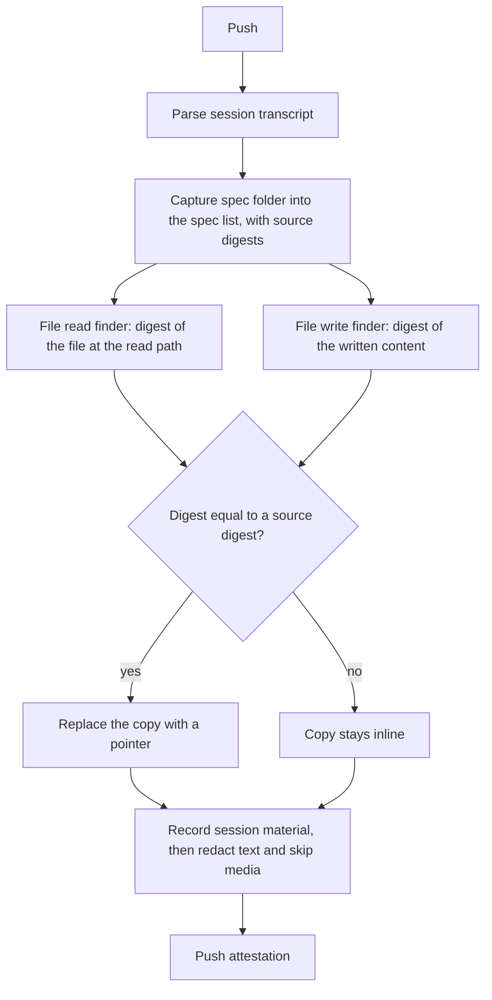

# Spec issue-3556: Pointers to spec sources in the AI coding session transcript

## Summary
The session material lists its sources in a spec list: each ticket, document, plan, image, and skill that the session captured ([Spec 002](002-session-spec-capture.md)). Each entry holds the digest of a sibling material in the same attestation. Today the transcript also holds copies of these sources. A screenshot that the agent read and captured is in the evidence three times: two base64 copies in the transcript and one material. A ticket that the agent wrote into the spec folder is in the transcript two times, and in one material. With this change, the CLI replaces each exact copy of a source in the spec list with a small pointer to its sibling material. Content that is not with certainty a copy of a source stays inline. The secret redaction skips base64 media. The session evidence gets smaller, the redaction is faster and no longer breaks images, and the transcript view can show each source from its pointer.

## Problem
- Inline media makes the session evidence too large. In one measured session, the evidence was 13.4 MB, and base64 images were 7.1 MB (53%) of it. The transcript view does not show evidence of this size inline.
- A file that the agent reads with its file tool is in the transcript two times. One copy is in the tool result content, and one is in the tool result metadata.
- A spec file that the agent writes is in the transcript two times: in the tool input, and in the tool result metadata.
- The spec material holds the same content again. So the evidence holds each captured source up to three times.
- The secret redaction scans all transcript text, base64 media included. This is slow. It also gives false matches in base64 data. In one session, the redactor wrote a redaction marker into a JPEG, and the image does not decode now.

## Goals and Non-Goals
- Goal: the transcript holds no exact copy of a source in the spec list. This applies to all file types: images, tickets, documents, plans, and other text.
- Goal: the secret redaction does not scan base64 media, so it is faster and does not break media.
- Goal: each replaced copy keeps its position in the transcript as a pointer. A transcript view can link the pointer to the sibling material.
- Goal: the mechanism can take other content kinds later, for example code snippets.
- Non-goal: pasted images. Their bytes are only in the transcript, and they are not in the spec list. A later spec can capture them as spec sources, and this mechanism then replaces them with no change (D-014).
- Non-goal: content that is not an exact copy of a source. Examples are a screenshot that the agent read but did not capture, and the tracker output from which the agent wrote a ticket file. This content stays inline.
- Non-goal: the change to the transcript view that shows the pointers. It is in a different repository. This spec defines only what the view gets.
- Non-goal: a change to evidence that an earlier CLI pushed. That evidence keeps its inline content.
- Non-goal: other duplicate data in the transcript, for example the rendered copies of agent attachment entries.
- Non-goal: image redaction, for example blurring a secret in a screenshot. The CLI stores media as it is, as in Spec 002.

## Requirements

### R-001: No copy of a spec source
When a copy in the transcript holds exactly the content of a source in the spec list, the CLI MUST replace it with a pointer. It MUST do this before it records the session material. This applies to all file types. In this version, a copy is a full file read (R-003) or a file write (R-011).
- Done when: the agent reads a screenshot and copies it into the spec folder, and writes a ticket file into the spec folder. The session material holds a pointer for each copy of both, and no inline content of them.

### R-002: Pointer content
A pointer MUST stay at the position of the replaced content in the transcript. An image block MUST keep its type. In this version, a pointer MUST hold only a `chainloop.replaced` marker and the digest of the sibling material. That digest MUST also be in the spec list of the session. The pointer MUST NOT repeat data that the material or the spec list already holds, for example the name, the size, or the role. A reader MUST be able to see from the marker alone that Chainloop replaced the content.

### R-003: Match of a file read
The agent can read a full file that is still on disk at push time. Then the CLI MUST compute the digest of the file. When the digest is equal to the source digest of an entry in the spec list, the CLI MUST replace the copies of that read. A partial read, for example a range of lines, stays inline.
- Done when: the agent reads a screenshot and copies it into the spec folder. The push gives one material, and both transcript copies hold its digest.

### ~~R-004: Upload of other base64 media~~
Dropped. See D-013.

### R-005: No secret scan of base64 media
The secret redaction MUST NOT scan base64 media data that stays inline. A media material MUST be stored byte for byte.
- Done when: a pasted image whose base64 text matches a secret pattern decodes after the push.

### R-006: Failures do not block the push
When the CLI cannot complete a replacement, the content MUST stay inline, and the push MUST continue.

### R-007: All agents
The CLI SHOULD apply this to each supported agent that keeps file reads or file writes in its transcript.

### R-008: Extensible pointer
The pointer format MUST NOT be specific to images or files. A later version MUST be able to add a content kind with optional fields, with no change to the existing pointers. An example is a code snippet that is a range of lines of a source. A transcript view MUST ignore fields that it does not know, and MUST still link the pointer to its material.

### R-009: Remove only known sources
The CLI MUST NOT remove data from the transcript unless the data is with certainty a copy of a source in the spec list. The material MUST exist in the CAS before the CLI replaces the copy. The digest MUST match exactly. When the CLI is not sure, for example the file is gone or the file changed, the data MUST stay inline.
- Done when: a screenshot that the agent read and then changed on disk stays inline.

### ~~R-010: Pasted images are spec sources~~
Dropped. See D-014.

### R-011: Match of a file write
The agent can write a full file. The CLI MUST compute the digest of the written content. When it is equal to the source digest of an entry in the spec list, the CLI MUST replace each copy of that content in the write. A write with other content, for example an earlier version of a spec file, stays inline. A partial edit of a file stays inline.
- Done when: the agent writes a ticket file into the spec folder two times, and the second version is the final file. The second write holds pointers, and the first write stays inline.

### R-012: Best effort, with a match report
The replacement MUST be best effort. The CLI tries each finder on each copy, replaces the exact matches, and keeps all other copies inline with no error. In debug output, the CLI MUST report the result for each session and each finder. The report gives the number of copies that it replaced, and the number that it did not replace, with the reason. Examples of reasons are "no spec entry with this digest", "file gone", "file changed", and "partial read". The report SHOULD give the number of bytes that the replacement removed.
- Done when: a session has 12 image reads, and 8 of the images are specs. A push in debug mode reports 16 replaced copies. It reports 8 copies that it did not replace, with the reason "no spec entry with this digest".

## Constraints
- The repository is public. The pointer format is visible to all users and to external transcript viewers.
- The change is additive. The session schema does not type transcript entries, so the change needs no schema change. A consumer that does not know the pointer MUST still read the session.
- The transcript view must keep support for evidence that an earlier CLI pushed with inline content.
- Policies read the session evidence. Content that is not a copy of a source stays inline, so these policies keep working.
- The push runs in a git hook. The extra work must stay small: one digest for each full file read and for each file write.

## Proposal
The user does nothing new. Each push rebuilds the session evidence from the raw transcript and the spec folder, so the result does not depend on earlier pushes. For each session, the CLI works in three steps:

1. **Capture specs, as today.** The CLI reads the spec folder into the spec list and stores each file as a sibling material. For each entry it also keeps the source digest: the digest of the file before redaction. For an image, the source digest and the material digest are the same. For a text file, the material is the redacted copy, so the two digests differ.
2. **Find and replace.** For each kind of copy, the CLI has one finder. A finder returns the transcript copies whose digest is equal to a source digest in the spec list.
   - The file read finder looks at each full read of a file. The tool call keeps the file path. The CLI computes the digest of the file at that path, one time for each path. The agent's file tool can change the content, for example it resizes images and adds line numbers to text. So the CLI does not compare the transcript copy.
   - The file write finder looks at each full write of a file. The tool call holds the written content, so the CLI computes the digest of that content.

   The CLI replaces each returned copy with a pointer to the material of that entry.
3. **Redact.** The CLI records the session material, and the secret redaction scans it. The source copies are gone, so the redaction scans less text. It skips base64 media that stays inline.

For a ticket, the agent first reads it from the tracker, and then writes a spec file from it. The tracker output is in a different format, so it is not a copy and stays inline. It shows where the ticket came from. The write of the spec file is a copy, and becomes a pointer.

### Pointer format
A pointer holds two fields:

```json
{ "type": "chainloop.replaced", "digest": "sha256:99c0bca3..." }
```

- `type`: always `chainloop.replaced`. It tells a person, a policy, or a view that Chainloop removed the content here.
- `digest`: the digest of the sibling material. The spec list has an entry with the same digest.

The material and the spec list hold the name, the size, the media type, and the role. The pointer does not repeat them. The position tells the origin: a file read or a file write.

The CLI puts the pointer where the content was:
- An image block keeps its type, and the pointer becomes its source.
- Text content in a tool result becomes one pointer block.
- The transcript can also hold the content in a text field. Examples are the content of a write and the metadata of a tool result. Then the CLI removes that field, and adds a `chainloop.replaced` field with the same pointer next to it. A consumer that reads the old field does not get an object where it expects text.

**A screenshot that the agent read and captured.** Before, the tool result holds the image two times:

```json
{ "type": "user",
  "message": { "role": "user", "content": [
    { "type": "tool_result", "tool_use_id": "toolu_01A", "content": [
      { "type": "image", "source": { "type": "base64", "media_type": "image/png", "data": "iVBORw0KGgo..." } }
    ] } ] },
  "toolUseResult": { "type": "image",
    "file": { "base64": "iVBORw0KGgo...", "type": "image/png", "originalSize": 316801 } } }
```

After, the image block keeps the type `image`, and its source is the pointer:

```json
{ "type": "user",
  "message": { "role": "user", "content": [
    { "type": "tool_result", "tool_use_id": "toolu_01A", "content": [
      { "type": "image", "source": { "type": "chainloop.replaced", "digest": "sha256:99c0bca3..." } }
    ] } ] },
  "toolUseResult": { "type": "image",
    "file": { "type": "image/png", "originalSize": 316801,
              "chainloop.replaced": { "type": "chainloop.replaced", "digest": "sha256:99c0bca3..." } } } }
```

**A ticket that the agent wrote into the spec folder.** Before, the write holds the text in the tool input. The tool result metadata holds it again. After, both fields are pointers. The pointer holds the digest of the redacted material:

```json
{ "type": "tool_use", "name": "Write",
  "input": { "file_path": ".chainloop/specs/<session>/ticket-eng-1234.md",
             "chainloop.replaced": { "type": "chainloop.replaced", "digest": "sha256:19b1..." } } }
```

```json
"toolUseResult": { "type": "create", "filePath": ".chainloop/specs/<session>/ticket-eng-1234.md",
                   "chainloop.replaced": { "type": "chainloop.replaced", "digest": "sha256:19b1..." } }
```

**A JSON file that the agent read and copied into the spec folder with no change.** Its content becomes one pointer block. The metadata copy of the text gets the same pointer:

```json
"content": [ { "type": "chainloop.replaced", "digest": "sha256:c2a1..." } ]
```

A later content kind adds a finder and optional fields to the pointer, for example a line range for a code snippet. The examples use the transcript format of Claude Code. Each other agent puts the same pointer in its own block shape (R-007).

A transcript view reads a pointer, finds the entry and the material with that digest, and shows the content from the CAS. For evidence from an earlier CLI, it shows the inline content as today.



## Decision Record

| ID | Decision | Choice | Why (and what we rejected) | Source |
|----|----------|--------|----------------------------|--------|
| D-001 | What to do with copies of a source | Keep the content in the material, and keep a pointer with the digest in the transcript | The transcript gets small and keeps the position of each copy. The content stays in the evidence. Rejected: drop the copies (a reader loses the position). Rejected: remove only the second copy of read files (the transcript is still large, and the redaction still scans the bytes). | drafting |
| D-002 | Where the change runs | In the CLI at push time, before the CLI records the session material | Only the CLI can read the file on disk for the match. The redaction runs when the CLI records the material, so it never sees the replaced bytes. Rejected: in the control plane after the upload (the bytes are already uploaded and scanned, and the file is not on disk). | drafting |
| D-003 | Shape of the pointer | Replace the content in place, and keep the block type of an image | A transcript view finds each copy where it was, with no join to other data. Rejected: a separate list of replacements in the session material (the view must join the list to the transcript). | drafting |
| D-004 | Match of a file read | Digest of the file at the path of the read tool call | The match is exact. Rejected: match by size (a guess). Rejected: digest of the transcript copy (the file tool changes the content, so the digest is different). | drafting |
| D-005 | ~~Main rule: no inline copy of an attachment, and move other media out as a SHOULD~~ | Replaced by D-013 | | owner review |
| D-006 | ~~Failed upload of a pasted image~~ | Dropped with D-014 | | owner review |
| D-007 | Text that is not a copy of a source | Stays inline | Reviewers read it in the transcript, and policies check it. Rejected: move all read text files to redacted materials (policies lose the content, and the view must download each file). | owner review |
| D-008 | Extensibility | One finder for each kind of copy. A later kind adds optional fields to the pointer | Other inputs, for example code snippets or pasted images, can use the same mechanism later. Rejected: an image-only pointer (each new kind would need a new format and a new view). Rejected: a version and a kind field in each pointer (optional fields are enough, and the material holds the kind). | owner review |
| D-009 | Direction and order | Start from the spec list: find the copies of its sources in the transcript and replace them. Then redact | The spec list is small and known. The rule of R-001 is about these sources, so the code follows the rule directly. The redaction runs last, on less text. Rejected: walk each transcript block and decide what it is (each block type needs a rule, also blocks that are never sources). | owner review |
| D-010 | Certainty before removal | Replace a copy only when the material is in the CAS and its digest matches exactly | The transcript is evidence. A wrong pointer loses content with no way back. Rejected: a best-effort match, for example by size or by file name (a wrong match removes content that is not stored anywhere). | owner review |
| D-011 | ~~Pasted images become spec sources~~ | Dropped with D-014 | | owner review |
| D-012 | Content of the pointer | Only the `chainloop.replaced` marker and the digest of the sibling material | The material and its entry in the spec list already hold the name, the size, the kind, and the role. The position of the copy tells the origin. The marker name tells any reader that Chainloop replaced the content. Rejected: a full reference with the name, size, media type, origin, kind, and version (it repeats the material). Rejected: the material name as the pointer (a label, while the digest is unique and lets a reader check the content). | owner review |
| D-013 | Scope of the replacement | Each exact copy of a source in the spec list, for all file types, from file reads and file writes | One rule covers images and text sources, for example tickets and plans. Each pointer resolves in the session itself, and the CLI never decides on its own that content is evidence. Rejected: images only (the write copies of tickets stay, and the redaction still scans them). Rejected: also upload each other base64 media block. An example is a screenshot that the agent read but did not capture, and the agent did not choose it. | owner review |
| D-015 | How hard the CLI tries | Best effort coverage, with an exact match for each replacement, and a match report in debug output | A copy that does not match costs only size, so the CLI must not fail or warn for it. A wrong match loses content, so each replacement needs an exact digest (D-010). The debug report shows how well the matching works in real sessions, and which finder to improve. Rejected: fail or warn on each copy that does not match (noise, because most transcript content is not a source). Rejected: no report (nobody can see the share of matches). | owner review |
| D-014 | Pasted images | Out of scope. A later spec | The bytes of a pasted image are only in the transcript. Capturing them adds new materials and a role decision. This spec keeps to sources that the session already captured. Rejected: capture them in this spec (larger scope, and open questions on the role and the limit). | owner review |

## Open Questions
None.

## Milestones
1. **Claude Code.** The CLI replaces the copies of spec sources from file reads and file writes with pointers, and the redaction skips media.
2. **Transcript view.** The view shows each source from its pointer. This is in a different repository.
3. **Other agents.** The same change for each other agent that keeps file reads or file writes in its transcript (R-007).

## Risks

| Risk | Mitigation |
|------|------------|
| The file changed after the read, so the match with the spec fails. | The read stays inline (R-009). The evidence holds one more copy, but it is correct. |
| The file changed after the read, and the agent then copied the new version into the spec folder. The digest matches, but the agent saw the old version. | When the tool result records the original size, the CLI also compares it with the size of the file. A different size keeps the read inline. |
| The agent reads a screenshot but does not capture it, so it stays inline and the evidence stays large. | The capture instruction asks the agent to capture images that the user gives (Spec 003). The share of read images with no spec entry is measurable from the evidence. |
| Pasted images stay inline and keep the evidence large. | R-005 stops the redaction from breaking them. A later spec captures them (D-014). |
| A policy reads a spec file from the transcript, and now finds a pointer. | The spec material holds the same content. The policy can read the material by its digest. Content that is not a copy of a source stays inline (D-007). |
| A very large transcript line, with a large image, stops the session parse before the CLI can replace the image. | The parse limit is separate from this change. The CLI can raise it or skip the media data while it reads the line. |
| A transcript view does not know the pointer. | The pointer keeps the block type of an image and holds a clear marker. So the view shows an image with no data, not wrong data. Milestone 2 adds the support. |
| An image holds a secret, for example a screenshot of a terminal. | The CLI did not redact images before this change either. It stores media as it is (Spec 002, non-goal). |
