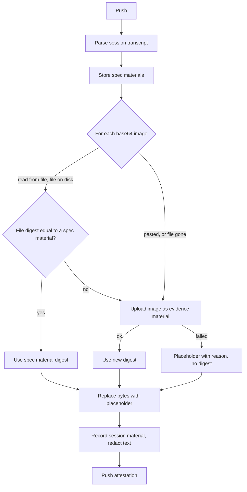

# Spec issue-3556: Image placeholders in the AI coding session transcript

## Summary
Today the AI coding session evidence keeps each image of the transcript inline, as base64 text. An image that the agent reads from a file is in the transcript two times. With this change, the CLI removes the image bytes from the transcript at push time and puts a placeholder in their place. The placeholder holds the digest of the image in the CAS. When the image is already a spec material of the same push ([Spec 002](002-session-spec-capture.md)), the placeholder references that material. Otherwise, the CLI uploads the image one time as a separate material. The session evidence gets smaller, the secret redaction does not scan image bytes, and the transcript view can show each image from its placeholder. This change also does the work that D-010 of Spec 002 left for "a later version": it keeps the bytes of pasted images.

## Problem
- Images make the session evidence too large. In one measured session, the evidence was 13.4 MB, and base64 images were 7.1 MB (53%) of it. The transcript view does not show evidence of this size inline.
- An image that the agent reads with its file tool is in the transcript two times. One copy is in the tool result content, and one is in the tool result metadata.
- Some of these images are also spec materials of the same attestation. The evidence then holds the same image three times.
- The secret redaction scans all transcript text, image bytes included. This is slow. It also gives false matches in base64 data. In one session, the redactor wrote a redaction marker into a JPEG, and the image does not decode now.
- The bytes of a pasted image are only in the transcript. A reader cannot get the image as a file.

## Goals and Non-Goals
- Goal: the session evidence holds no image bytes, so its size depends on the conversation text only.
- Goal: the secret redaction does not scan image bytes, so it is faster and does not break images.
- Goal: each image keeps its position in the transcript as a placeholder. A transcript view can link the placeholder to the image in the CAS.
- Goal: the evidence holds each image one time.
- Non-goal: the change to the transcript view that shows the images. It is in a different repository. This spec defines only what the view gets.
- Non-goal: a change to evidence that an earlier CLI pushed. That evidence keeps its inline images.
- Non-goal: other duplicate data in the transcript, for example repeated attachment blocks in subagent streams.
- Non-goal: image redaction, for example blurring a secret in a screenshot. The CLI stores images as they are, as in Spec 002.

## Requirements

### R-001: No image bytes in the transcript
The CLI MUST replace each base64 image in the session transcript with a placeholder before it records the session material. This applies to images that the agent reads from a file and to images that the user pastes.
- Done when: the agent reads one screenshot, and the user pastes one image. The push records a session material with no base64 image data.

### R-002: Placeholder content
A placeholder MUST stay at the position of the image in the transcript, with the same block type. It MUST hold the digest of the image in the CAS, the media type, and the origin (`file` or `pasted`). It SHOULD hold the original size of the image. A transcript view MUST be able to tell a placeholder from an inline image without other data.

### R-003: Reuse of spec materials
The agent can read an image from a file that is still on disk at push time. Then the CLI MUST compute the digest of the file. When the digest is equal to the digest of a spec material of the same push, the placeholder MUST reference that material. The CLI MUST NOT upload a second copy.
- Done when: a screenshot that the agent read and also copied into the spec folder gives one material, and the placeholder holds its digest.

### R-004: Upload of other images
For each other image, the CLI MUST upload the image as an evidence material of the same attestation, and the placeholder MUST hold its digest. The material MUST be linked to the session by an annotation. An image that is in the transcript more than one time MUST give one material.

### R-005: No secret scan of image bytes
The secret redaction MUST NOT scan image bytes. The CLI MUST remove the bytes before the redaction runs. An uploaded image MUST be stored byte for byte.
- Done when: a pasted image whose base64 text matches a secret pattern decodes after the push.

### R-006: Failures do not block the push
When the CLI cannot upload an image, the placeholder MUST hold the reason and no digest, and the push MUST continue. The CLI MUST NOT put the bytes back into the transcript.

### R-007: All agents
The CLI SHOULD apply this to each supported agent that keeps images in its transcript. An agent that keeps no images needs no change.

## Constraints
- The repository is public. The placeholder format is visible to all users and to external transcript viewers.
- The change is additive. The session schema does not type transcript entries, so the placeholder needs no schema change. A consumer that does not know the placeholder MUST still read the session.
- The transcript view must keep support for evidence that an earlier CLI pushed with inline images.
- The CAS backend limits the size of each material. An image over the limit follows R-006.
- The push runs in a git hook. The extra work must stay small: one digest for each read image, and one upload for each new image.

## Proposal
The user does nothing new. At push time, after the CLI parses the session and stores the spec materials, it walks the transcript and finds each base64 image. For each image, it decides on a digest:

1. **Read image that is a spec.** The tool call that read the image keeps the file path. The CLI computes the digest of the file at that path. The agent's file tool can resize the image, so the CLI cannot use the transcript bytes for this match. When the digest is equal to a spec material of this push, the CLI uses it.
2. **Other read image, or pasted image.** The CLI decodes the transcript bytes and uploads them as an evidence material. It keeps a map from digest to material, so a second copy of the same image gives no second upload.

The CLI then replaces the image data with a placeholder. The image block keeps its type and its position. Its data field holds a Chainloop reference in place of the base64 text:

| Field | Value |
|-------|-------|
| type | A reference marker, for example `chainloop_material` |
| digest | `sha256:...` of the image in the CAS, or empty when the upload failed |
| media_type | The media type of the image, for example `image/png` |
| origin | `file` or `pasted` |
| size | The original size in bytes |
| error | The reason, only when there is no digest |

The second copy of a read image, in the tool result metadata, gets the same reference. After this step, the CLI records the session material. The secret redaction then scans only text.

A transcript view reads a placeholder, finds the material with that digest in the same attestation, and shows the image from the CAS. With no digest, it shows the reason. For evidence from an earlier CLI, it shows the inline image as today.

## Decision Record

| ID | Decision | Choice | Why (and what we rejected) | Source |
|----|----------|--------|----------------------------|--------|
| D-001 | What to do with image bytes | Move them to the CAS, and keep a placeholder with the digest in the transcript | The transcript gets small and keeps the image position. The image stays in the evidence. Rejected: drop the images (the evidence loses what the agent saw). Rejected: remove only the second copy of read images (the transcript is still large, and the redaction still scans the bytes). | drafting |
| D-002 | Where the change runs | In the CLI at push time, before the CLI records the session material | Only the CLI can read the image file on disk for the spec match. The redaction runs when the CLI records the material, so the bytes never reach it. Rejected: in the control plane after the upload (the bytes are already uploaded and scanned, and the file is not on disk). | drafting |
| D-003 | Shape of the placeholder | Replace the image data in place, and keep the block type | A transcript view finds each image where it was, with no join to other data. Rejected: a separate list of images in the session material (a schema change, and the view must join the list to the transcript). | drafting |
| D-004 | Spec match | Digest of the file at the path of the read tool call | The match is exact. Rejected: match by size (a guess). Rejected: digest of the transcript bytes (the file tool can resize the image, so the digest is different). | drafting |

## Open Questions
- [ ] **Which bytes does the CLI upload for a read image that is not a spec?** Proposed: the transcript bytes. The agent saw these bytes. They are always present, also when the file is gone. The original file can have a higher resolution. But the file can change after the read.
- [ ] **Is there a limit on the number of uploaded images for each push?** Proposed: yes, 50. Over the limit, the placeholder holds the reason and no digest. A long session with many screenshots must not add hundreds of materials to one attestation.
- [ ] **Do uploaded transcript images also become spec entries, with kind `image` and role `reference`?** Proposed: no. They are not specs that the agent chose (D-009 of [Spec 003](003-spec-capture-during-session.md)). They get their own material annotations, so a tool can list them apart from the specs.
- [ ] **Does this apply to other base64 media too, for example a PDF?** Proposed: yes, to all base64 media blocks. The size and redaction problems are the same.

## Milestones
1. **Claude Code.** The CLI replaces images with placeholders and uploads them. The evidence gets smaller, and the redaction skips image bytes.
2. **Transcript view.** The view shows each image from its placeholder. This is in a different repository.
3. **Other agents.** The same change for each other agent that keeps images in its transcript (R-007).

## Risks

| Risk | Mitigation |
|------|------------|
| An attestation gets many new materials, and the materials view gets long. | Each image material has an annotation that links it to the session, so a view can group or hide them. The limit in the open questions caps the number. |
| The image file changed after the read, so the spec match fails. | The CLI uploads the transcript bytes. The evidence holds one more copy, but it is correct. |
| A very large transcript line, with a large image, stops the session parse before the CLI can remove the image. | The parse limit is separate from this change. The CLI can raise it or skip the image data while it reads the line. |
| A transcript view does not know the placeholder and shows raw data. | The placeholder keeps the block type and holds a clear marker, so a view that ignores it shows nothing wrong. Milestone 2 adds the support. |
| An image holds a secret, for example a screenshot of a terminal. | The CLI did not redact images before this change either. It stores images as they are (Spec 002, non-goal). |
