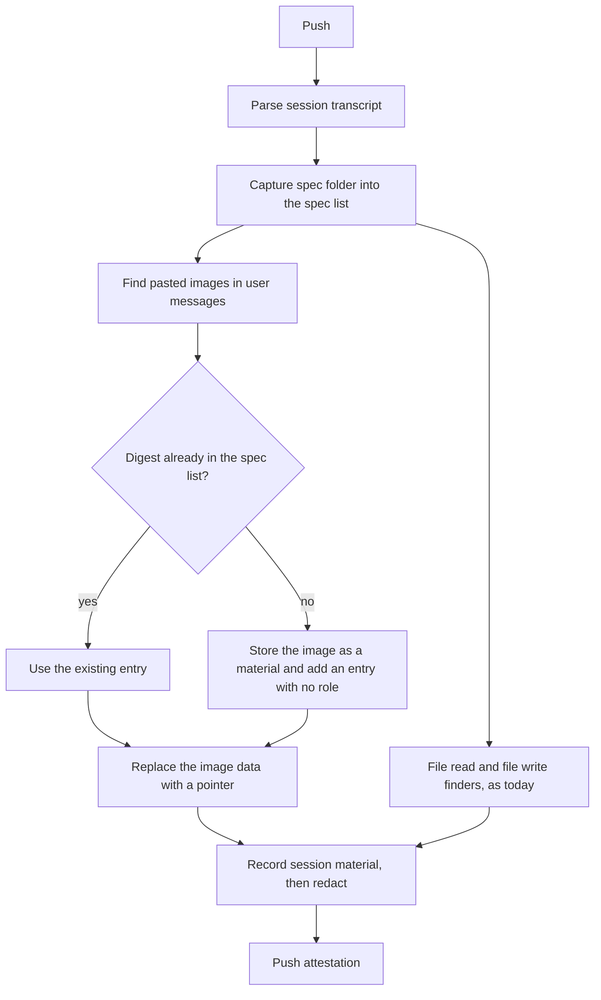

<!--
AGENT INSTRUCTIONS. Keep this comment. Read it before you change this file.

This spec records a design that humans reviewed and approved. Do not change it as part of other work. Find the status of the parent ticket (the `ticket:` field) before you change anything. If you cannot find the status, or you are not sure which case below applies, do not change the spec. Ask the human first.

- Ticket in design, and the spec PR is open: change the spec only through the br:eng-spec skill (`--revise`). Never renumber or reuse an R-xxx or D-xxx ID.
- Ticket in progress: do not rewrite the requirements, the Proposal, or existing Decision Record rows. Record a changed decision as a new Decision Record row. The owner records the differences with the shipped work through br:eng-spec (`--done`).
- Ticket done or canceled: the spec is frozen. Do not change, delete, or strike through any text. The only allowed edits are typo fixes, broken links, and the "Superseded by" line under the title. For a design change, write a new spec with br:eng-spec that supersedes this one.

When your code goes against this spec, say so in your PR. Do not edit the spec to match the code.
-->

# Spec issue-3569: Pointers for pasted images in the AI coding session transcript

## Summary
[Spec issue-3556](issue-3556-session-image-placeholders.md) replaces each exact copy of a spec source in the session transcript with a pointer to its sibling material. It put pasted images out of scope and left them to a later spec (D-014). This is that spec. It extends Spec issue-3556 and does not replace it. With this change, the CLI stores each image that the user pasted as an image spec entry. It uses the bytes in the transcript. Then it replaces the inline copy with a pointer. When the agent also captured the same image, the CLI keeps the entry of the agent. Pasted images are often the largest part of the session evidence, and this change takes them out of the transcript.

## Problem
- A pasted image stays in the transcript as inline base64 data. Base64 makes the data approximately one third larger than the image.
- Spec issue-3556 says that a later spec can capture pasted images as spec sources. It also says that the pointer mechanism then replaces them with no change. This is wrong. The mechanism finds copies only in file reads and file writes. A pasted image is a plain image block in a user message. In a test run, the agent copied a pasted screenshot into the spec folder. The spec list held the image with the exact digest, but the transcript still held the inline copy. So the evidence held the image two times.
- The agent captured that image only because the agent showed the path of a clipboard file on disk. When there is no file on disk, or the agent does not copy the image, the image is not in the spec list.

## Goals and Non-Goals
- Goal: the transcript holds no inline copy of an image that the user pasted. Each pasted image is a pointer to an image material in the same attestation.
- Goal: the capture of a pasted image does not depend on the agent or on a file on disk.
- Goal: the session evidence holds each pasted image one time, also when the agent captured it.
- Non-goal: images that the agent read with its file tool but did not capture. These stay inline, as in Spec issue-3556.
- Non-goal: a change to the capture instruction of the agent. The agent can still capture a pasted image and give it a role, a title, and a description.
- Non-goal: the change to the transcript view that shows the pointers. It is in a different repository (Milestone 2 of Spec issue-3556).
- Non-goal: a change to evidence that an earlier CLI pushed.
- Non-goal: image redaction. The CLI stores media as it is (Spec issue-3495).

## Requirements

### R-001: Capture of pasted images
For each image with inline data in a user message of the transcript, the session MUST hold one spec entry of kind `image`. The CLI MUST make the entry at push time from the data in the transcript. Its material MUST hold the decoded image byte for byte. The CLI MUST NOT need a file on disk or an action of the agent. An image in the result of a file tool call is not a pasted image.
- Done when: the user pastes a screenshot, and the agent does not copy it anywhere. The push gives one image material, and the spec list has one entry with its digest.

### R-002: Content of a pasted image entry
The title of an entry that the CLI makes from a pasted image MUST be "Pasted image N". N is the number of the paste in the session, as the agent shows it to the user. When the agent shows no number, N is the position of the image in the session, from 1. The CLI MUST NOT set a role, a description, or a source address for this entry. The capture time MUST be the time of the transcript entry that holds the image.
- Done when: the user pastes two different images. The spec list holds the entries "Pasted image 1" and "Pasted image 2".

### R-003: One entry for each image
The spec list MUST hold one entry for each distinct image content. When the agent captured the same bytes, the CLI MUST keep the entry of the agent, with its role, title, and description. It MUST NOT add a second entry. When the user pastes the same image two times, the spec list MUST hold one entry.
- Done when: the example run of the parent ticket, pushed again, gives one image entry with the role `reference` that the agent set.

### R-004: Pointer in place of a pasted image
The CLI MUST replace the data of each pasted image with a pointer to its material, as Spec issue-3556 defines it (R-002 there). The block MUST keep its type, and its position in the transcript. This MUST also work in a transcript that has no file read and no file write.
- Done when: the example run of the parent ticket, pushed again, gives one `chainloop.replaced` pointer at the position of the pasted image. The pointer holds the digest of the image material.

### R-005: Best effort, with a match report
The pasted image capture MUST follow R-012 of Spec issue-3556. An image that the CLI cannot decode or store stays inline, and the push continues. The debug report MUST give the pasted image finder its own line. The line gives the number of images that it replaced, and the number that stayed inline with the reason. Examples of reasons are "invalid image data" and "material not stored".

## Constraints
- The repository is public. The pointer format and the spec list are visible to all users and to external transcript viewers.
- The change is additive. It uses the existing pointer format and the existing image spec entry. It needs no schema change.
- The push runs in a git hook. The pasted image data is already in memory. The extra work is one decode and one digest for each image, and one upload for each distinct image.
- A transcript view must keep support for evidence with inline pasted images.

## Proposal
The user does nothing new. Each push rebuilds the session evidence from the raw transcript and the spec folder. The steps of Spec issue-3556 get one new step before the replacement:

1. **Capture specs, as today.** The CLI reads the spec folder into the spec list, and keeps the source digest of each entry.
2. **Capture pasted images.** The CLI looks at each user message in the transcript, also in subagent streams. It selects each image block with inline data that is not part of a tool result. It decodes the data and computes the digest of the bytes. When an entry with this digest is already in the spec list, the CLI uses it. This is the case when the agent copied the image into the spec folder, or when the user pasted the same image before. Otherwise the CLI stores the bytes as a new image material, with the media type of the block, and adds an entry with no role.
3. **Find and replace.** The pasted image finder replaces the data of each pasted image with a pointer to the material with that digest. The block keeps the type `image`, and the pointer becomes its source, as for an image in a file read. The file read finder and the file write finder run as today. The CLI runs each finder on each stream, also when a stream has no tool call.
4. **Redact.** The CLI records the session material, and the secret redaction scans it, as today.

The pointer is the same as in Spec issue-3556: the `chainloop.replaced` marker and the digest of the material. A transcript view that shows an image from a pointer in a file read shows a pasted image the same way. The entry of an agent capture gives the view the title of the agent. An entry that the CLI made gives the title "Pasted image N", which matches the label the user saw in the agent.

The agent can still capture a pasted image, as the capture instruction asks today. This adds a role, a title, and a description. Agents that have no pasted image finder still capture images in this way.

## Decision Record

| ID | Decision | Choice | Why (and what we rejected) | Source |
|----|----------|--------|----------------------------|--------|
| D-001 | Who captures a pasted image | The CLI captures each pasted image at push time | The bytes are in the transcript, so the capture does not depend on the agent or on a file on disk. Skills use the same model (Spec issue-3540). Rejected: replace only the images that the agent captured. Images then stay inline when the agent does not copy them, and the agent can copy only when it has a file path. | drafting |
| D-002 | Role of a pasted image entry that the CLI makes | No role | The CLI does not guess a role (D-004 of Spec issue-3531, D-011 of Spec issue-3540). The kind `image` tells what the entry is. Rejected: always `reference` (a guess, and a pasted mockup can be the spec). | drafting |
| D-003 | Size limit | No new limit | The bytes are already in the evidence as inline data. A material holds them without the base64 overhead, so the change never makes the evidence larger. The agent already limits the size of a paste. Rejected: a cap with larger images inline (it keeps the largest images in the transcript, which is the opposite of the goal). | drafting |
| D-004 | Agent capture of pasted images | Keep the capture instruction. One entry for each digest, and the entry of the agent wins | The agent adds a role, a title, and a description that the CLI cannot know. A match by digest prevents a second material. Agents with no pasted image finder still capture images. Rejected: take pasted images out of the capture instruction (the entry loses its role and title). | drafting |
| D-005 | Source of the image bytes | The decoded data of the image block in the transcript | The data is what the model got, and it is always there. Rejected: read the clipboard file that the agent names. It is a temporary file that can be gone at push time, and its format is specific to one agent. | drafting |
| D-006 | Relation to Spec issue-3556 | Extend it with one capture step and one finder. Do not change its text | The team shipped Spec issue-3556, so its text is frozen. Its non-goal says that capture alone replaces pasted images. This spec records that a finder is necessary too. | drafting |
| D-007 | Title of a pasted image entry that the CLI makes | "Pasted image N", with the paste number that the agent shows | A reader can find the image in the conversation from the same number. The title is a fixed label, not a guess about the content. An agent capture still sets its own title. Rejected: no title (a list of entries with no title is hard to read). Rejected: a title from the text of the user message (the user wrote that text as a prompt, not as a title). | drafting |

## Open Questions
None.

## Milestones
1. **Claude Code.** The CLI captures pasted images and replaces them with pointers.
2. **Transcript view.** The view shows a pasted image from its pointer. This is in a different repository, and it is the same work as Milestone 2 of Spec issue-3556.
3. **Other agents.** A pasted image finder for each other agent, for example Cursor and OpenCode. Each agent puts pasted images in a different block shape.

## Risks

| Risk | Mitigation |
|------|------------|
| A session with many pasted images adds many materials and uploads. | Before this change, the same bytes were in the session material as base64, which is larger. The CLI stores each distinct image one time (R-003). |
| A pasted image holds a secret, for example a screenshot of a terminal. Now it is a material of its own. | It was in the evidence before this change too, as inline data. The CLI does not redact images (Spec issue-3495, non-goal). |
| A policy reads pasted image data from the transcript and now finds a pointer. | The policy can read the image material by the digest in the pointer. |
| The agent changes the shape of the pasted image block. | The image is not found and stays inline. The match report shows the drop, and the push does not fail (R-005). |
| The agent changes a pasted image before it writes it to the transcript, so the agent capture and the transcript data differ. | The CLI stores the transcript data, which is what the model got. The spec list then holds two entries: the agent capture and the pasted image. Both entries are true records. |
