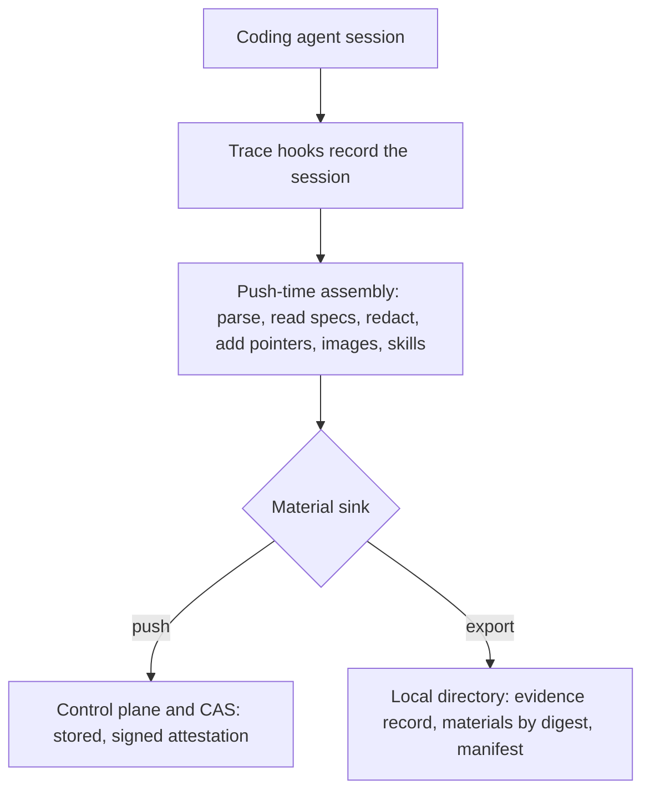

<!--
AGENT INSTRUCTIONS. Keep this comment. Read it before you change this file.

This spec records a design that humans reviewed and approved. Do not change it as part of other work. Find the status of the parent ticket (the `ticket:` field) before you change anything. If you cannot find the status, or you are not sure which case below applies, do not change the spec. Ask the human first.

- Ticket in design, and the spec PR is open: change the spec only through the br:eng-spec skill (`--revise`). Never renumber or reuse an R-xxx or D-xxx ID.
- Ticket in progress: do not rewrite the requirements, the Proposal, or existing Decision Record rows. Record a changed decision as a new Decision Record row. The owner records the differences with the shipped work through br:eng-spec (`--done`).
- Ticket done or canceled: the spec is frozen. Do not change, delete, or strike through any text. The only allowed edits are typo fixes, broken links, and the "Superseded by" line under the title. For a design change, write a new spec with br:eng-spec that supersedes this one.

When your code goes against this spec, say so in your PR. Do not edit the spec to match the code.
-->

# Spec issue-3582: Trace evidence export to disk

## Summary
Chainloop Trace records an AI coding session. On a git push, it assembles the session evidence and sends it to the control plane as a signed attestation. The assembly does real work. It reads the spec sources at push time, redacts secrets, and replaces copies with pointers. It stores each spec, skill, and image as its own material. Today that assembly runs only inside a push, so it needs a control plane, credentials, and a network. This spec adds a mode that runs the same assembly and writes the result to a local directory, with no control plane and no attestation. It gives developers and tests the exact evidence a push would produce, on disk, for inspection and comparison.

## Problem
- The evidence a push produces is more than the raw transcript. The push reads the spec sources, redacts secrets, and adds the pointers, the pasted images, and the skills.
- This assembly runs only inside a push. So a developer needs a running control plane, credentials, and a network to see its output.
- A test cannot get the pushed evidence without a live backend. So the assembly is hard to test.
- No command writes the session evidence to disk. A developer cannot see what a session would send before they send it.
- The push also signs and stores the attestation. A developer who only wants to read the evidence pays for the whole backend path.

## Goals and Non-Goals
- Goal: a mode runs the full push-time assembly and writes the result to a local directory, with no control plane.
- Goal: the written evidence equals what a push would upload for the same session. The fields, the redaction, the pointers, and the spec, skill, and image materials match.
- Goal: the output is laid out so a reader and a test find each material by its digest.
- Goal: a developer reads the evidence of a session with no backend and no credentials.
- Non-goal: a signed attestation. The mode writes the evidence set, not a signed statement or a signed bundle. A control-plane-free signed attestation needs a contract and a signing key, and it is a separate, larger effort.
- Non-goal: policy evaluation and contract-required materials. Those need a contract from the control plane.
- Non-goal: a change to the push path, or to what a push uploads.
- Non-goal: the agent or the model offline. The agent still calls its model over the network during the session. This mode is about the Chainloop backend, not the model.

## Requirements

### R-001: Write the evidence to a local directory
The mode MUST run the push-time assembly and write the result to a directory the user names. It MUST make no call to the control plane and emit no attestation.
- Done when: the mode runs with no network and no credentials, and it writes the directory.

### R-002: The same evidence as a push
The written evidence record MUST equal the one a push would upload for the same session. The fields, the redaction, the pointers, and the spec, skill, and image materials MUST match. The one difference is the signature and the attestation wrapper, which the mode does not produce.
- Done when: a session that is exported and the same session that is pushed give the same evidence record and the same material digests.

### R-003: Materials addressable by digest
The mode MUST write each material under its content digest. A reader and a test MUST find each material from the reference in the evidence record.

### R-004: Redaction on by default
The mode MUST redact secrets in the evidence and in the materials, as a push does. An opt-out is for a trusted local run only, and the output can then hold secrets.
- Done when: a secret in a spec source does not appear in the exported files.

### R-005: No control plane and no credentials
The mode MUST NOT need a control plane, an organization, a token, or a network.

### R-006: A manifest
The mode MUST write an index. The index MUST list each material by name, kind, and digest. A reader MUST see the whole set of materials from the index, with no need to parse each file. The evidence record holds the warnings of the run, not the index.

### R-007: Export from a recorded session
The mode MUST build the export from the session state that the hooks recorded. It MUST NOT depend on one way of running the agent.

## Constraints
- The repository is public. The mode and its code hold no internal context.
- The agent calls its model over the network during the session. The mode changes the Chainloop backend path only.
- The export is not signed, so it is not proof of anything. It is for inspection and for tests.
- The mode reuses the push assembly. It does not fork that logic.
- An export can hold the content of the session, including local files the session read. A developer keeps the output directory as they keep any working copy of the session.

## Proposal
The developer runs the mode and names an output directory. The mode records the session as the push path does, or it reads a session the hooks already recorded. It then runs the same assembly a push runs. It parses the session. It reads each spec source at that time. It redacts secrets. It replaces each copy in the transcript with a pointer. It gathers the pasted images and the skills. A push would store each material in the backend and send a signed attestation. Instead, the mode writes each material to the output directory under its digest, writes the session evidence record, and writes a manifest.

The push path already separates the assembly from the step that stores one material. That store step is a single seam. The mode gives the seam a store that writes to disk and returns the digest, in place of the store that uploads to the backend. Every assembly step runs unchanged: the spec read, the redaction, the pointers, the images, the skills, and the evidence record. So the export cannot drift from a push. It is the same assembly with a different sink.

The output directory holds three things. It holds the session evidence record, which carries the warnings of the run. It holds a folder of materials, each named by its digest. It holds a manifest that lists the materials. The layout mirrors the content-addressed store the backend uses. So a material is found by its digest, and two runs of the same session are easy to compare.

The mode writes the evidence set, not a signed attestation. A signed attestation with no control plane needs a contract and a signing key. That is a separate, larger effort, and this spec puts it out of scope. The export is for a developer who reads the evidence, and for a test that checks the assembly.

The mode is not named "offline". The agent still calls its model over the network during the session, so "offline" would claim something false. The name says what the mode does: it writes the evidence to disk. The verb is "export". The first surface is a flag on the single-session run that names the directory to write to. A standalone "export" command can come later, for a session the hooks already recorded.

## Decision Record

| ID | Decision | Choice | Why (and what we rejected) | Source |
|----|----------|--------|----------------------------|--------|
| D-001 | How the mode produces the evidence | Reuse the push assembly through its store seam, with a store that writes to disk | The export is then the same assembly as a push, so it cannot drift. Rejected: a new path that parses and assembles on its own (it forks the logic, and the two drift). | drafting |
| D-002 | What the mode writes | The evidence set: the evidence record and its materials. Not a signed attestation | A developer and a test need the evidence, not a signature. Rejected: a signed bundle with no control plane (it needs a contract and a signing key, which is a larger, separate effort). | drafting |
| D-003 | Output layout | Content-addressed: each material under its digest, plus a manifest | A reader maps a reference in the evidence to its material, and two runs are easy to compare. Rejected: a flat dump with ad-hoc names (hard to map, hard to compare). | drafting |
| D-004 | Secrets in the output | Redaction on by default, with an opt-out for a trusted local run | The output equals a push by default, so it holds no secret a push would drop. The opt-out serves a developer who debugs the redaction. Rejected: no redaction (the output holds secrets). Also rejected: redaction with no opt-out (a developer cannot see the raw text). | drafting |
| D-005 | Name of the mode | Name it for what it does, write the evidence to disk, for example "export" | The agent and the model are still online during the session, so "offline" claims something false. Rejected: "offline" (false claim). Also rejected: "dry-run" (it already means render without store, and it still calls the control plane). | owner request |
| D-006 | The surface and the verb | The verb is "export". The first surface is a flag on the single-session run that names the output directory. A standalone "export" command comes later | One command then gives the whole path: run the agent and write the evidence together. A standalone command serves a session the hooks already recorded, and it can wait. Rejected: a standalone command first (it does not cover the common case of running the agent and reading the evidence together). | owner request |
| D-007 | What the export carries | Everything a push uploads, including the raw transcript material | The export is faithful only when it holds what a push holds. Rejected: the evidence record and the spec, skill, and image materials only (it drops the transcript, so the export does not match a push). | owner request |
| D-008 | Determinism for a compare | The mode writes the faithful output. A shared helper normalizes the volatile fields for a compare | The export stays faithful to a push, with no special mode that hides a difference. One helper keeps each test from normalizing on its own. Rejected: a normalized form that the mode itself writes. Such a mode can drift from a push, and it can mask a real change. | owner request |

## Open Questions
None.

## Milestones
1. **Core export.** The mode writes the evidence set of a recorded session to a directory, with the disk store and no control plane.
2. **Export from the run.** The single-session run takes an export flag that names a directory, so one command runs the agent and writes the evidence.
3. **Layout and manifest.** The content-addressed layout and the manifest have a documented structure, so a test reads the output without guessing.

## Risks

| Risk | Mitigation |
|------|------------|
| The export drifts from a real push. | The export reuses the push assembly through its store seam, so the only difference is the sink. A test compares an export with a push for the same session (R-002). |
| The output holds secrets. | Redaction is on by default, as in a push. The opt-out is for a trusted local run, and it is documented as such (D-004). |
| A reader treats the export as a signed attestation. | The export is not signed, and the manifest says so. The mode is for inspection and for tests. |
| Timestamps and volatile paths make a test flaky. | The test normalizes the volatile fields before a compare (D-008). |
